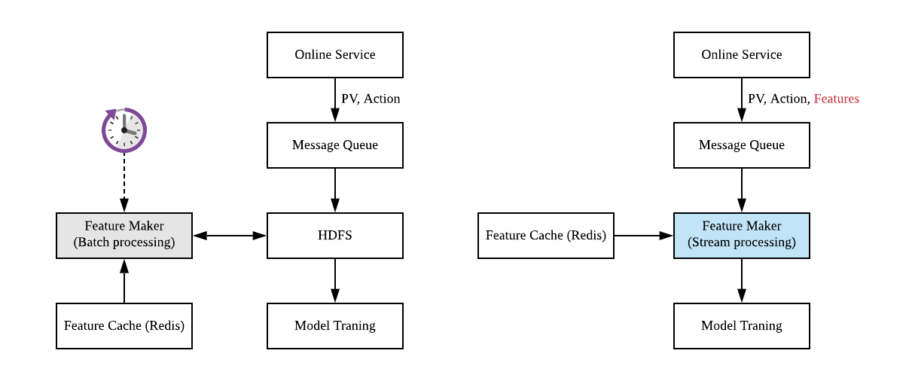
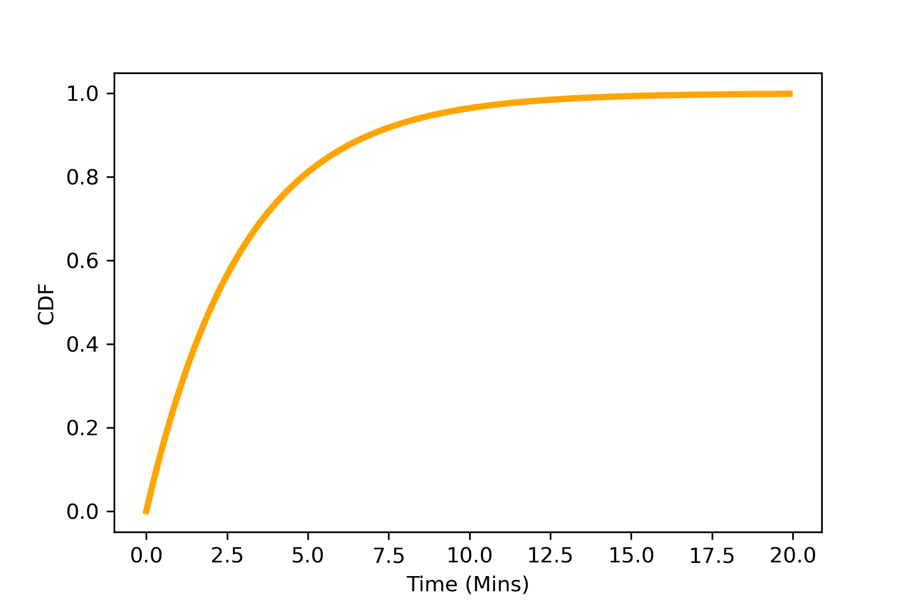
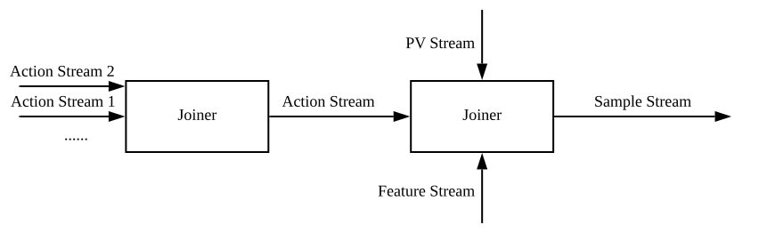

继搜索引擎之后，推荐系统已经成为移动互联网时代人们获取信息的主要渠道，比如，流行的新闻 App 都会利用推荐系统进行用户的个性化推荐。新闻推荐场景具有高度的实时性，每时每刻都会有大量的新闻、热点产生。王喆前辈的两篇博客已经对推荐系统的实时性问题进行了深入的探讨：

- [天下武功，唯快不破，论推荐系统的「 实时性」](https://zhuanlan.zhihu.com/p/74813776)
- [如何增强推荐系统模型更新的「实时性」？](https://zhuanlan.zhihu.com/p/75597761)

增量更新、在线学习、局部更新甚至强化学习等训练策略可以令推荐系统迅速的对用户的新行为做出反应，而这些更新策略的前提是样本本身具有足够的实时性。新闻场景下，典型的训练样本是用户的点击等行为数据。用户行为数据在客户端收集之后，需要尽可能迅速的发回后台生成训练样本，再尽快对模型进行更新。笔者于 2020 年夏在某千万用户级别新闻 App 推荐组实习，负责了样本实时化项目的主要开发工作。在这里对该项目进行技术层面的总结。

## 样本的产生与实时性

首先讨论一下典型的新闻应用推荐系统的 Data Pipline 与模型训练样本的产生。客户端将一组新闻曝光给用户之后，曝光数据流 PV (Page View) 会被立即发送回后端 Online Service. 用户会点击感兴趣的新闻，产生用户行为数据流也即 Action 数据流，这部分数据也被发回后端。之后后端会将这些用户行为消息写入消息队列 Message Queue, 最终会将其落盘到分布式文件系统，如 HDFS 上。最简化的推荐系统样本生成逻辑就是 PV Join Action. 用户只会对部分曝光新闻样本产生行为，这部分样本即为正样本，剩余的没有产生行为的曝光样本即为负样本。生成正负样本之后即可进行模型的训练。

实时性要求不高的推荐系统可以使用批处理技术（典型的工具是 Apache Spark）生成样本，如图 1 左图所示. 设置一个定时任务，每隔一段时间，比如一小时，从 HDFS 读取时间窗内的用户行为日志、曝光日志进行 JOIN 操作，生成训练样本，再将训练样本写回 HDFS, 之后启动模型的训练更新。


<center> <p> 图 1: 典型的新闻推荐系统 Data pipeline </p> </center>

批处理一个明显的问题是延时。定时运行批处理任务典型的周期是一个小时，这就意味着从样本产生到模型训练至少有一个小时的延时，有时批处理平台负载过大，任务需要排队，则延时会更大。另一个问题是边界问题，上一段提到的，PV 数据如果产生在批处理任务选取的日志时间窗结尾，则对应的 Action 数据可能会落到批处理任务的下一个时间窗中，导致 Join 失败，产生假负样本。

为了增强实时性，我们使用 Apache Flink 框架，将样本的生成逻辑以流处理技术重写。如图 1 右图所示。线上服务生成的用户曝光与行为日志写入消息队列后，不再等待其落盘到 HDFS, 而是直接用 Flink 消费这些消息流。Flink 同时从 Redis 缓存等位置读取必要的特征信息，直接生成样本消息流。样本消息流写回 Kafka 队列，下游 Tensorflow 可以直接消费该消息流进行模型的训练。

## 曝光与行为流的 Join 逻辑

对于新闻推荐，用户行为天然存在时间不同步的问题。一条新闻曝光给用户，PV 数据流产生之后，用户可能立即点击，也有可能几分钟，十几分钟，甚至数小时之后产生行为。这就意味着 PV 数据流到达之后，需要等待一段时间再与 Action 数据流进行 Join. 等待时长过短，会导致一些本应有用户行为的样本（正样本）因为用户行为没有来得及回流而被错误的标记为负样本。等待时长过长会损害加大系统的延时。

<center>

<br/>
<p> 图 2: 样本回流时间分布。纵轴是回流的样本比例 </p>
</center>

这一方面有一些比较复杂的解决方案，比如[这篇文章的总结](https://zhuanlan.zhihu.com/p/165625326)。离线分析一下实际的 Action 数据流与 PV 数据流之间的延时分布，是一个非常典型的指数分布，如图 2 所示。数分钟之内绝大多数用户行为已经回流，而数分钟对我们目前是一个可以接受的延时，因此，一个简单的解决方案是设置一个大小比较折中的时间窗。Flink 本身即提供了 Window Join 来实现这种逻辑。但我们最终敲定的实际逻辑实现要比上文描述远为复杂，Windiow Join 无法满足要求，因此我们自行实现了一些底层的 CoProcessFunction 函数，综合使用 PV 数据流、Action 数据流和一些特征流，实现了最终训练样本的生成。

## 项目 Flink App 架构

落实到工程上，数据流示意图如图 3 所示。实际项目中有多个 Action Stream, 从 Kafka 消费之后合并。然后 Action Stream 与 PV Stream 进行 Join 操作。为了生成实际的训练样本，还需要一些新闻相关的特征，这些特征部分由 Flink App 访问 Redis 数据库进行查询（查询操作应该加缓存），部分也是以 Kafka 消息流的形式提供的，需要得到消息流之后缓存在 Flink App 内存。最终完成 Join 逻辑，生成用于模型训练的 Sample Stream.


<center>图 3: Joiner 数据流示意图</center>

为了实现 Join 操作，首先需要以某种方式进行 Key 的对应，这是通过 KeyedStream 实现的。首先，Flink 通过 FlinkKafkaConsumer 等工具消费 Kafka 消息流生成 Flink Stream, 然后通过 keyBy 方法将流按照某种 key 进行划分，具有相同 keyBy 方法的流可以借助 CoProcessFunction 进行 coProcess 操作，简单的例子：

```scala
val pvStream = getDataStreamFromKafka...
val actionStream = getDataStreamFromKafka...
val sampleStream = pvStream.keyBy(x => (x.id, x.time))
    .connect(actionStream.keyBy(x => (x.id, x.time)))
    .process(new CoProcessJoin)
    .name("sampleStream")
```

CoProcessFunction 是 Flink 提供的一种较低层的对于流操作的抽象。比如，下面是一个简单的 CoProcessFunction 实现两个流的 Join 操作，继承 CoProcessFunction 类，override 两个函数，定义好在两个流中读取到元素时的动作即可：

```scala
// apache flink, scala, CoProcessFunction Sample
// doc: https://ci.apache.org/projects/flink/flink-docs-release-1.9/dev/stream/operators/process_function.html

class CoProcessJoin extends CoProcessFunction[PV, Action, Sample] {
  private val ttlConfig = 
    StateTtlConfig
    .newBuilder(Time.milliseconds(time))
    .build()
  private val descriptor =
    new ValueStateDescriptor[NewsInfo](
      "newsInfo", classOf[NewsInfo])
  descriptor.enableTimeToLive(ttlConfig)

  lazy val pvVal: ValueState[PV] = 
    getRuntimeContext.getState(descriptor)

  override def processElement1(
    value: PV,
    ctx: CoProcessFunction[PV, Action, Sample]#Context,
    out: Collector[Sample]): Unit = {

    if(value != null) {
      pvVal.update(value)
      registerTimerAfter(ctx.timerService(), waitingTime)
    }
  }

  override def processElement2(
    value: Action,
    ctx: CoProcessFunction[PV, Action, Sample]#Context,
    out: Collector[Sample]): Unit = {

    if(pvVal.value() != null) {
      out.collect(positiveSample(pvVal.value(), value));
    }
  }

  override def onTimer(
    timestamp: Long,
    ctx: CoProcessFunction[PV, Action, Sample]#OnTimerContext,
    out: Collector[Sample]): Unit = {
    
    if (pvVal.value() != null) {
      out.collect(negitiveSample(pvValue.value()))
    }
  }
}
```

以上代码块的例子中，首先定义了一个 ValueState, 这是一种由 Flink 维护的变量，可以保存在 Flink App 内存（或者其他持久化方案）中。假设 PV 总是首先到达（实际应用中并非如此），由 Flink 将其缓存并等待对应的 Action 到达。Action 到达之后，从 ValueState 中读取 PV，并经过一定的操作生成 Sample 即可。CoProcessFunction 除了能定义 ValueState 之外，还能定义定时器，从而在没有元素到达的时间点也能触发一些动作。如，对于推荐系统样本生成，等待一定的时间之后如果没有 Action, 则生成负样本。真正使用 ValueState 时，注意设置生存周期或者手动清空状态，避免状态始终不释放而占用内存。

## 项目难点

人们常常会将 Flink 与 Spark 进行对比。Spark 一般将数据抽象成没有时序的 DataSet，其处理逻辑天然要简单得多。Spark 和 Flink 都会将计算任务抽象成计算图（有向无环图 DAG), 但作为批处理任务 Spark 实际上可以逐个完成计算任务，不必要完全并行整个 DAG, 并行度不好只会导致整个批处理任务耗时稍长，但不会导致异常。但对于 Flink 任务，整个 DAG 常常必须同时运行，计算资源必须妥善分配到 DAG 的每个节点上，否则就会导致消息积压。因此，Flink App 的开发要比 Spark 复杂得多，但这些复杂性是为了实现准实时处理所必然的。

本项目中主要难点可以分为以下几块。首先，需要理解 Flink 对于 DataStream 的抽象，理解 CoProcessFunction 的抽象，从而使用 CoProcessFunction 实现自己的业务逻辑。理解 Flink 的抽象其实并不困难，但对于实际业务而言，业务逻辑可能非常复杂，而 Flink 提供的 State, Timer 等工具实际上是比较简陋的，比如 Timer 只是能在特定时间触发调用 onTimer 方法，如果有多个 Timer, 则 onTimer 方法需要自行判断自身是被哪个 Timer 触发的。CoProcessFunction 总共只有 processElement1, processElement2, onTimer 三个方法，但业务逻辑可能会有非常复杂的状态转移，我们在实现过程中自行维护了一个有限状态机。

另一方面，业务数据流量非常大，我们需要将整个 Flink 任务的计算压力相对均匀的分配到所有的计算节点上，否则瓶颈节点会导致消息积压。对此，Flink 提供了为每个操作 (Operator) 指定并行度（运算节点个数），并将 Operator 组织成组，每个组共享计算资源等方法。但计算节点的分配还有一些限制，比如消费 Kafka 的输入节点并行度最多只能设置成跟上游 Kafka 并行度一致。在这些限制之下，节点计算负担的妥善分配并不容易，很容易出现部分节点 CPU 比较空闲，部分节点压力过大消息积压。更加不幸的是，我们没有找到非常有效的方法分析每个操作的计算代价，主要依靠调试来发现瓶颈。

除了计算资源之外，由于我们维护了大量的状态信息，集群的存储也面临压力。这一部分相对而言容易根据消息流量和保存时长进行数量级的估计。使用 StateValue 或者其他类型的 State 时应该注意 Flink 是如何存储这些 State 的，如果存储在内存中，当然需要注意内存压力，Flink 也能使用数据库等方式进行持久化，可能需要注意 IO 压力。

## 项目反思

该项目原「计划」一个月，实际上拖了五个月才上线。在参与该项目过程中，笔者带有一些「实习生心态」，作为主要开发人员却缺乏责任意识，感觉规划性质的工作应该由 mentor, leader 等人完成，只是在 mentor 指导下进行机械的开发工作、解决技术问题。项目周期拖的时间如此之长并不是开发效率问题或者技术困难，原因总结如下：

1. 我们并没有在开始开发工作之前妥善的预估资源使用，导致开发过程中常常停下来等待资源申请。而公司内部资源，包括机器和数据权限，申请流程比较长，
2. 由于低估了项目规模和开发时间，没有搭建本地测试环境、准备测试数据等，导致出现问题之后调试只能依靠上线到测试环境上借助日志调试，过程非常痛苦耗时。
3. 推荐系统的样本实时化是一个著名问题，因此没有在开始开发之前借助离线实验验证该项目的收益，这一点在与有经验的前辈交流之后才意识到问题的严重性。如果开发完成，却没有明显的收益，就会非常糟糕。
