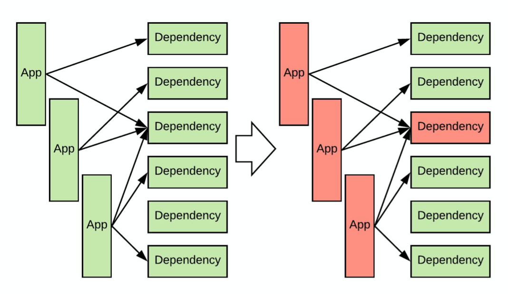

本文是笔者 2019 年在 HULU 的实习项目，拖了一年之后才把这篇博客整理出来，留作纪念吧。

## 延迟与差错控制问题

首先让我们熟悉一下问题的背景。一个现代的后端服务可能会有多个依赖服务，而这些依赖服务不一定总是能保持稳定。比如，推荐系统后台可能需要从一个服务中获取读取用户配置，从另一个服务中读取用户历史。这样就存在一个问题：如果服务有非常多的依赖，那么在任意时刻，都很有可能有某个依赖出问题。

依赖出现问题之后，如果没有兜底逻辑，服务就不能正常运行了。另外，出问题的依赖延时会变得很长，这会导致该依赖的请求长时间的占用线程池、TCP 连接等资源，直至耗尽资源。于是，如果服务没有差错容忍能力，那么服务的 downtime 可能会是所有的依赖的 downtime 之和，而且服务跟随上游依赖 down 掉之后，还会引起下游服务跟随 down 掉，这是不可接受的。

为了避免服务跟随上游服务 down 掉，至少需要做到以下两点：

- 有一个 fallback 逻辑，也即当上游的依赖服务挂掉之后的兜底逻辑。一般而言，这应该是个本地逻辑，而不是另一个服务。
- 能够检测服务的健康状态，如果服务挂掉，尽快切换到 fallback 逻辑。同时，能够在服务恢复正常后及时切换回来。

Hystrix & Resilience4j 就是完成后一个要求的工具。它们可以检测服务的健康状态，并在服务状态不佳时及时切换到兜底逻辑，并在服务回复之后切换回来。

## Hystrix 原理

在这里比较偏向原理的介绍一下 Hystrix. Hystrix 首先将依赖的调用抽象成函数（方法）调用，函数调用有三种可能的结果：正常返回，抛出异常，超时。简单起见，超时这里也归入异常。Hystrix 的基本原理就是对于每个依赖，分别统计其在一段时间内抛出异常的概率，异常概率过高时即认定依赖已经不健康。

Hystrix 判定依赖出现问题之后，新的请求不会再调用依赖，而是会调用 Fallback 逻辑（兜底逻辑）。此时我们称为短路状态，依赖被短路。短路状态下，Hystrix 每隔一段时间会尝试调用一下依赖，Hystrix 会在一定次数的成功之后判定依赖已经恢复，并取消短路状态，否则会继续短路。

通过短路掉不正常的依赖，Hystrix 一方面可以降低本服务的压力，防止大量的超时拉高本服务的响应时间，也防止占用线程池等资源。同时也避免给依赖带来更大的压力。

> 未完待续。。。