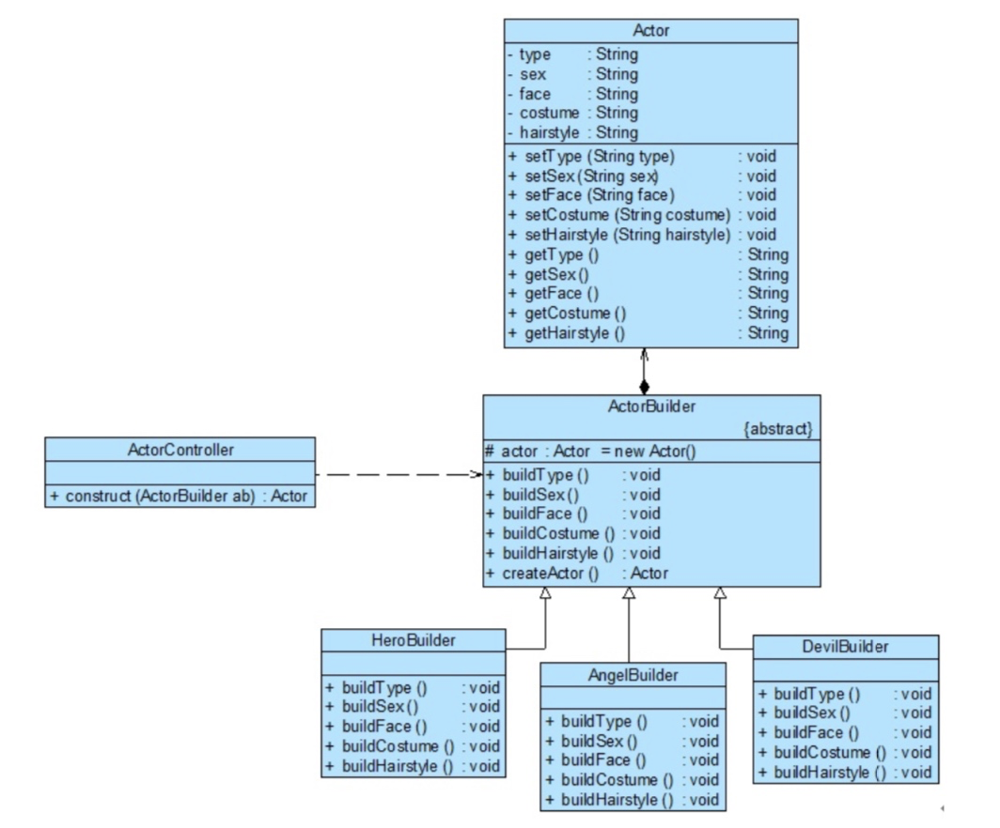
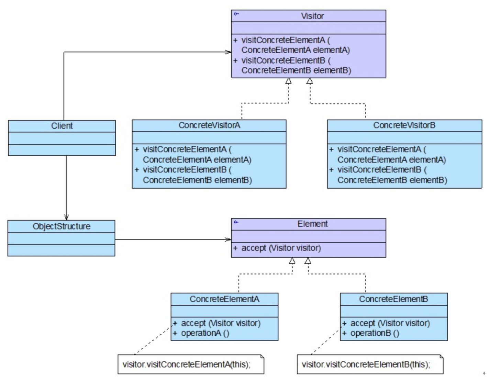

# 设计模式

## 面向对象设计原则

- 单一职责原则：一个类只负责一个功能领域中的响应职责。
- 开闭原则：当需求发生扩展时，应该可以通过扩展代码而非修改代码实现。
- 里氏代换原则：所有引用基类对象的地方能够透明地使用其子类的对象。
- 依赖倒转原则：抽象不应该依赖于细节，细节应该依赖于抽象。
- 接口隔离原则：使用多个专门的接口，而不是用单一的总接口。
- 合成复用原则：尽量使用对象组合，而不是继承来达到复用的目的。
- 迪米特法则：一个软件实体应当尽可能少的与其他实体发生相互作用。

## 创建型模式

- 简单工厂模式：抽象类工厂方法根据参数使用 IF-ELSE 语句返回具体类对象。
- 工厂方法模式：抽象类工厂根据参数使用多态、反射机制返回具体类对象。
- 抽象工厂模式：抽象工厂用于创建一族互相关联、具有相似属性的对象。不同的抽象工厂对应不同的属性。如，UI 系统中有不同的主题，可以每个主题对应一个抽象工厂，该工厂创建的对象全部为该主题下的对象。
- 单例模式：构造函数私有，提供静态 getInstance 方法。用于一些不应该有多个实例的类。
- 原型模式：保存一些对象模板，方便用户创建跟模板相似的对象。
- 建造者模式：当某个类具有复杂的创建（设置）过程，且根据不同的参数，创建过程使用的具体对象不同，然而步骤是相近的。此时设计一个建造者，建造者控制整体创建流程，但在此过程中可能使用不同的具体模块。一个例子是游戏中创建不同的角色，通用创建逻辑实现在 ActorController, 一些关键差异实现在 Builder. 参照下图：

【注：该图中恰好出现了类之间的函数参数调用、成员、继承三种关系，以及抽象类、具体类。可以借助该图学习这种对象关系的图形化表示形式。】

## 结构型模式

- 适配器模式：当想要对象不满足接口要求又不方便修改时对它进行一次封装。
- 桥接模式：其实就是针对抽象类进行编程。
- 组合模式：树形结构（如文件夹结构）的处理。
- 装饰模式：系统功能的拓展，使用装饰器类作为原有类的包装，实现功能强化。
- 外观模式：功能代理，提供一个类，该类整合多个类实现一个具体功能。该代理类对用户隔离了内部实现。
- 享元模式：对不可变对象的共享对象池，如某些字符串不可变语言的字符串对象池。
- 代理模式：为某些不方便访问的接口（如远程接口）增加一层代理，代理类实现了与被代理类相同的接口。

## 行为模式

- 职责链模式：由一系列 Handler 组成，每个 Handler 维护其「上级」，对于发来的请求，如果该 Handler 可以处理则加以处理并返回结果，否则提交其上级。职责链的头可能是个抽象 Handler. 模仿了官僚系统中的事件逐级上报。
- 命令模式：一种强大的模式。命令发出者（如按钮）维护一个抽象命令类引用，并向该引用发出命令。根据配置，这个引用指向不同的具体命令接受者，该接受者执行具体的命令。可以方便地拓展命令执行者队列、命令日志、撤销等功能。
- 解释器模式：表达式求值。
- 迭代器模式。
- 中介者模式：某些系统中存在复杂交互，典型如 GUI 系统中按下一个按钮要通知许多部件刷新，因此一个类可能要与多个类打交道。为此增加一个中介者，该中介者维护对所有相关对象的引用，关联到多个类的动作借助中介者进行。
- 备忘录模式：典型应用，悔棋。
- 观察者模式：就是 GUI 系统常见的消息发布者 - 监听者模型。[Java 的观察者模式工具类](https://docs.oracle.com/javase/8/docs/api/index.html?java/util/Observable.html)。
- 状态模式：有限状态机模式。在 OOP 中可以构造一个抽象状态，提供状态转移接口，具体状态继承抽象状态。
- 策略模式：封装一系列接口相同的算法（策略），客户端可以根据具体情况选择不同的策略。
- 模板方法模式：定义一个操作中的算法框架，而将一些操作延迟到子类中。模板方法模式使得子类可以不改变一个算法的结构即可重定义该算法的某些特定步骤。是 OOP 结构上最简单的设计模式，只牵扯子类和父类。「钩子」就与该方法有关。
- 访问者模式：

## 其他设计模式

遇到的其他没有在《设计模式》一书中读到过的设计模式。

- [Reactive Pattern](https://en.wikipedia.org/wiki/Reactive_programming)