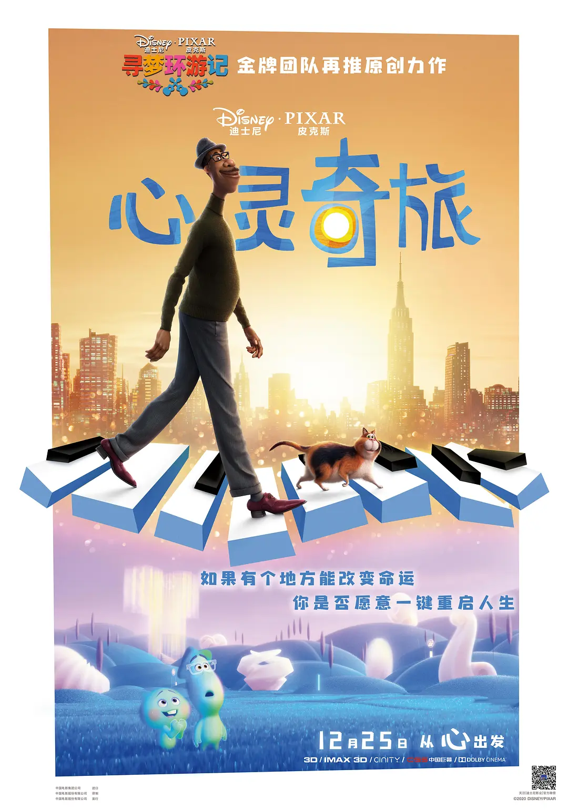

虽然本博客是以技术博客为主，但也记录一下生活吧。在此记录本年度看过的电影。

## 2021.01.08 Soul

由于误操作美团买的票，意外的很不错，老少皆宜。「生活的意义在于生活本身」对这一概念对很多人已经并不新鲜，但并不是那么容易做到。我们仍然时常会迷失在执念之中，忘记生活的本真。

电影中有一些有意思的意象，比如投入忘我与陷入执念的相似，比如陷入执念会让人变成行尸走肉。甚至，「寻找自己的意义」本身也会成为执念。另外，陷入迷思记不起来自己的价值时，脑海中否定的声音就像是所有人都在说「你没有价值，你百无一用」。末尾 22 号认为自己存在的意义被否定时，脑海中浮现各种否定的意象，电影中的形象化非常有张力。

