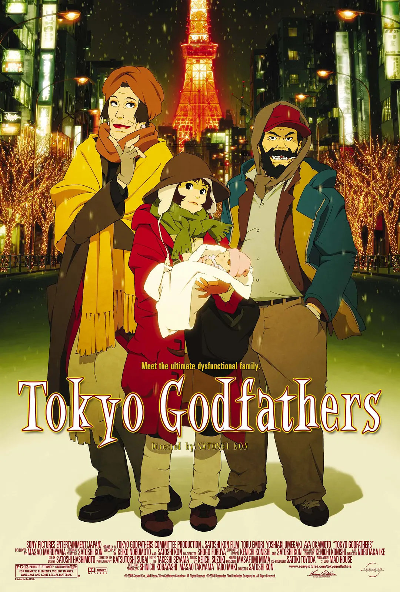
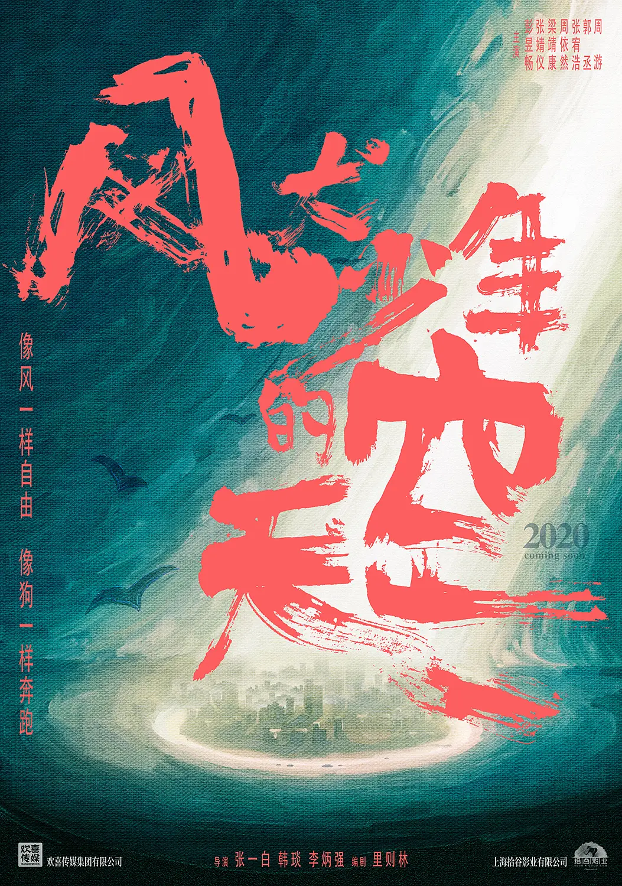

虽然本博客是以技术博客为主，但也记录一下生活。在此记录看过的电影、电视剧、图书等等。豆瓣的备份。

## 2021.01.08 Soul

误操作美团买的票，但电影很不错，老少皆宜。「生活的意义在于生活本身」已经并不新鲜，但并不是容易做到。我们仍然时常迷失在执念之中，忘记生活的本真。

电影中有一些有意思的意象，比如投入忘我与陷入执念的相似，比如陷入执念会让人变成行尸走肉。甚至「寻找自己的意义」本身也会成为执念。陷入迷思记不起来自己的价值时，脑海中否定的声音就像是全世界所有人都在说「你没有价值，你百无一用」。但这并不是真的，一片树叶也是生命的价值。

## 2021.01.25 东京教父

今敏大师作品。圣诞夜的温情故事。

## 2021.01.31 风犬少年的天空

国产青春片比较贴合我们的青春，但人物、情节确实差一点，后半部分以及结尾情节有些不必要的波折，有点为虐而虐。

