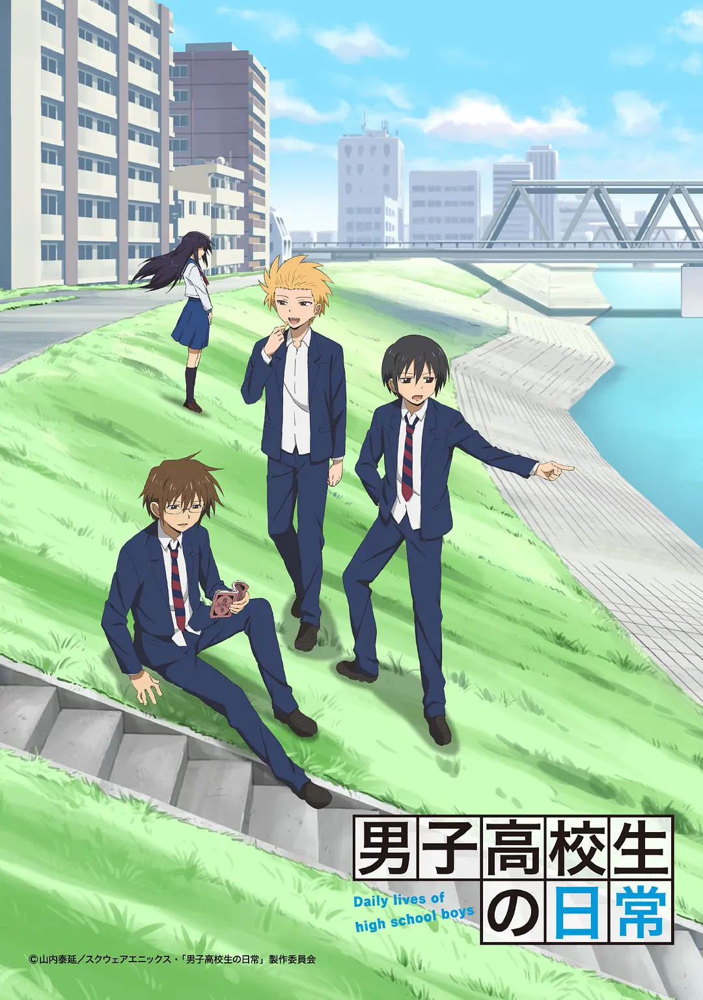
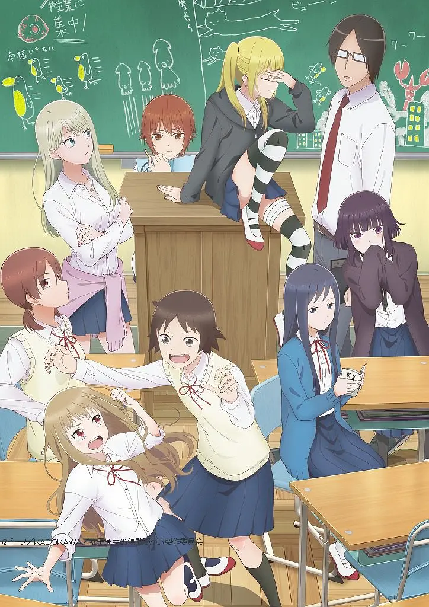
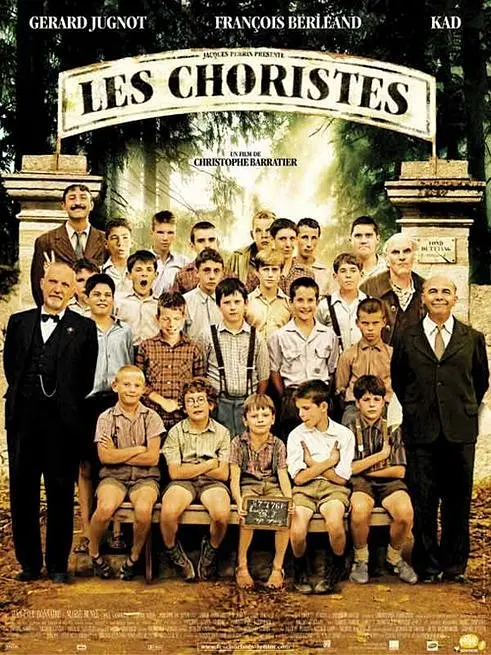
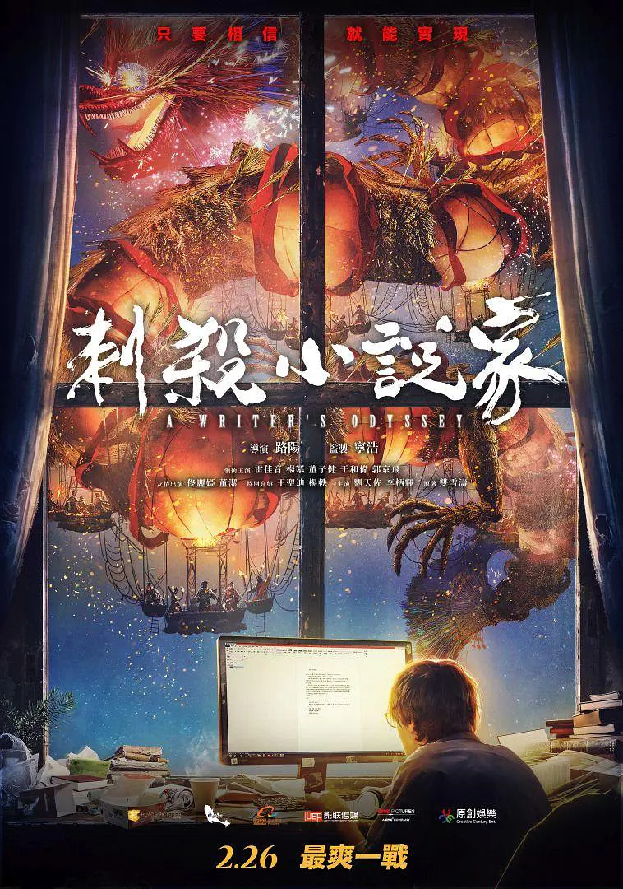

## 2021.02.05 男子高中生的日常 & 女子高中生的虚度日常

两部著名的搞笑日常番。男高要早一些，诞生了「文学少女」等著名梗。女高出的要晚一些，热播时不少人慕名去补了男高。

更喜欢男高一些。男高总让我想起「喜剧的内核都是悲剧」，比如小时候被邻居大力妹子打出的永久伤疤 & 心理阴影，而打遍几条街的妹子长大之后没有男生敢追。众所周知动漫人物都是打不死的，动漫人物常常会打来打去，所以这部动漫也常常打人开玩笑。我看到过评论表示这引起不适，但我感觉这是再用一种戏虐的方式表达真实的伤害甚至暴力。喜剧的最高价值就是以戏虐的视角看待悲剧，于是悲剧不过是一点滑稽而已。

女高出得更晚，人物多少有点脸谱化，然后构建一些无害的单元喜剧。这部动漫的高光点是后期有一集狗粮，据说是作者真人经历改编，值得一看！

<table> <tr>
<td>  </td>
<td>  </td>
</tr> </table>

## 2021.02.18 放牛班的春天

经典作品，以前可能看过，重温一遍。

没有不可救药的学生，可惜合适的教导可遇不可求。

## 2021.02.25 刺杀小说家

还行，国产片新尝试，糅合了很多元素，印象深刻的有重庆的 3D 街道、强行超能力大战，还不错的特效，最后也算是圆回来了。

