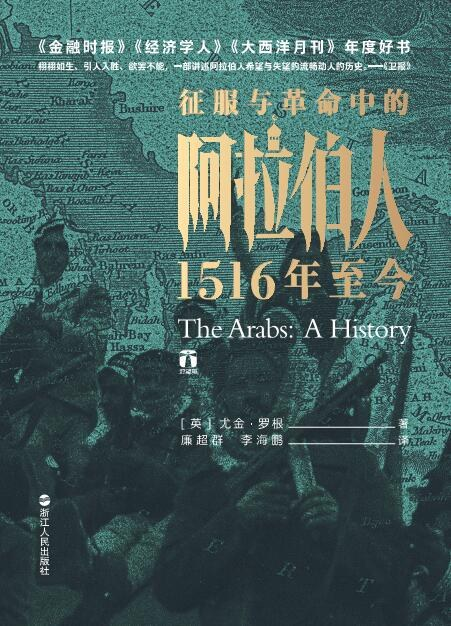
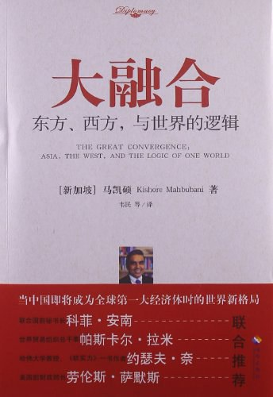

## 2021.03.04 征服与革命中的阿拉伯人

阿拉伯从 1516 年到 2015 年左右的历史。

暴力和仇恨解决不了问题。暴力可以消灭一个国家，消灭一支军队，但强加的政权终究会被持续的反抗，导致统治的代价过于高昂。中东的历史中，一个国家或民族如果不能正面抗击敌人，就会建立流亡政府，诉诸游击、甚至恐怖主义。

联合如此艰难。殖民者随意划分的国境线维持几十年之后就会成为历史事实，纠缠各方利益，加之宗教、民族、历史等等问题，纷争之中仇恨和纠纷逐渐积累，国家甚至会进一步分裂，更不能奢望走向联合。

## 2021.03.14 极简主义者的崛起

在图书馆捡到的一本书，不怎么样，整本书比较散，字号大排版稀疏很快就可以看完。但之前没有读过介绍日本极简主义的书籍，借此可以有一点感觉。

一些关键词印象：泡沫经济之后，低欲望，老龄化，少子化，邻里，社区，从欧美崇拜到重拾日本文化，实用，极简，依托都市基础设施的生活，便利店，租房，不婚，少物件。

## 2021.03.22 大融合

在图书馆捡到的另一本书。这本书的「国际背景」非常有意思，是一位印裔新加坡人于 2013 年左右创作的，有大量关于中美内容的一本书。

十年过去了，「大融合」趋势是否还在延续是要画个问号的。近几年（2021 年）反全球化浪潮兴起，但其实也符合了书中提到的，因为人口的差异，西方迟早要让出主导地位，但西方尚没有准备好。最大经济体和最快发展经济体之间的矛盾，在多年之后的今天越发尖锐。

这本书还提供了一个了解东盟的视角。读过之后才了解到，东南亚地区成分非常复杂，人种复杂、宗教复杂、存在历史遗留问题，但东盟却将这些国家整合在了一起，成为仅次于欧盟的最成功的地区联合。

对于封闭的国家，不同于西方的制裁措施，书中提到东盟会更积极的与之接触，与之建立经济联系、邀请参加国际会议、邀请留学等等，让这些封闭国家的领导人和精英阶层看到世界的发展，之后他们就更有可能自愿的走向开放。（不幸的是，书中作为例子的缅甸最近又政变恢复到军政府状态了。）

大融合之所以能够进行，是因为越来越多的国际交流使得各国精英阶层趋同。精英阶层接受了相似的教育（欧美顶尖大学），在留学和旅游过程中受西方理想社会形态熏陶，归国之后就会引入西方社会的一些要素。但是，特别在最近几年，这种趋势都在逆转（比如，上一本书《极简主义者的崛起》就提到了日本和风复兴）。这是暂时的调整还是说趋同有其极限尚不得而知。

印象词：多样化，开放，交流，留学，旅游，欧美大学

