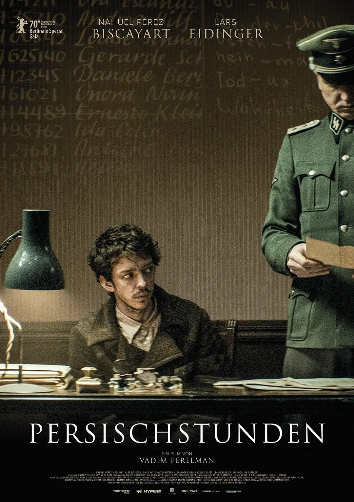
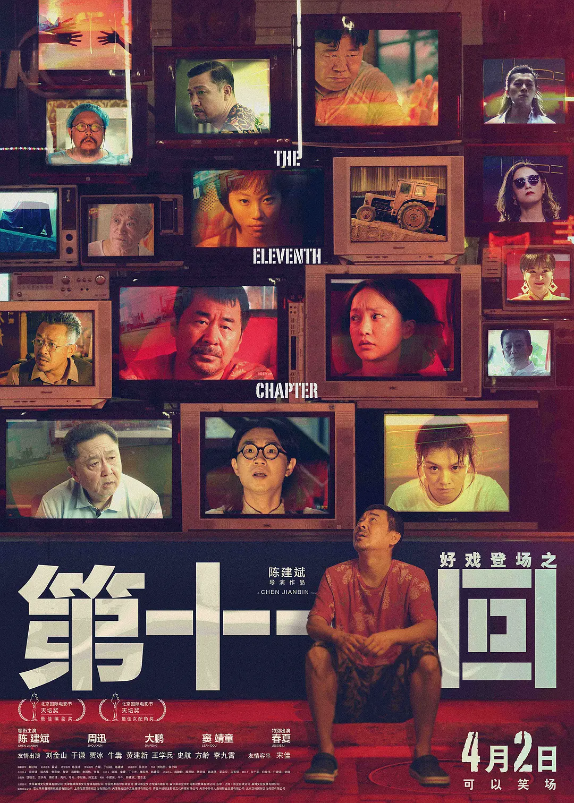
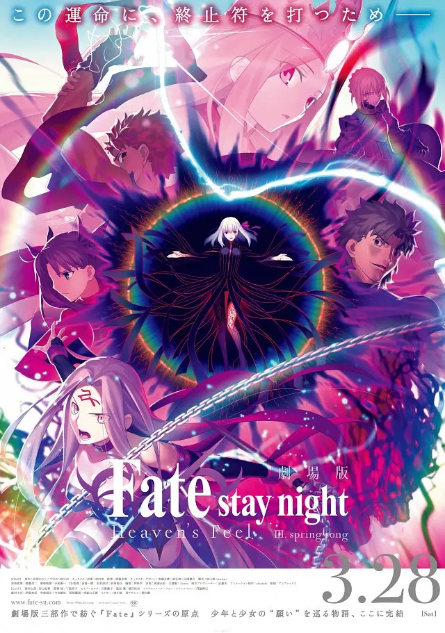

## 2021.04 波斯语课

战争残酷，战争会将普通人便成畜生或者恶魔。上波斯语课的德国军官其实只是个厨子，梦想是去波斯开一家餐厅，但他因为「觉得酷」加入了纳粹党，于是身不由己。尽管他没有直接杀人，但他喂饱了那些军人。

看完之后，我感觉关于纳粹、二战的电影我可能看得太多了，有点审美疲劳，甚至开始感觉这其实就是制作更精良的抗德神剧。。暂时休息一段时间吧。

## 2021.04 哥斯拉大战金刚

拍的不错，看这个标题就有画面了，不用贴海报。。

著名笑话，金刚：导演，你确定让我打这个？

## 2021.04.11 第十一回

其实看不太懂。老马，屡次露骨的做「传声筒」，只会复述别人的话，没有主见，屡次说「现在的好日子」，他会觉得自己已经在过着好日子了。很多人过的很惨，但除了荒谬，似乎「说不上来」问题在哪里。

其实再想想，也很明显。比如女儿重走妈妈的老路，比如导演把自己演进戏里去了，甚至殉情，他殉情其实也很荒谬，没有看出来几分伟大的爱情，更像是一种把戏演砸了的走投无路。。

另外，看了看豆瓣的评论区，各有看法。。

另外，这部电影是 19 年的电影现在才上映，也是有点意思。。之前不知道在什么文章上看到过老马在电视前大喊的那一幕，影院里看到这一幕的时候猜测应该是个九电影，因为「种种原因」现在才公映吧。。影片内外，鲜明的时代色彩。

## 2021.03.31 Fate / stay night [Heaven's Feel] III. spring song

这个超长的片名。。所以这是一部粉丝向深宅剧场版。由于众所周知的原因，我们现在能看到了。海报上 Illiya 穿上了天之衣，也是官方剧透了。

Fate HF 对我意义重大。第二部 Lost Butterfly 上映时国内有引进，我得以在影院观看，在荧幕上我终于看懂了，圣杯战争只是假借的故事，FSN 这部作品讲的果然是几位少男少女的故事，而且是可以投射到现实中的故事，FSN 作品因此有其深度。Lost Butterfly 给我留下最深刻印象的是其结尾，为什么结尾到樱杀死哥哥？她已经杀死许多人，为什么杀死她哥哥后就此黑化？我的理解是，其实之前杀人都是发生在圣杯战争的夜间，如果理解「圣杯战争只是假借的故事」，那么这些杀人并未发生在现实世界，而她杀死哥哥是发生在现实世界里的事。第三章里，黑樱也提到过，「哥哥死了，爷爷也死了，那我。。」发生在夜间的黑影吃人可以理解为噩梦。观看第二章还终于理解了为什么 FSN 要做成一部成人游戏，有些内容确实是借助这样的载体能够最佳的表达。

第三章，樱与凌决战。命运的不公就是，樱沾染黑暗罪恶，在黑夜吃人，咽下无数痛苦得到【力量】，以为终于能超越姐姐一次，因此多么痛苦也不想放弃。可凌亮出了宝石剑，就像毫无代价一般，轻描淡写，远坂家族的传承，闪耀着光芒驱散黑影。。Fate 就是，樱付出一切得到的，凌可以轻描淡写的得到，还作为一次性武器随手丢弃。所以她对樱说出「我并不觉得我是得天独厚之人」之时，樱会彻底崩溃。

片尾 Aimer 的主题曲响起，FSN 几位少男少女最后的故事终于落幕。。

## 2020.04.09 进击的巨人

大一看的巨人第一季动漫，现在巨人终于完结，我也要毕业了。不幸的是，巨人烂尾了，而且号称史诗级烂尾。。这个结尾刚看时还想说说好话，但越想越不对劲。进击的巨人主题是为自由而战，这个结尾自由到哪里去了？真的是只有艾伦的头是自由的。

我猜测这个结尾是迫于压力修改过的，谏山创原本的结尾可能是灭世成功，但那是不折不扣的法西斯主义，我们之前还以为谏山创是反战的。。巨人的设定，埃尔迪亚人可以变成巨人，这是诅咒，但也是强大的力量。特别是「地鸣」设定中是绝对无法阻挡的灭世力量，艾伦掌控地鸣之后，烂尾就不可避免：如果不使用地鸣，就是圣母式烂尾。如果使用地鸣，就是法西斯再世，将会在三次元遭遇严重的问题。现在的结尾有点像鲁鲁修结尾，但比鲁鲁修差远了，因为鲁鲁修明确的铺垫过要终结战争，而艾伦没有足够强的动机在拥有绝对力量时牺牲自己，所以被调侃成用灭世的力量为兄弟们搞到了绿卡。

烂尾的根源在于，谏山创设定了一个种族，这个种族拥有其他种族都没有的绝对的力量，他们被困在一个岛上，他们有毁灭世界的能力，这确实是不折不扣的法西斯设定。。我本来以为他最后要通过反转这个设定（比如意外发现其实所有人都可以变巨人，这就意味着所有人是平等的，艾尔迪亚人是单纯的被陷害的受害者）来升华主题，但他并没有，艾尔迪亚人至始至终都是特殊的。

尽管史诗级烂尾，但巨人前半部分仍然曾经给我们带来许多震撼和感动。为自由而战，为自由而献出心脏。但也为平等而战，为平等献出灵魂。

---

另外，四月份，一月番完结。除了 3 月份已经记录过的咒术回战，看过的还有：

- RE0 制作精良，深宅动漫，没有太多好说的
- 堀与西宫 一月的高评分狗粮片，情节不起伏，顺顺利利谈恋爱。这部番吸引我的是它非常有特色的 OP 和片头曲，OP 画面其实也是对剧情的补充
