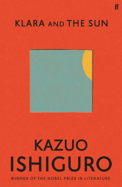

## 克拉拉与太阳

人工朋友 AF 也即人工智能陪伴机器人克拉拉，与女孩乔西在商店橱窗里互相看的一眼即互相选中了彼此。克拉拉被买到乔西家里成为「家庭的一员」来陪伴乔西，但乔西却身患重病。

克拉拉是太阳能机器人，她信仰着太阳是全能的。她曾经在商店橱窗目睹一个乞丐晚上似乎死去了，却在清晨的阳光下「复活」，因此她相信太阳可以给予「特殊的滋养」帮助乔西康复。为此，她去往她认为的太阳下山要路过的一个谷仓，向太阳祈祷，甚至保证为太阳「做点什么」，破坏掉一台污染空气遮蔽阳光的工程机械。

但随着一次进城为乔西画像，克拉拉终于得知，母亲无法接受可能会失去乔西，为此她跟一名疯狂的工程师正在试图制作一个机器人替代或者「延续」乔西，而克拉拉需要观察乔西，一旦乔西离去她即「占据」那个机器人的躯体，成为乔西。这一次进城乔西的男友里克也在寻求步入大学的机会。乔西的病其实来源于她接受了那个时代普遍的基因工程增强，而里克并没有，因此未来的前景暗淡。但同样这次进城，克拉拉在父亲的建议下，用自己的「血」破坏了那台机器。但回家的路上却看到新的、更坏的机器出现了。

太阳并未降下「特殊的滋养」，克拉拉再次来到谷仓向太阳祈祷，希望太阳宽恕自己。乔西和男友里克彼此深爱着，克拉拉认为太阳希望看到人们彼此相爱而不被死亡分开，因此祈祷太阳帮助他们。

在乔西一段时间的重病之后垂危，太阳的奇迹却在一天穿越乌云真正的降临了。乔西醒了过来，并渐渐恢复了健康。

于是替代计划不必执行。乔西逐渐长大并要步入大学，里克因为并未接受基因增强与她有着不同的人生道路，渐行渐远。长大的乔西越来越不需要克拉拉，克拉拉从乔西的卧室搬到了杂物间，并在乔西上大学之后不知何时送入了回收站。全书即为她在回收站的回忆。她在回收站里仍然在感恩太阳的仁慈、一家人对她的爱。

-----

这本书有太多令人感慨的故事细节。有人说太阳降下恩惠过于梦幻，真相是克拉拉用自己的「血」破坏掉机器之后就坏掉了，后面的都是她的幻想。但我却觉得在这之后的故事非常的真实。乔西如果不是面对死亡，就并不会那么软弱、那么孤独，因此她痊愈之后渐渐不需要克拉拉了，更何况她在长大。故事一开始在一个家庭聚会中就已经明确乔西跟里克不是一个阶层的人，甚至他们在基因层面也是不一样的，他们注定要走向不一样的人生，孩子之间的约定难以保证兑现。乔西不必面对死亡，因此诡异、恐怖的「替代」计划就不必要了，故事前半部分有在渲染母亲逐渐向克拉拉投注或者转移感情，而乔西一旦康复，这也不必要了。

克拉拉最后被废弃，在垃圾场回味着这一切，这总让我想起宠物。宠物无论寄托了主任多少感情，一旦大难临头大部分人都会理智起来，那只是一只猫，一条狗，不会为他们付出太大的代价 —— 也不该付出太大的代价，毕竟这个世界上还有许多【人】得不到良好的照顾。无论如何，她只是个机器人。我还会想起《星际穿越》中机器人 TARS 牺牲自己驾驶飞船飞向黑洞，库伯认为「我们不能眼睁睁看着 TARS 牺牲」，但艾米利亚却指出那正是 TARS 的设计使命 —— 必要时牺牲自己保护人类，它乐于完成它的使命。机器人毕竟与人不同，尽管很多人因此批评人类的自私，但毕竟，这是机器人的使命，创造者赋予它们的使命。不妨做一个区分，有些文学作品中会将此渲染为对机器人的压迫，这种作品一般是用机器人映射现实世界中对某些族群的压迫。还有些作品强调这是他们的使命，这些作品可能更强调机器人作为「物品」，「造物」，我们会对物品倾注感情，但终究它们为我们而存在。

或许更可悲的是，克拉拉一开始就知道人类很孤独、人类害怕孤独，所以需要 AF 的陪伴，没有 AF 陪伴的孩子非常的可怜。这似乎是生活在城市的孩子、生活在城市的人类面对的不幸的事实。。

这本书杂糅了很多热点社会和科学问题，比如人工智能、人工智能抢人类的饭碗、基因编辑、社会分层、社会固化等等。我一直是对这类话题不太感冒的，因为「作为人工智能相关行业从业者，我深知有多少人工才有多少智能、现代的人工智能完全是人工智障，有生之年取得重大突破是不可能的」。但这是技术视角。从旁观的、社会的视角看待这个问题，反而可能比局内人看得更远。机器人、变种人、生化人等等以前常常只是科幻作品里映射现实的一个象征，但或许什么时候就会不再象征什么东西，而是认真的讨论它们本身，为其到来做准备了。

## 白蛇 II 青蛇截起

我找来这部电影简直是主动吃屎。。还专门开了反向梯子看 B 站。。这电影不太行，杂糅了太多乱七八糟的东西，甚至嗅到了性别相关热点的气息。故事结构在各个层面上也是不完整的。

这几年国产动画电影拍了几部，但我们差的远远不是技术，甚至也不只是自由发挥的空间。我们的作品常常只是各种热点素材和主流观念杂交上一些熟知的故事，并没有作为一步作品想要讲的故事、没有作为内核的创作者的观念与情感。
