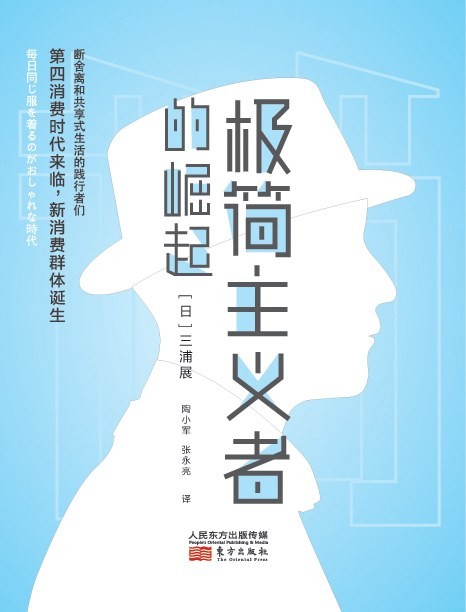
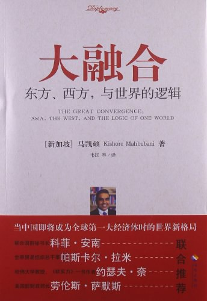
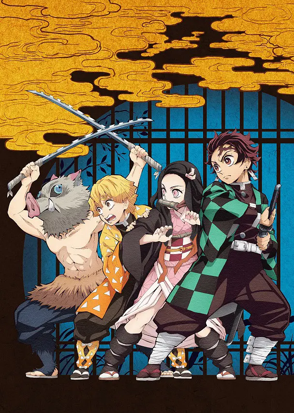
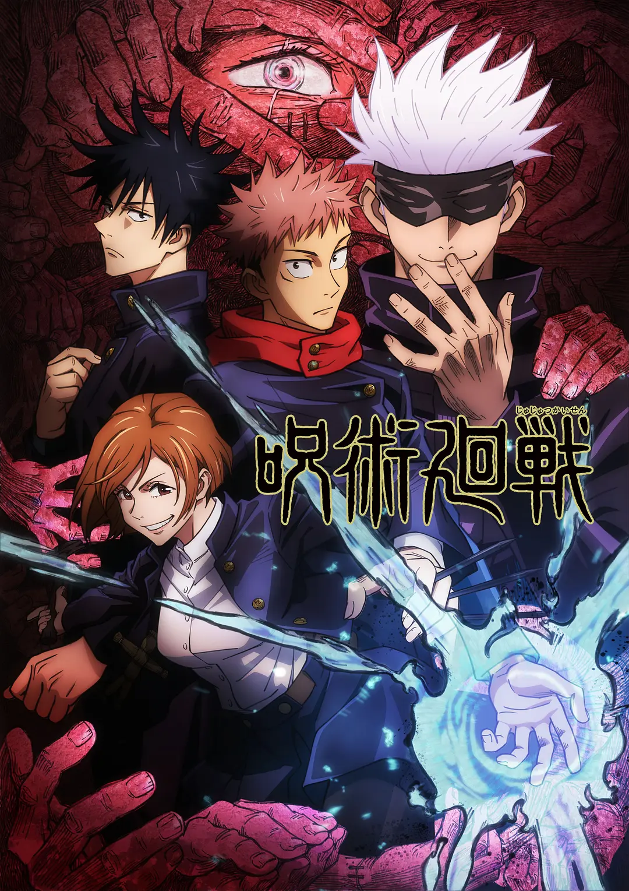

## 2021.03.04 征服与革命中的阿拉伯人

阿拉伯从 1516 年到 2015 年左右的历史。

暴力和仇恨解决不了问题。暴力可以消灭一个国家，消灭一支军队，但强加的政权终究会被持续的反抗，导致统治的代价过于高昂。中东的历史中，一个国家或民族如果不能正面抗击敌人，就会建立流亡政府，诉诸游击、甚至恐怖主义。

联合如此艰难。殖民者随意划分的国境线维持几十年之后就会成为历史事实，纠缠各方利益，加之宗教、民族、历史等等问题，纷争之中仇恨和纠纷逐渐积累，国家甚至会进一步分裂，更不能奢望走向联合。

## 2021.03.14 极简主义者的崛起

在图书馆捡到的一本书，不怎么样，整本书比较散，字号大排版稀疏很快就可以看完。但之前没有读过介绍日本极简主义的书籍，借此可以有一点感觉。

一些关键词印象：泡沫经济之后，低欲望，老龄化，少子化，邻里，社区，从欧美崇拜到重拾日本文化，实用，极简，依托都市基础设施的生活，便利店，租房，不婚，少物件。

## 2021.03.22 大融合

在图书馆捡到的另一本书。这本书的「国际背景」非常有意思，是一位印裔新加坡人于 2013 年左右创作的，有大量关于中美内容的一本书。

十年过去了，「大融合」趋势是否还在延续是要画个问号的。近几年（2021 年）反全球化浪潮兴起，但其实也符合了书中提到的，因为人口的差异，西方迟早要让出主导地位，但西方尚没有准备好。最大经济体和最快发展经济体之间的矛盾，在多年之后的今天越发尖锐。

这本书还提供了一个了解东盟的视角。读过之后才了解到，东南亚地区成分非常复杂，人种复杂、宗教复杂、存在历史遗留问题，但东盟却将这些国家整合在了一起，成为仅次于欧盟的最成功的地区联合。

对于封闭的国家，不同于西方的制裁措施，书中提到东盟会更积极的与之接触，与之建立经济联系、邀请参加国际会议、邀请留学等等，让这些封闭国家的领导人和精英阶层看到世界的发展，之后他们就更有可能自愿的走向开放。（不幸的是，书中作为例子的缅甸最近又政变恢复到军政府状态了。）

大融合之所以能够进行，是因为越来越多的国际交流使得各国精英阶层趋同。精英阶层接受了相似的教育（欧美顶尖大学），在留学和旅游过程中受西方理想社会形态熏陶，归国之后就会引入西方社会的一些要素。但是，特别在最近几年，这种趋势都在逆转（比如，上一本书《极简主义者的崛起》就提到了日本和风复兴）。这是暂时的调整还是说趋同有其极限尚不得而知。

印象词：多样化，开放，交流，留学，旅游，欧美大学

## 2021.03.23 动漫 鬼灭之刃

去年出圈的动漫，其剧场版《无限列车篇》超越宫崎骏新海诚诸多大作登顶日本影史第一，要知道《无限列车篇》是有前作的动漫剧场版，受众不如没有前作的电影广，登顶影史第一实属不易。主题曲《红莲华》更是把 LiSA 送上了红白歌会。

正在热播的时候其实看过几集，但对这种题材不太感冒。这部动漫是所谓的王道题材，人设非常典型，主人公热血励志，情节简单。我总感觉「还行」，但没有巨人、Fate 那种决定性的亮点。但动漫制作精良，作画、音乐无可挑剔，无愧良作。可惜剧场版在大陆看不到。

之前读过一篇文章提到，《鬼灭之刃》跟传统的拯救世界题材的王道动漫不同，主人公炭治郎至始至终的动力都是拯救妹妹，一家人和睦的生活下去。日本这一世代的年轻人已经没有关于世界的野心了，所以对家人题材比较有感觉。炭治郎老亚撒西了，杀的每一个鬼都会有尊严的死去，超度的漂亮。全篇每一个反派角色，包括最终 BOSS，都有其故事，为什么走上邪路，都是可怜人。

这篇文章被我找到了，[不宽容的时代，人们对温柔的饥饿感。](https://mp.weixin.qq.com/s/9uMUIC8VjW_e7lJ2sZ7HVg) [【存档】](https://web.archive.org/web/20210328021310/https://mp.weixin.qq.com/s/9uMUIC8VjW_e7lJ2sZ7HVg)

这动漫有一个优势，是全年龄向的，不用删减就能在大陆播放，既不血腥也不色情，能拿上台面，所以才能出圈。虽然这几年对这些题材没什么共鸣了，但良作不可多得，什么时候找机会补上剧场版吧。

## 2021.03.28 动漫 咒术回战

类似鬼灭之刃，制作非常精良的动漫，第一季完结撒花。最后两集武戏惊艳。咒术回战已经确定制作剧场版，今年冬天上映（当然大陆大概是无缘了）。如果能形成亏本制作精良的 TV 动漫，然后剧场版大卖的良性机制也是极好的。

话说鬼灭之刃的 OP 红莲华出圈，咒术回战最出圈的却是 ED1 画面、五条悟老师盛世美颜。

我也看到过关于咒术回战的一篇文章，但不幸的是找不到链接了。咒术回战中五条悟就像是已经长大的少年漫主角，七海则是「靠谱的大人」形象，或许折射出这一代少年对靠谱成年人的期待。

