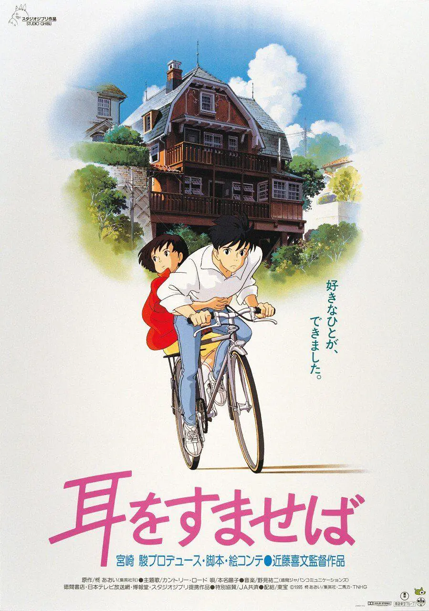
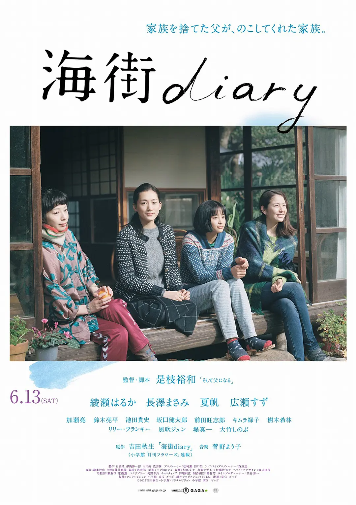
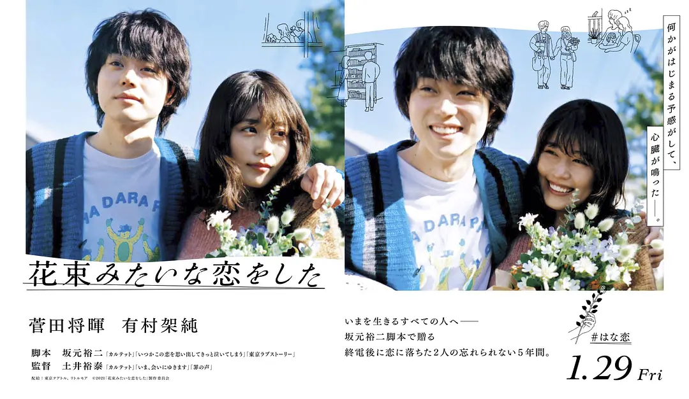

## 2021.07.10 侧耳倾听 / 耳をすませば

毕业旅行时队友推荐的 1995 年的动画电影。

国中生月岛雯在每次借书时，书本借书卡上常常已经有个名为圣司的男生。于是月岛雯隐约好奇这个跟自己有着相似爱好的男生，却因为几次意外发现圣司就是几次因为自己落下东西出丑而认识的男生。两人的关系在圣司爷爷的小店中渐渐靠近，某天月岛雯撞见了正在制作小提琴的圣司，巧合之下圣司演奏小提琴，月岛雯唱了自己填词的 Country Roads. 但对于圣司而言真正重要的不是演奏，而是制作小提琴，他立志成为小提琴工匠。他争取到了去意大利工坊学习的机会，并通过在本地的工坊的实习向父亲证明了自己的决心和潜力，启程去意大利学习。

在圣司追求自己的理想的过程中，月岛雯也在思考着自己成为怎样的人、如何证明自己。她喜欢阅读，并决定将圣司爷爷与店里猫男爵陶瓷人偶的故事改写成小说。她为了这本小说而调研了许多文献，彻夜撰写，将此看的比即将到来的升学更为重要。

月岛雯完成小说之际，将小说带给圣司爷爷阅读，单她对自己的创作并不自信。爷爷给憔悴的月岛雯做了一碗面，在她休息之时慢慢阅读。爷爷很喜欢月岛雯的故事，月岛雯终于松了一口气，回到家里睡下。她在醒来之时，归国的圣司正在楼下等着，并用自行车带着她去自己的「秘密基地」看日出。

这部作品的情节非常经典，我在观看时处处都是似曾相识。但即使是已经熟悉这些情节，在观看这部电影时也没有感到缺乏新意，而是一种「这才是经典」的感觉。

以借书卡为载体的两人的相识，在同为 1995 年作品的《情书》中也有类似的情节，甚至新海诚著名的函授补习班广告中也是一个味道。于是，两人因为一种较为小众的爱好在不相识的前提下结缘。这种情节安排让两人仿佛大千世界里两片不一样的叶子，但又彼此共鸣。还可以安排辅助情节，两人在现实世界中再以另一种途径见面，比如在女生出丑时相识，并在发现身边的人就是自己注意许久的人。甚至还可以更「经典」一点，那个人也已经注意自己很久了。「灵魂伴侣」实际上是身边的人，这种安排方便故事的展开。可惜现代太多的人用「阅读」给自己打标签，并且再也没有借书卡了。

故事中，少男少女都在探索去追寻自己想成为怎样的人。圣司在故事开始时就已经立志要成为小提琴工匠，甚至是「最好的小提琴工匠」。为此他要去小提琴故乡意大利求学，于是产生了两人要分开的故事情节，给女主去寻找自己的理想的空间。圣司为了去意大利需要放弃通常的学业，为此他首先需要说服父亲。他在爷爷朋友的小提琴工坊实习一段时间，借此证明自己「是不是这块料」。月岛雯这边也有对偶的情节，她的故事完成之后，就万分忐忑的将故事带给爷爷去看。影片中着重表现了月岛雯在「等待评价」时的焦虑不安，以及最终爷爷评价为「是一个有趣的故事」时终于放下了创作过程中的紧绷，回家好好睡一觉休息。

这类情节在日漫中特别常见。特点是寻求某长辈认可自己，付出诸多努力、忍受痛苦证明自己「是不是这块料」，「有没有才能」。寻求权威或者长辈的认可在中文语境中不那么常见，中文语境从《西游记》开始就信奉有没有才能要打一架来体现，并且近现代历史消解了诸多对于权威的信仰。中文语境也不太强调「才能」这种东西，孙悟空或者郭靖，都是只要「根正苗红」、拿到了秘籍或者法宝就有了才能，不需要做什么证明自己「配不配」。

关于「才能」的情节尽管在故事中非常经典，但放到现实世界就太可怕了。青春、奋斗系日漫中常见对于「才能」的讨论，一种典型冲突情节就是，没有才能的人无论如何拼尽全力都没有办法胜过有才能的人，后者通常是故事主角。同样作为东亚社会，容易看出这个情节是我们社会压力、教育系统营造出来的。

动画的最后，圣司用自行车载着雯去看日出。途中有一个大坡，圣司一边费劲的蹬着自行车，一边说「我早就想好了，我要像这样载着你翻山越岭」，而雯跳下自行车，在后面推着自行车为圣司助力，并说「我不要成为你的包袱，我要在背后支持着你」。这一情节象征了影片中理想的伴侣吧，两人互相扶持、共同拼搏前进。

作为吉卜力作品，本作有着优美的画面，「满足了对夏天的全部幻想」，以及优美的音乐。月岛雯填词翻唱 “Take Me Home, Country Roads”, 这首歌每次出现都令我难忘。

## 2021.07.14 海街日记

队友推荐的另一部电影。同样的夏天、清新的故事。四姐妹温馨的家庭故事。

## 2021.08.14 花束般的恋爱

100% 的合拍抵不过柴米油盐的故事。电影看到 30% 忍不住看了看时间：到这里就已经到了幸福的高峰，那后面一个多小时得多虐啊。。之后，麦为了留住两个人的幸福时光而走入社会，但却在社会的毒打之后忘记了初心，不再相信当初的幸福时光可以留存。麦从当初的文艺青年变成了社会人。没有时间读小说、看漫画、看电影看展，于是失去了与娟的交集。

从娟的视角，麦步入社会之后果然应了她妈妈的话，变成了他们当初最讨厌的人。麦不再陪她去看电影、看展，看的书也变成了如何成为成功人士。甚至麦熬夜加班还会「居功」，影片中娟几次给麦端水，而麦会说一些大道理。在他们的朋友因为家暴分手时，我甚至担心会不会出现家暴情节。。但导演还是没有那么残忍吧。

有点讽刺的是，麦的前辈说过，工作「坚持五年就好了」，所以两人分手时麦工作压力最大的几年已经过去了。但失去的再也不会回来了。

我大概年龄还小，看这一部作品时更多的感觉他们可以更多的抗争一下。为什么步入社会就要忘掉初心，否定过去的自己？为什么能同甘不能共苦，为什么不能一起努力找回过去的感觉？难道「文艺青年」就是读一些书，看一些展吗？去掉这些标签，没有时间做这些事，就完全变了一个人吗？这样来看，就会发现这部作品描绘的两人的「共鸣点」有些浅，基本上是特别适合豆瓣的一些文青活动，并没有去深入探讨他们是怎样的一类人，「深处」有什么共鸣。所以当生活压迫之下，失去了「形式」，也就失去了身份标签。

但这当然不是这部作品的主题。多数人在生活面前都是无力的，像电影中一样，感觉消失之后，什么都不重要了，一拍两散，各寻欢喜，只留下美好的回忆，花束般的恋爱如花束般的短暂。
