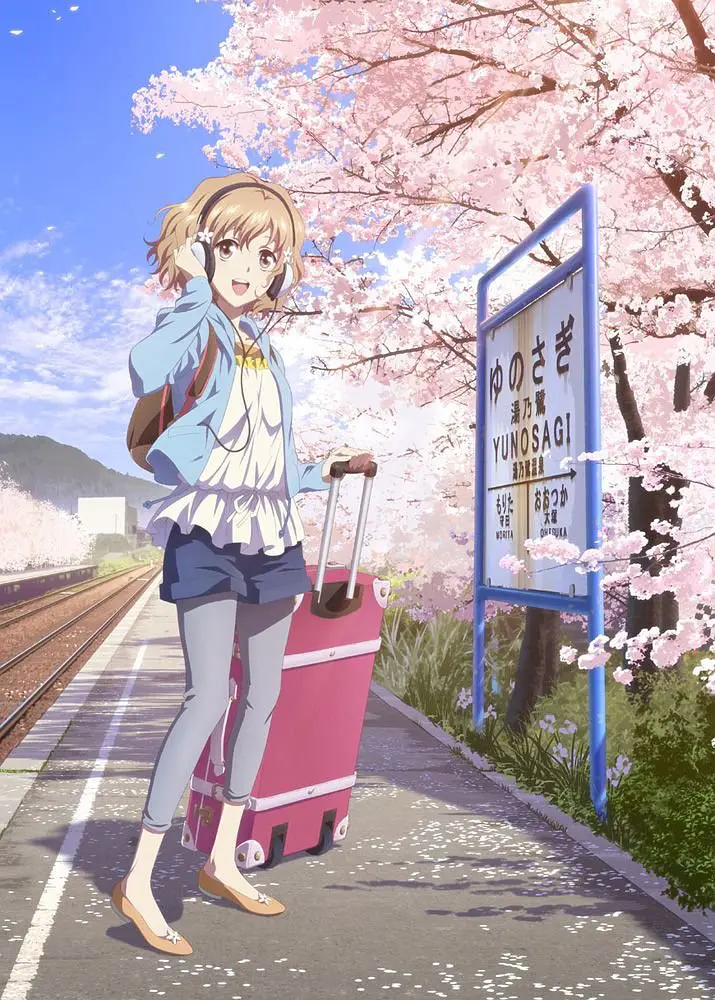

2011 年著名作品，而现在是 2021 年了，我在研究生毕业、开始工作之际看完了这部作品，而且前前后后看了几个月，看第一集的时候我还在为毕设头疼不已，今天看完我已经是个社会人了。

这部作品对于我的观看体验其实不太好。我看到一条豆瓣评论深有同感：无法接受第一集就甩耳光，吃了耳光还得说谢谢的价值观，奴性到骨子里了。因为这部动漫很有名，好几年前看过几集，也是因为这个情节比较恶心没有看下去，但这一次我想我已经老了老几岁了，要接纳不同的观念、不能极端。于是硬着头皮看了下去，最后的感觉是，这部作品确实不太一样。

这部作品片头曲第一句「泪水每次敲打脸颊，便会更加美丽」，听上去就有受虐倾向。这作品中女主绪花母亲是个「不中用的大人」，在家里甚至需要女儿做饭。绪花则是典型的开朗、充满了活力的形象。因为母亲私奔而投奔开旅馆的外婆，在旅馆受到外婆严苛但有有原则的对待。。这部作品很多人物的塑造是有争议的，外婆第一集甩耳光、性格特别别扭的民子、不中用的母亲。于是，女主的开朗和活力就会显得很不合理 —— 没有人能够无限制的承受、无限制的充满活力，「泪水每次敲打脸颊，便会更加美丽」只可能是过于美好的幻想。

这部作品并不会批评以上所有的这些不合理的对待（泪水的来源），而是为所有的这些事件找到了「理由」—— 后文有交代，妈妈总是换男朋友是因为始终忘不掉死去的父亲；外婆是坚持宾馆顾客至上的原则；民子一心想要成为厨师，这个梦想是她的一切。但这正是这部作品别扭的地方：它一边叙述别人有多过分，一边为别人开脱。这就是这部作品令我不舒服的地方 —— 它将所有的不合理视为天经地义，仿佛原谅这一切、开脱这一切就可以「更加美丽」。

这跟这部作品另一个争议点可以互为表里：「顾客至上」。虽然服务业确实有这个说法，但一般理解的服务是基于平等关系的服务，服务人员只是多了一些礼节。但这部作品确实含有一些生动的、字面的诠释这一原则的情节。比如一开始绪花被扇耳光是因为她把室友发霉的被子晒在外面，影响了顾客的风景，再比如绪花母亲作为客人入住，外婆和绪花也要把她当作客人对待。职业原则无限制的压倒了其他原则、职业身份无限制的压倒了其他身份。

也算是鲜明的国家特色吧。

这部作品评分存在分化，有人表示反感、无法理解这些人的行动，但也有人共鸣。不争气的父母、严苛的长辈，在这样的环境之下常常是无能为力的。最好抱有美好的期待，希望泪水让自己更加美丽。

本作另一大主题是「工作」。投入的工作，工匠精神，在此找到「想做的事」，找到「归宿」。尽管夸张，但能找到愿意为之投入的工作是每个人的幸运吧。
