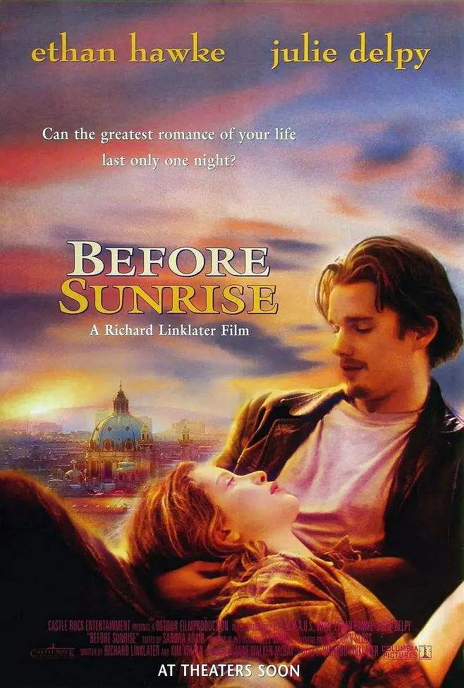

Richard Linklater 著名的三部曲，两人火车上初试并度过梦幻的一夜，失去联系多年之后因为 Jesse 的书重逢并结婚生子，多年之后婚姻生活却充斥着对彼此的不满以及互相的指责。。

第一部 Before Sunrise 是经典的相遇的故事，两人在旅途中相遇，在一座陌生的城市下车闲逛，彼此共鸣。一座陌生的城市就像一个世外秘境，所有的事情都是新奇，而且远离了两个人彼此的日常生活。这一部里 Jesse 还感觉比较青涩而不成熟，Celine 所说的就像一只好斗的公鸡、渴求注意力的小男孩。分别时两人都认为如果留下联系方式书信联络，则两人之间的关系就会逐渐变淡，于是相约六个月后再见。

第二部 Before Sunset 已是多年之后，两人在当初约定的六个月后因故未能相见，从此失去联络。而 Jesse 将两人的经历写成畅销书，以此为契机在巡回签名售书时得以与 Celine 重逢。多年之后两人都忘不掉当初的那一晚，并且生活都不尽如人意。Celine 有男友，但她男友是一个战地摄影记者在远方工作。Celine 的这种关系看起来就像是在重复他们两人当初相遇的那一晚的模式。那一晚仿佛集中了一辈子的浪漫。最终 Jesse 错过了飞机，两人留在巴黎。

第三部 Before Midnight 中我们得知 Jesse 离婚，Celine 分手，两人在一起组建家庭并已经有了两个孩子。但可悲的是两人未能免俗。这一夜里两人因为各种大事小事互相指责。Celine 抱怨自己有了孩子之后因为各种家务失去了思考、发展爱好的时间，而 Jesse 反驳她「如果把抱怨的时间八分之一用在音乐上就会成为音乐家」。Celine 指责 Jesse 不分担照顾孩子的负担，Jesse 则认为那是因为 Celine 不允许。Celine 还抱怨 Jesse 的大男子主义、两人互相指责对方出轨。最终 Celine 夺门而出在河边黯然神伤，Jesse 随后去河边找她，逗她开心。印象最深刻的是，这一部结尾，Jesse 说自己不会每一次都来挽回、逗她开心，而 Celine 突然漏出非常痛苦、要落泪的表情，但几秒钟的掩饰、调整之后，开始迎合 Jesse 的笑话，影片到此戛然而止。

三步曲看下来，可以注意到两个人多年的变化、两个人之间关系、地位的变化。特别是第三部，从梦幻的约会到生活中因琐事互相指责，从灵魂伴侣到互相限制、互相指责，非常令人唏嘘。据说影片还会有第四部，期待两人老去之后的故事吧。

