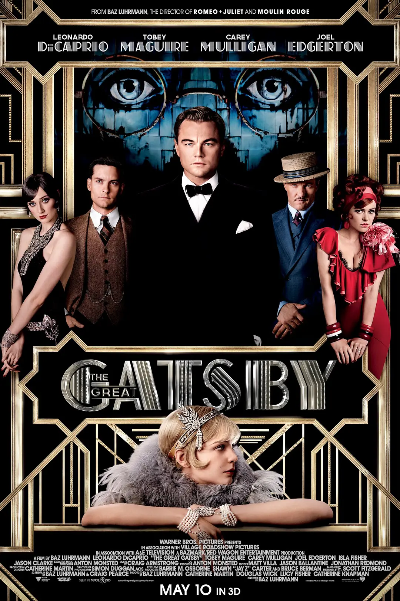

大名鼎鼎的盖茨比，看完之后，后悔应该先看小说的。经典名不虚传。

之前曾经听说过这部作品是一部关于美国梦以及美国梦的破灭的作品。按我的理解，盖茨比就是美国梦的具像化：一个出身贫寒的孩子，一贫如洗却梦想着出人头地，并有着惊人的乐观。因为从海难中救了一个富豪，学习到了富豪的绅士生活方式，但在富豪去世后并没有如愿继承到富豪的遗产。参军，取得军功，并因此得到机会去牛津进修几个月成为「牛津人」。回到美国后，在禁酒令背景下最终通过贩卖私酒暴富。

盖茨比暴富之后，念念不忘五年前身为军官时认识的千金小姐黛西。那时的他军装掩盖了他一贫如洗的身份，一表人材、积极主动的争取到了黛西的芳心。但战争之后他却迟迟没能回国迎娶黛西，等到他终于暴富时黛西已经嫁给了一个来自老牌名门的汤姆。盖茨比在黛西家对面买了一栋豪宅，每周末举办盛大的宴会，并通过黛西的表哥尼克最终与黛西见面、再续前缘。他鼓动黛西与汤姆离婚，并最终在尼克和另一位知情人乔丹的见证下，黛西、盖茨比、汤姆三人摊牌。但在这一关键时刻，黛西最终未能下定决心，并在盖茨比失态后彻底倒向汤姆。之后，盖茨比送黛西回家，路上一路狂飙却不幸发生车祸，撞死的恰好是汤姆的情妇默特尔。发生车祸时恰好是黛西在驾驶，为了掩盖真相盖茨比和黛西逃逸，但汤姆向默特尔丈夫乔治暗示正是盖茨比撞死了她的妻子。

盖茨比相信黛西最终会下定决心跟随他，没有抓紧时间逃跑而是在家里等待黛西的电话。但第二天等来的却是乔治的刺杀。盖茨比死后，不仅当初参加他的宴会的人没有出席她的葬礼，黛西也没有露面，而是远走「度假」避风头。唯有作为这个故事讲述者与见证者、作为盖茨比的好友尼克出席了葬礼。

这看似是个爱情故事，但其实也是一个关于 New Money 也就是暴发户与 Old Money 也即名门望族之间对抗并彻底惨败的故事。电影一开始就渲染着各种流言，暗示盖茨比身世显要，盖茨比跟尼克刚刚认识时就在吹嘘自己的身世与成就，甚至故意找了一个老绅士来「证明」。这是古今中外暴发户的惯常操作。盖茨比的宴会仿佛是财富的象征，极尽奢华，仿佛是那个纸醉金迷的时代的缩影，但汤姆出席时却说三教九流什么人都有，像个马戏团。

最明显的冲突发生在黛西、汤姆和盖茨比三人摊牌，盖茨比和汤姆的直接冲突，盖茨比最终惨败。汤姆其实在外面有情妇，难说他对黛西有多少爱，但很容易理解作为望族的尊严和作为男人的尊严他一定会跟盖茨比对抗，去争夺黛西。他首先质疑盖茨比的身世，质疑他的「牛津人」身份，盖茨比坦白他借助军官项目在牛津有五个月的经历。他挑明了盖茨比的财富来自于贩卖私酒，并嘲笑盖茨比穿了一件粉色的西服。最终他对盖茨比直接攻击，嘲讽他暴发户的身份，盖茨比最终被激怒，情绪失控并对汤姆挥拳 —— 但此刻恰好是他的惨败。情绪失控的盖茨比吓坏了黛西，黛西就此彻底倒向了汤姆。

在这场冲突中，来自老牌望族的汤姆不仅占据情报优势，揭穿了盖茨比的身份，而且对情绪的控制、对对手心理的把握完全压倒盖茨比，然后顺利把盖茨比击溃，让盖茨比在黛西面前显露他不过是个暴发户，展示他失去理智之后那么可怕。而至于盖茨比，仿佛是爱情的魔力之下，尼克说他「惊人的乐观」，黛西说他「你要的太多了」，甚至黛西愿意跟他私奔，但他却一定要黛西跟汤姆直接决裂，既要保留黛西，又要保留自己为黛西准备的豪宅以及所有的美梦。

车祸发生后，盖茨比做的是替黛西顶罪，所有人都认为驾驶员是盖茨比，因为那是他的定制豪车。而汤姆却毫不惊慌的在桌前安抚黛西，告诉黛西自己几个电话就能摆平这一切，黛西要做的不过是出去度个假避避风头。最终盖茨比如愿顶罪，死于刺杀。我甚至认为刺杀的死法其实是作者的善意了，事发、审判、身败名裂才是更残忍的。在这些事件中，盖茨比的冲动与汤姆的世故形成的对比，黛西没有悬念的回到汤姆的怀抱，盖茨比失去了黛西的爱，然后失去了一切。

在我看来黛西是个象征，象征着盖茨比的「美国梦」。当初他一无所有之时，对黛西的一见钟情不仅是爱情，更是一眼见到了最美的梦，所以他一辈子都在追求他当初所见的梦。但不幸的是，凡有的，加倍给他，凡没有的，连他所有的也要夺取，不论是爱情还是财富，盖茨比想要的太多，反而留不住。甚至黛西也会直接告诉他「你要的太多了」。汤姆是一个鲜明的对比，他有了黛西，还是会出去找情妇，但黛西却最终选择了回到了她的怀抱。

所以这是一部关于美国梦彻底破灭的故事：美国梦是不问出身，每个人都能凭借天赋与勤奋而实现自己的梦想。盖茨比出身贫寒，然后靠非法手段得到财富，被嘲讽是个穿粉色西装的暴发户。他的乐观掩饰了他的虚弱，仿佛一切尽在掌控，其实恰恰相反，最后在秋风萧瑟之时被刺杀在自己的豪宅里，死后只有一个友人参加自己的葬礼。

找时间再去读读原著小说吧。

---

在 2021-12-20 终于读完了原著小说。不幸的是，由于英语水平太烂，这本小说中优美的部分都读不懂，凭借电影情节的记忆才能理解、读完。英语阅读水平有待进一步提升。
