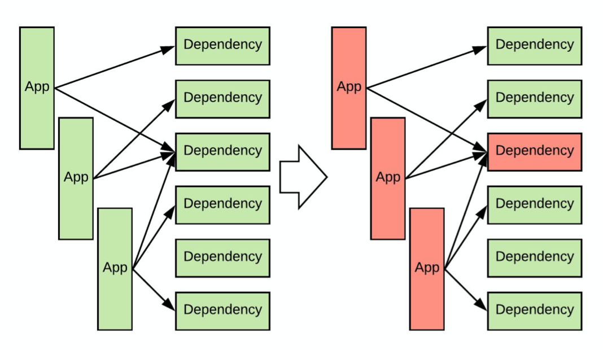

本文是笔者 2019 年暑期在 HULU 的实习项目，拖了一年之后才把这篇博客整理出来，留作纪念吧。

## 延迟与差错控制问题

首先让我们熟悉一下问题的背景。一个现代的后端服务（下文称之为 App）可能会有多个依赖服务（下文简称为依赖），依赖需要通过网络请求，但这些依赖不一定总是能保持稳定。比如，推荐系统后台可能需要从一个依赖中获取读取用户配置，从另一个依赖中读取用户历史。这样就存在一个问题：如果服务有非常多的依赖，那么在任意时刻，都很有可能有某个依赖出问题。

依赖出现问题一般表现为对一些请求会抛异常，如果没有兜底逻辑，App 就不能处理这些请求了。另外，出问题的依赖延时会变长，这会导致该依赖的请求大量占用线程池、TCP 连接等资源，直至耗尽资源。于是，如果 App 没有差错容忍能力，那么本 App 的 downtime 可能会是所有的依赖的 downtime 之和，而且 App 跟随上游依赖挂掉之后，还会引起下游服务跟随挂掉，导致雪崩式崩溃，这是不可接受的。

为了避免 App 跟随上游依赖挂掉，至少需要做到以下两点：

- 有一个 fallback 逻辑，也即当上游的依赖服务挂掉之后的兜底逻辑。一般而言，这应该是个简单的本地逻辑，比如返回合理的空值。
- 能够检测服务的健康状态，如果服务挂掉，尽快切换到 fallback 逻辑。同时，能够在服务恢复正常后及时切换回来。

Hystrix & Resilience4j 就是完成后一个要求的工具。它们可以检测依赖的健康状态，并在依赖状态不佳时及时切换到兜底逻辑，以及依赖恢复正常之后切换回来。

## Hystrix 原理

在这里偏原理的介绍一下 Hystrix. Hystrix 首先将依赖的调用抽象成函数（方法）调用，函数需要用户自己继承 Hystrix 提供的类来实现，在函数中可以使用 HttpClient 等进行依赖的调用。函数调用有三种可能的结果：正常返回，抛出异常，超时。简单起见，超时这里也归入异常。Hystrix 的基本原理就是对于每个依赖，分别统计其在一段时间内抛出异常的概率，异常概率过高时即认定依赖已经不健康。

Hystrix 判定依赖出现问题之后，新的请求不会再调用依赖，而是会调用 Fallback 逻辑（兜底逻辑）。此时我们称为短路状态，依赖被短路。短路状态下，Hystrix 每隔一段时间会尝试调用一下依赖，在一定次数的尝试成功之后，判定依赖已经恢复，并取消短路状态，否则会继续短路。

通过短路掉不正常的依赖，Hystrix 一方面可以降低本服务的压力，防止大量的超时拉高本服务的响应时间，也防止占用线程池等资源。同时也避免给依赖带来更大的压力。

Hystrix 详细原理参考 [官方 wiki](https://github.com/Netflix/Hystrix/wiki/How-it-Works).

## Hystrix 配置探究

Hystrix 一般用来管理依赖服务，所以一般搭配 HttpClient 使用，如 Apache HttpClient. 这样 Hystrix & Http Client 主要会有如下参数：

- HttpClient 连接数目
- HttpClient 超时
- Hystrix 线程池大小
- Hystrix 超时

我的实习任务就是通过一个 mock 系统对这些参数和我们使用 Hystrix 的方式进行调优。Mock 系统包括一个虚拟的依赖，主要是可以在运行时方便的调整其响应时间分布和返回的 payload 大小；以及一个虚拟的 App，其调用依赖的方式与我们的线上服务相同。有了 Mock 系统之后，我们可以再现依赖的不同状态，然后不同参数下观察调用依赖时的开销与行为等等。

通过前辈的经验和我的实验补充，我们得到了以下配置原则。

首先，需要通过实测得到依赖的平均响应时间，u99 (upper99 时间，也即 99% 的响应耗时小于该时间) 等响应时间分布参数，据此设置 HttpClient & Hystrix 的超时时间。Hystrix 的超时设置成略长于 HttpClient 即可，因为 Hystrix 的超时即使被触发，Hystrix 受 Java 限制也无法杀死进程，并不会释放资源，因此超时应该由 HttpClient 控制。超时时间设置过短会导致大量超时触发并抛出大量的异常，但如果设置的过长，则会在依赖响应延时变长时迅速消耗线程池等资源。比如，如果超时设置成 100ms, 在 1000 rps 流量下，一旦依赖挂掉，在超时释放资源之前，这个依赖在 100ms 之内会消耗掉 100 个 TCP 连接和线程。超时合理的设置可以参考服务的 u99 (upper99) 响应时间，比这个时间略长 1.5 倍左右。

线程池设置主要根据服务的平均响应时间和 RPS 确定，根据排队论，理论上最小值应该是 $N=RPS \times 1s/\lambda$, 其中 $\lambda$ 就是平均响应时间，$1s$ 也即一秒钟。当然，实际使用时要比这个值设置的大一些，比如 1.5 倍到 2 倍，平均响应时间也要根据服务压力比较大时的平均响应时间指定。这个参数最好设置成 Hystrix 与 HttpClient 等同，特别不要设置成 Hystrix 线程池比 HttpClient 最大连接数目大，否则 Hystrix 的线程会在等待 HttpClient 资源时排队会排队，导致延时上升。

> 线程池耗尽后，Hystrix 对新来的请求也会直接调用 fallback 逻辑。

另外，特别需要注意的是，使用 Hystrix 时应该实现 Fallback 逻辑，不要留空，并且注意代码逻辑中妥善处理异常。这是因为 Hystrix 在没有 Fallback 逻辑时会向上级抛出异常，如果业务逻辑没有处理好这些异常，可能会继续上抛直到本服务的 Servlet 容器，如 Jetty. 虽然 Servlet 容器一般不会因此挂掉，但异常处理代价是高昂的，特别是如果代码中随手打印了调用栈，打印异常的调用栈是串行的，因此在 RPS 较高的服务中很容易把整个 Java 进程搞挂，而此时可能正是流量高峰，于是雪上加霜。

对此，个人的思考是异常本不应该大量抛出，处理异常的代价总体而言是要比正常逻辑代价高很多的。调用依赖失败在网络环境下其实是比较正常的一种情况，并且可能大量发生，用异常表示依赖调用失败是略显不合理。一般异常处理代码不用过于在意效率，因为异常是罕见的。但唯独这种情境下必须考虑效率，因为高 RPS 下异常可能频率非常高。特别注意，Hystrix 短路时如果没有 Fallback 逻辑，就会大量抛出异常。短路逻辑顾名思义，其处理代价应该小于正常逻辑，但如果 Hystrix 抛出异常并且没有尽快被业务逻辑处理掉，则短路状态下处理代价就有可能很高，导致服务挂掉。

> 这些结论大部分都是之前的前辈调研和总结的，我的 Mock 平台上的实验主要发现了 HttpClient & Hystrix 的参数互相之间的优先关系，以及异常处理的问题。我们后来复盘时有一些总结：
> 1. 这个 Mock 系统的服务和其依赖都是假的，形象称之为「空对空」，系统行为过于理想，无法再现实际业务场景下服务的 CPU 负载等复杂行为，导致其参考价值不高。
> 2. 有条件的场合，最好考虑把真实的线上服务在一个受控环境中启动，并通过流量重放等方式进行测试。但是，我当时需要测试的服务过于复杂。它是推荐系统的后台，依赖过多，把这些依赖全部 Mock 过于困难。
> 4. 总体而言，复现网络环境、网络相关的问题是很困难的。或许，加强监控，出问题时及时登录到出问题的机器节点上观察是更合适的选择。

## Resilience4j 简介

Hystrix 已经不再活跃开发。其使用要借助继承机制，略显繁琐。Hystrix 本身也有一定的开销。而 Resilience4j 是其官方推荐的后续。两者的功能相似，但 Resilience4j 默认使用 Java8 提供的 lambda 表达式实现，更为简洁优雅，同时也更为轻量、模块化。据笔者测试，其开销也要远远小于 Hystrix. 具体介绍参考其[官方 github](https://github.com/resilience4j/resilience4j).