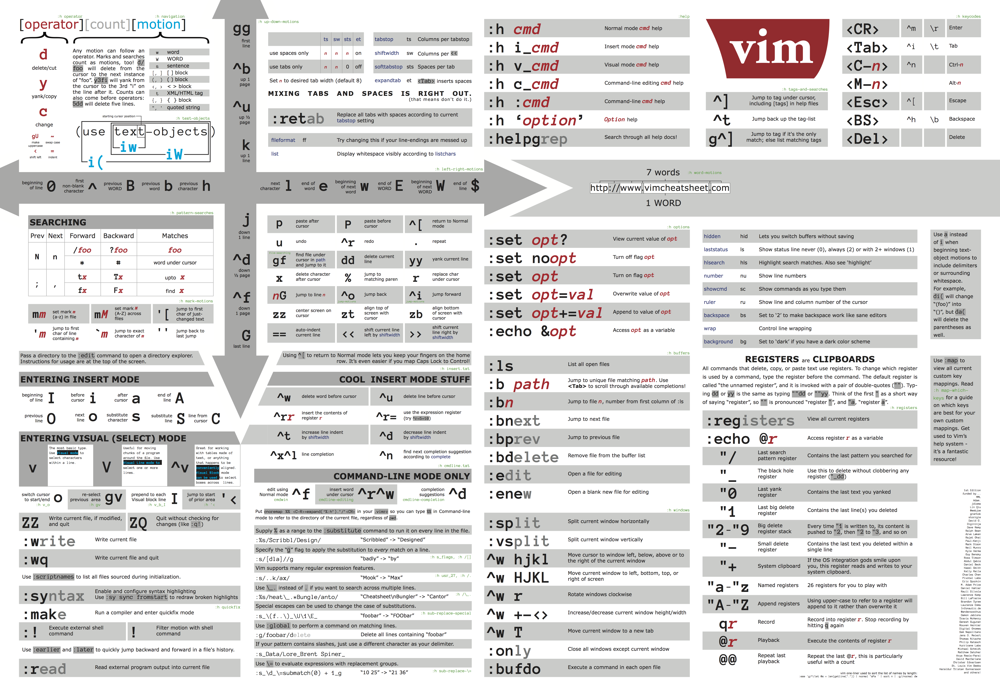

一些基础的用法可以参考 vim cheatsheet,




我的个人 [配置文件 Github](https://github.com/plus2047/script)

## 基本操作

- `h, j, k, l` 单字符光标移动
- `w, b, W, B` 单词光标移动，以空格为标准的单词光标移动
- `C+d, C+u, C+f, C+b` 上翻半页，下翻半页，上翻页，下翻页
- `gg,G,nG` 移动到文件第一行 / 最后一行 / 第 n 行
- `%` **括号匹配移动**
- `(), {}` 前后移动一句，一段
- `i, a, o, O` 在当前字符之前、之后，当前行下一行、上一行插入
- `J` 合并当前行和下一行。处理粘贴文字段时有用
- `Ctrl+N / Ctrl+P` 在 Insert Mode 内，当前文件内部的关键字补全
- `Ctrl+X + Ctrl+f` 在 Insert Mode 内，使用当前目录中的文件名进行补齐
- `:tabe filename / gt, gT, ngt` 标签中打开 / 标签跳转
- `n + cmd` N 次重复 CMD
- `u, C+r` N 次重复 CMD / 撤销，重做
- `C+o, C+i == tab` 跳转到上一次 / 下一次查看位置
- `g; g,` 跳转到上一次 / 下一次编辑位置
- `:xa` 保存 Buffer 中所有有更改的文件后退出
- `ZZ, :x` 两个命令等价，修改保存的文件后退出
- `:wq :wq!` 保存文件，退出；强制保存文件并退出 

## 查找与替换

- `/word,?word` 向下/上查找字符串
- `:n1,n2s/word1/word2/g` 在n1,n2行之间将word1替换为word2
- `:%s/word1/word2/gc` 全局将word1替换为word2并要求确认

## 删除、复制、粘贴

- `x,X` del, backspace
- `dd, ndd` 删除整行，删除 n 行
- `d1G, dG` 删除从第一行到光标，删除从光标到最后一行
- `d$, d0` 删除从光标到本行结尾 / 开始
- `yy, nyy, y1G, yG, y0, y$` 复制
- `P,p` 在光标上一行/下一行粘贴
- `:set paste` 从外部粘贴时，避免粘贴时自动缩进引起的格式问题
- `:set nopaste` 取消外部粘贴模式
- `daw, da}, da), da]` 删除当前单词，删除当前括号内内容。

## 文件操作、多文件编辑

- `:q, :q!, :wq, ZZ` 退出，强制退出，保存退出，保存退出
- `:w, :w!, :w filename` 写入，强制写入，写入到文件
- `:n1,n2 w filename` n1 - n2 行写入到文件
- `:r filename` 在编辑的数据中读入另一个文件，新文件内容插入到光标所在行之后
- `:e filename, :open filename` 打开文件
- `:n, :N` 下一个文件、上一个文件
- `:ls` 列出正在编辑的文件
- `:sp :vsp` 竖直，水平分屏
- `C+w+hjkl` 窗口切换
- `:tabe filename`: open file in new table
- `gt gT`: next or previous tab.
- `number+gt`" go to the number-th tab.

## 命令重做、宏

- `n + cmd` N 次重复 CMD
- `u, C+r` 撤销，重做
- `qq, @q` 录制宏到 q 寄存器，调用 q 寄存器中的宏
  
保存宏：在 `.vimrc` 中保存一行内容：`let @q = 'macro contents'`. `macro contents` 可以通过键入 `"qp` 粘贴当前 `q` 寄存器内容。

## 设置、系统命令、其他

- `:! shell_cmd` 运行shell 命令
- `:set nu` 显示行号
- `:set nonu` 不显示行号
- `:noh` 退出高亮（用于搜索之后退出搜索高亮）

##  其他

- `ls | vim -` 从 `stdin` 读取文件，用于替代 `less` 等命令  

## VISUAL BLOCK 纵向编辑模式

纵向编辑模式和查找匹配编辑模式可以用来代替 Sublime 的多光标编辑模式。

VISUAL BLOCK 模式。按 `CTRL + v` 进入块选择模式，使用 `hjkl` 选中文本块。选中多列相似文本后，可以进行的操作包括：

- `I / A` 在块首 / 块尾插入文字。
- `r / x` 修改 / 删除当前字符。
- `>` 缩进， `<` 反锁进；普通模式下，双击 `>` 缩进。

完成后改后按 `ESC` 退出并将修改应用到所有文本列。注意应用之后会彻底退出 VISUAL BLOCK 模式，而 Sublime 的多光标并不会自动消失。

## 查找匹配编辑模式

查找单词之后，按下 `cgn` (:help gn) 对匹配的单词进行编辑（此时会自动删除匹配的单词，等待键入新的单词，目前没有办法保持这个单词进行编辑）。编辑完毕按 ESC 退出后，按下 `.` 将同样的操作应用到下一个 Match 或者按 `n` 跳过一个 Match. 复杂的操作建议使用宏完成。

## 多文件查找替换

[REF: VimRegEx](http://vimregex.com/#substitute)

```
" keyword replace.
" 'bufdo' means run command in each file in the buff.
" '%' means for the whole file searching.
" \<keyword\> means search whole word for 'keyword'.
" 'Igc' means DO NOT ignore cases, search for the whole line, confirm.
:bufdo %s/\<keyword\>/_keyword_/Igc
```
