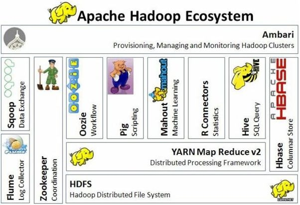
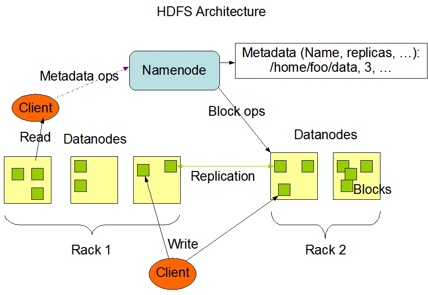
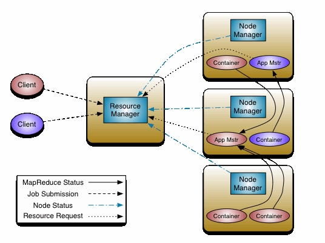

## Hadoop

Hadoop 是一个由 Apache 基金会所开发的分布式系统基础架构。用户可以在不了解分布式底层细节的情况下，开发分布式程序。

Hadoop 包括 HDFS, Yarn, MapReduce 三个关键组件。

> Hadoop 最早是 Apache 在 Google 的关于 MapReduce 的论文启发下开发的，虽然后续 Spark 等项目一定程度上取代了原始的 MapReduce，但这些新的项目都运行在 Hadoop 生态系统中。
> Hadoop 本身的历史参考：https://data-flair.training/blogs/hadoop-history/

### HDFS

Hadoop Distributed File System 是在 Google GFS 论文启发下开发的分布式文件系统，其设计目标是基于价格低廉的硬件（相对于企业级硬件而言）上提供可靠的、高吞吐量的文件系统。HDFS 有一个 Namenode 提供文件名、文件路径等元信息和许多存储节点。

### MapReduce

MapReduce 是一种编程模型，用于大规模数据集的并行运算。

### Yarn

YARN （Yet Another Resource Negotiator，另一种资源协调者）是一种新的 Hadoop 资源管理器，它是一个通用资源管理系统，可为上层应用提供统一的资源管理和调度，它的引入为集群在利用率、资源统一管理和数据共享等方面带来了巨大好处。

## HBase

HBase is high scalable (scales horizontally using off the shelf region servers), highly available, consistent and low latency NoSQL database. 

HBase 是设计用于 real-time querying 的列式的分布式数据库。Hbase 是由当年的 Google 公布的 BigTable 的论文而生。HBase 底层依旧依赖 HDFS 来作为其物理存储，但 HBase 并不依赖 MapReduce 算法运行。

## Hive

Hive 可以将结构化的数据文件映射为一张数据库表，并提供完整的 SQL查询功能，可以将 SQL 语句转换为MapReduce任务进行运行。可以通过类 SQL 语句快速实现简单的MapReduce统计，不必开发专门的 MapReduce 应用，十分适合数据仓库的统计分析。

## ZooKeeper

ZooKeeper 是一个协调工具，许多组件依赖 ZooKeeper 来保证分布式计算或者数据存储的正确性。

-----

## Spark

基础的 MapReduce 模型较为僵化，使用不便，而 Spark （基本上）是建立在 Hadoop 生态系统上的更灵活的计算组件，提供更丰富的抽象、更丰富的语法。Spark 任务最终会被分解成 MapReduce 任务执行。

## Flink

流处理引擎，可以使用 Yarn 进行资源调度，使用 HDFS 进行存储。

## Kafka

消息队列。

