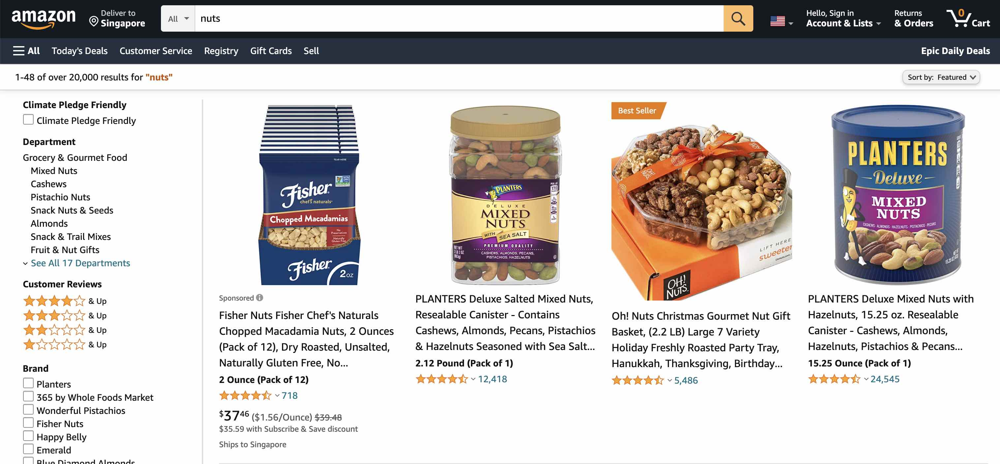

## 业务场景

电商平台最重要的广告就是搜索页面下，与商品一同展示的广告，通常只有一个不太起眼的标志跟自然搜索结果加以区分。下图第一个标记 Sponsored 的商品就是广告商品。

电商的搜索广告有两个很强的先天优势：第一，由于是搜索广告，可以根据搜索关键词展示高度相关的广告内容。第二，商家可以直接将现有的商品作为广告，降低了使用门槛，同时也保证了广告本身就是商品，因此可以最大程度减小广告对用户的干扰。

本文面向技术人员，介绍搜索广告最基本的业务逻辑。

## 常见术语

从电商 [Shopee](https://ads.shopee.sg/learn/faq/92/176) 摘录一部分最基础的术语。广告主（卖家）需要熟悉这部分术语。

- **Impressions**, Impressions measure the number of times your ads are seen by logged-in shoppers.
- **Clicks**, Clicks measure the number of times logged-in shoppers click on your ads after seeing them. 
- **Click-Through-Rate (CTR)**, CTR measures the percentage of times shoppers click on your ads after seeing them. 
- **Orders**, Orders measures the number of orders placed by shoppers containing the advertised product or other products from your shop, within 7 days of an ad click.
- **Conversions**, Conversions measure the number of unique products sold in each order within 7 days of an ad click, including the advertised products and other products from your shop.
- **Gross Merchandise Value (GMV)** measures the total amount of money generated by shoppers from the purchase of the advertised product and other products from your shop within 7 days of an ad click. 
- **Expense** measures the total amount of money spent on your ads. Make sure your expense is within your advertising budget.
- **Return on Investment (ROI)** indicates the return from your ad spend, by measuring the revenue generated by the ad from the sales of your shop's products relative to every dollar spent on your ad. 
  - ROI = GMV ÷ Expense
- **Cost-Income-Ratio (CIR)** measures the percentage of your ad spend relative to the revenue generated by your ad from the sales of your shop's products.
  - CIR = Expense ÷ GMV x 100%
- **Conversion Rate (CR)** measures sales conversion for the advertised product and other products from your shop per ad click.
  - CR = Conversions ÷ Clicks x 100%
- **Cost Per Conversion (CPC)** Cost Per Conversion measures the average cost per sales conversion.
  - Cost Per Conversion = Expense ÷ Conversions

一些技术人员需要了解的术语，

- **expected Cost Per Mille (eCPM)**, 千次展示期望收入，Mille 是拉丁语的 Thousand. 字母 e 代表是个m模型预期值而非真实值。
  - RPM, Revernue Per Mille, 通常跟 eCPM 基本同义。
- **Bidding** 广告主为每次 Click 的出价。
  - eCPM = pCTR * Bidding

## 结算方式

结算方式也即广告主如何与广告品台结算广告费用。

- **CPC** 结算，即按点击结算。这是最常见的、也是搜索广告或电商平台搜索广告常用的结算方式。

除此之外，还有一些其他场景使用的结算方式。

- **CPS (Cost Per Sale) / CPA (Cost Per Action) / ROI** 结算，是一种比较极端的结算方式。广告主直接为产生的订单付费。
- **CPM** 结算，比较接近传统广告位的结算方式。即按照千次展示结算。可以用于一些横幅广告、品牌广告。
- **CPT (cost per time)** 结算，按照独占时间段结算，也是比较接近传统的结算方式。可以用于一些品牌广告等。

## 搜索广告的定价问题

最广泛使用的搜索广告定价方式是 **GSP (Generalized Second Price)** 广义第二高价。搜索广告常常会打出一排广告，组成一个广告列表，而不仅仅是一个广告。GSP 也即广告列表每个位置的拍卖中，向赢得该位置的广告主收取他下一位广告位置出价的费用。

一次性拍卖中的第二高价问题，是一个可以证明的最优策略（可以参考一些经济学的文章），但对于列表推荐，其实这并不是最优的，最优的是 VCG (Vickery-Clarke-Groves) 策略，但后者太复杂了，使用最多的还是 GSP.

## 优化目标

与搜索、推荐不同，广告需要权衡多方面利益。以电商平台的搜索广告为例，需要综合考虑平台利益、商户利益和买家利益。

由于按照 CPC 结算，最大化 eCPM 能够最大化平台利益。买家希望看到最有吸引力的商品，因此可以使用 CTR 作为买家利益的衡量。商户希望能够最大化自己的 GMV, 因此 CTR * CR 是其优化目标。生成广告列表时，无法预先知道 CTR, CR 等真实值，需要使用模型估计 predicted CTR (pCTR) 等。

最终优化目标可能是，

$$
\text{Cost} = a \cdot \text{eCPM} + b \cdot \text{pCTR} + c \text{pCTR} \cdot \text{pCR}
$$