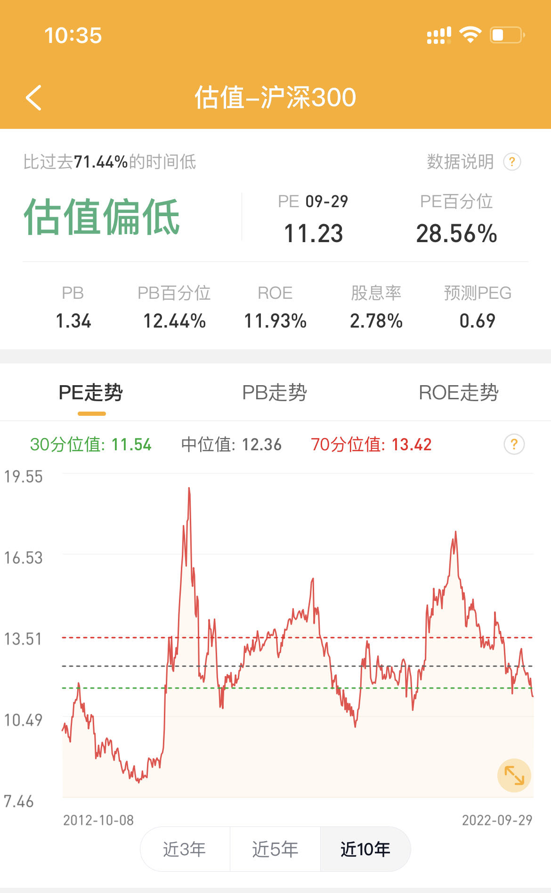

在上一篇文章里，我们提到了股票型基金具有相当高的期望收益率，但与高收益率相对应的，是极高的投资风险。可以说，主动基金的投资风险，超出了多数人的风险承受能力。本文是作者血亏之后真金白银的教训。。

## 指数基金

本文的重点是主动型偏股基金，但首先我们要来讨论一下指数基金，也即所谓的 ETF 基金。讨论指数基金之前，需要首先明白什么是股价指数。有些机构会根据一些简单的规则，选择一系列股票，用以代表整个市场或者某个行业。比如沪深 300 指数，其规则就是非常简单粗暴的沪市和深市中市值最大的 300 支股票。中证银行指数则是只包含银行行业上市公司。于是，这些指数可以根据其包含的股票的价格，加权计算出指数的点数，指数点数变换就代表了所有股票价格涨跌的「平均值」。指数基金就是简单粗暴的跟踪股票指数替你投资股票的基金。那么，如果我们拿不准一只股票的涨跌，就可以购买指数基金，至少期望能够达到一个「平均收益」。

指数基金其实是非常好的投资方式，不求超额收益，只求市场平均水平。对于美国股市，有很多专家建议直接购买指数基金，而不要购买主动基金。但在中国市场，多数人的观点是主动基金还是有一定优势的。

投资指数基金又有什么注意事项呢？其实应该问的更基础一点，投资任何股票，有什么需要注意的？就跟我们买商品一样，投资股票是需要去考虑股票「贵不贵」的。衡量股票贵不贵并不是看当前股价高不高，而是看公司总市值贵不贵。非常基础的一个指标是市盈率，就是公司市值与公司年收入的比率。如果一个公司一年能够赚一个亿，而公司的市值是 10 亿，则市盈率是 10，相当于公司每年提供了 10% 的收益率，是非常划算的，而如果公司市值是 100 亿，则市盈率是 100，投资收益率是 1%，还不如银行存款，那这只股票就非常贵。

指数基金可以跟单只股票相似，根据其包含的股票成分计算市盈率。一个指数市盈率多少算是高，多少算是低，是一个比较复杂的问题。但指数通常可以存在很长时间，于是我们就可以追踪市盈率的变化。如果当前市盈率处于历史高位，我们有理由相信当前指数非常贵，不适宜投资。反之，如果处于历史低位，则适合买入。

指数的市盈率是很容易查到的。比如，使用蛋卷基金 App，很容易查到沪深 300 市盈率，当前处于较低位置。

只根据市盈率投资可能是不够的，但市盈率至少能告诉我们，如果指数处于 2021 年或者 2015 年那个高峰位置，而你此时入场，大概率是个接盘侠。

如果投资的是行业指数基金，比如银行指数，新能源指数，那么就需要额外的知识来判断特定行业是否在高速发展。如果对一个行业并不十分了解，是不适宜投资这样的指数基金的。

## 主动基金

谈完了指数基金，我们就可以聊一聊主动基金。主动基金其实就是委托基金经理为我们炒股，基金经理有很大的自由度，可以决定买哪些股票，买多少。主动基金的管理费比 ETF 要高，所以基金经理带来的超额收益率至少应该值回管理费。主动基金尽管可能有比指数基金更高的收益率，但却更为复杂，有更多的问题。

常常有人说，专业的事应该交给专业的人去做，所以投资应该交给专业的基金经理为我们打理。但事实没有这么简单。基金经理当然不是做慈善的，他们要收取管理费。而要命的是，多数主动基金的管理费是固定费率，外加买入赎回的手续费，跟基金本身盈利或者亏损没有关系。所以基金经理和基金公司其实更关注卖更多的基金，而不是给客户赚了多少钱。这就是为什么基金公司喜欢频繁发布新基金，并且喜欢在牛市高点发基金。

我们在聊指数基金时提到，市盈率之类的指标可以用来衡量股票或者指数基金价格是否适当，便宜还是太贵。但对于主动型基金，由于其持有的股票成分并不能随时查到，历史持仓更是不清楚，因此没有办法计算其市盈率曲线，我们很难衡量一只主动基金当前价格是否合理。

即使克服了以上两条问题，过于火爆的主动基金还有另一个问题：基金有可能体量过大，从而导致无法获得较高收益。体量过大就是指一只基金投资人数非常多，因此基金经理手里的资金数额会非常大（达到几千亿）。此时，基金经理会无法投资大部分股票，因为这一只基金的买入就足以把股票价格拉升过多。所以这种超大体量的基金只能投资少数的市值非常大的股票，这样一来灵活度就会大大下降，难以获得高的收益。

对于行业主题基金，比如名字中带有白酒、医药、新能源的基金，基金的投资收益受到基金经理水平和行业发展周期双重因素影响，投资难度进一步增加。而且限定在一个行业内投资，相当于限定了基金经理的投资领域，基金经理发挥空间将会收到进一步限制。如果基金再更大一些，基金经理的发挥空间就更小了。

主动基金的历史业绩，是以收益率曲线的形式展示的。但一只基金实际赚钱、亏钱的绝对数额是不会展现在曲线上的。如果一只基金在其净值很高时下跌，会亏掉大量真金白银，客户可能会无法承受而大量卖出。之后即使基金涨回原点，因为体量变小了，亏到的钱也赚不回来。基金公司尝尝把这一过程归结为客户不够理性，但实际上这一过程符合基金公司利益。高位宣传大卖收取手续费，然后暴跌亏掉的并不是公司和基金经理的钱。甚至，大量客户撤出后，基金体量变小，更容易操作了。

投资主动基金，必须要解决以上问题。让我们逐条分析。

首先，主动基金也需要估值。最最粗略的办法，没有主题的主动基金可以参考沪深 300 指数点位，它们一般是高度相关的。如果指数点位很高，主动基金可能也存在很高的风险。对于行业主题主动基金，可以直接参考行业主题指数的点位。一般来说，越是基金投资大火，市场越有可能高估，反而不应入场。

市值太高的主动基金可能难以获得较高的超额收益率，市值太低的主动基金确实很烂，存在风险。因此估值适中的基金比较合适。国内市场上，20 亿以上，100 亿以下或许是个适中的选择。

我们当然需要参考主动基金的历史收益率数据来判断一只基金是否可靠，新发行的基金没有历史数据，因此可以选择至少有三年以上，甚至五年以上历史的基金。

归根结底，主动基金就是委托基金经理炒股，因此基金经理和公司的专业素质和人品至关重要。可以关注一下基金经理以及基金公司的评价。