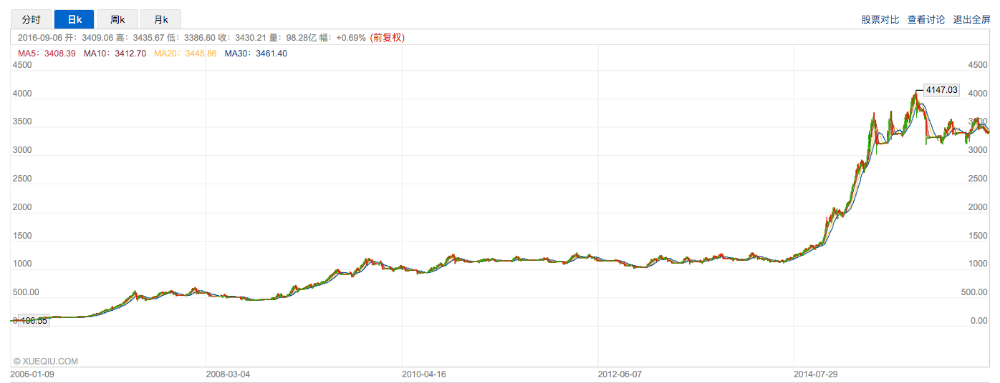
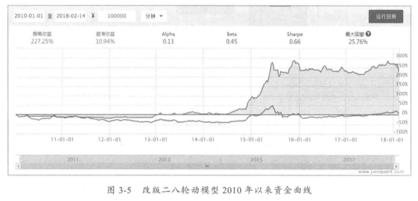
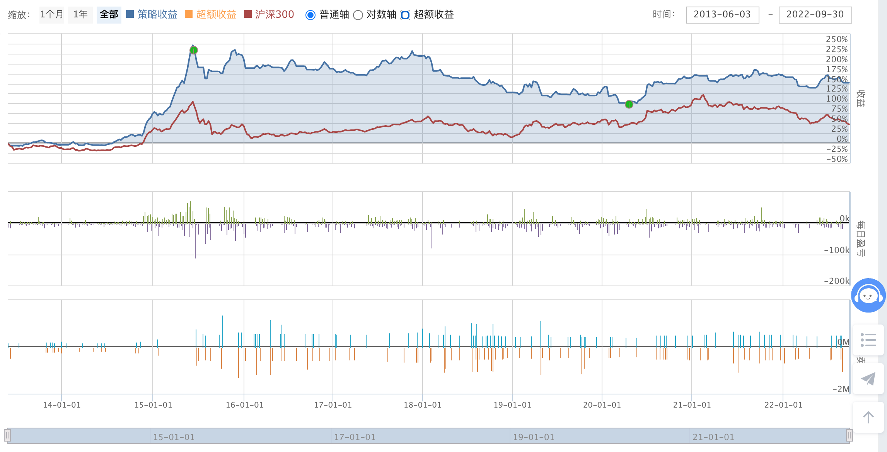

最近尝试学习量化投资策略，正在阅读《量化投资技术分析实战》一书。书中给出的第一个例子是「蛋卷斗牛二八轮动策略」，这是蛋卷网一个曾经卖过的实盘策略，历史上据称曾大幅跑赢大盘，2006 - 2016 年十年 30 多倍，



书中也给出了 2010-01-01 到 2018-02-14 年的收益曲线，达到 2.5 倍的收益也可以接受。



书中给出的代码在新版的聚宽量化网站上已经无法运行，我将其修复，基本可以复现书中结果。代码附在本文最后。

不幸的是，将回测时间向后推四年，收益曲线就非常难看了。



而且，很明显，该策略最后一次成功就是在 2015 年的疯牛市了，如果将回测时间限制在 2015 年六月之后，在七年多的时间里，该策略基本与 HS300 表现相当。

在回测过程中，还发现书中代码的一个 BUG, 书中策略交易上证50，沪深300，中证500 三支 ETF，但这三支 ETF 在 2013-06-01 左右才全部可以交易，书中回测却是从 2010-01-01 开始的，因此书中策略在前几年其实无法完全运行，反而可能躲过了一些亏损。

我对其评价是，该策略基本只对疯牛市有效，即使是 2019-2020 & 2016-2018 这种慢牛市，该策略也是基本跑输沪深300的。而疯牛市以后不容易有了，即使有，「随便买就能赚钱」，这个策略的价值也很有限。

这是我运行成功的第一个量化策略，是非常好的一课，可以学到很多教训：

- 长线、低频交易策略，更容易受到过拟合影响。该策略在过去的二十年里，几乎全部收益都来自三个牛市，样本严重不足，无法判断其接下来的表现。从这个角度来说，低频交易是风险更大的投资方式
- 长线交易策略更容易受到回测起止时间和参数设置的影响
- 长期回测中，投资标的不一定能稳定存在，交易规则等等可能一直在变化，都会给回测带来困难

```py
# modify by plus2047

# https://mp.weixin.qq.com/s/5cglPeoFSN0vIM4NsWsjKg
# 原作者：JoinQuant量化课堂
# 原地址：https://www.joinquant.com/post/1923

# 回测开始时间 2013-06-01

def initialize(context):
    set_params()    #1 设置策略参数
    set_backtest()  #2 设置回测条件
    run_daily(before_trading_start, time="before_open")
    run_daily(trade, '14:53')
    run_daily(after_trading_end, time="after_close")

def set_params():
    # 设置参数，定义了交易时间和股票
    # 设置基准收益
    set_benchmark('000300.XSHG') 
    g.lag = 20     # 回溯期
    # g.hour = 14    # 小时（每天交易时间：具体哪个小时bar）
    # g.minute = 53  # 分钟（每天交易时间：具体哪个分钟bar）
    
    g.sz =  '000016.XSHG' # 计算标的——上证50指数（超级大盘股）
    g.hs =  '000300.XSHG' # 计算标的——沪深300指数（价值股）
    g.zz =  '000905.XSHG' # 计算标的——中证500指数（成长股）
    
    g.ETF50 = '510050.XSHG'  # 交易标的'510050.XSHG' 成立于 2004-12-30
    g.ETF300 = '510300.XSHG' # 交易标的'510300.XSHG' 成立于 2012-05-04
    g.ETF500 = '510500.XSHG' # 交易标的'510500.XSHG' 成立于 2013-02-06

def set_backtest():
    # 设置回测条件
    set_option('use_real_price', True) #用真实价格交易
    log.set_level('order', 'warning')
    log.set_level('strategy', 'warning')

def before_trading_start(context):
    log.info("set slip fee for %s" % context.current_dt)
    set_slip_fee(context) 

def set_slip_fee(context):
    # 将滑点设置为交易额的千分之2
    set_slippage(PriceRelatedSlippage(0.002))
    # 根据不同的时间段设置手续费
    dt=context.current_dt
    
    if dt > datetime.datetime(2013,1, 1):
        set_order_cost(OrderCost(
            open_tax=0,
            close_tax=0.001,
            open_commission=0.0003,
            close_commission=0.0003,
            close_today_commission=0,
            min_commission=5
        ), type='stock')
        # 买入时印花税=0，卖出时印花税=千分之1，买入佣金=万3，卖出佣金=万3，最低佣金5元

    elif dt > datetime.datetime(2011,1, 1):
        set_order_cost(OrderCost(
            open_tax=0,
            close_tax=0.001,
            open_commission=0.001,
            close_commission=0.001,
            close_today_commission=0,
            min_commission=5
        ), type='stock')

    elif dt > datetime.datetime(2009,1, 1):
        set_order_cost(OrderCost(
            open_tax=0.001,
            close_tax=0.002,
            open_commission=0.001,
            close_commission=0.001,
            close_today_commission=0,
            min_commission=5
        ), type='stock')

    else:
        set_order_cost(OrderCost(
            open_tax=0.002,
            close_tax=0.003,
            open_commission=0.001,
            close_commission=0.001,
            close_today_commission=0,
            min_commission=5
        ), type='stock')

def getStockPrice(stock, interval): # 输入stock证券名，interval期
    # 定义函数 getStockPrice
    # 取得股票某个区间内的所有收盘价（用于取前20日和当前收盘价）
    # 输入：stock, interval
    # 输出：h['close'].values[0] , h['close'].values[-1]
    h = attribute_history(stock, interval, unit='1d', fields=('close'), skip_paused=True)
    return (h['close'].values[0] , h['close'].values[-1])

def get_signal(context):
    # 核心逻辑：计算得到信号（这个信号是一个string）
    # 输入：context
    # 输出：string: sell_the_stocks || ETF50 || ETF300 || ETF500

    # 收盘价，通过getStockPrice获取
    # Yesterday50是昨日收盘价，interval50是interval周期前的收盘价

    # 取出价格
    interval50,Yesterday50 = getStockPrice(g.sz, g.lag)  
    interval300,Yesterday300 = getStockPrice(g.hs, g.lag)  
    interval500,Yesterday500  = getStockPrice(g.zz, g.lag)
    # log.info("price: 50: %s, 300: %s, 500: %s" % (Yesterday50, Yesterday300, Yesterday500))

    # 计算前20日动量
    sz50increase = (Yesterday50 - interval50) / interval50
    hs300increase = (Yesterday300 - interval300) / interval300
    zz500increase = (Yesterday500 - interval500) / interval500 

    def get_amount(name):
        positions = context.portfolio.positions
        return 0 if name not in positions else positions[name].total_amount
    # 对于这3个指数基金的持有金额
    # hold50 = context.portfolio.positions[g.ETF50].total_amount 
    # # positions.total_amount: 上证50ETF持有金额
    # hold300 = context.portfolio.positions[g.ETF300].total_amount 
    # # positions.total_amount: 沪深300ETF持有金额
    # hold500 = context.portfolio.positions[g.ETF500].total_amount 
    # # positions.total_amount: 中证500ETF持有金额
    hold50, hold300, hold500 = get_amount(g.ETF50), get_amount(g.ETF300), get_amount(g.ETF500)

    # 300空头，且300仓位>0 || 500空头，且500仓位>0 || 50空头，且50仓位>0

    if (hs300increase <= 0 and hold300 > 0) or (zz500increase <= 0 and hold500 > 0) or (sz50increase <= 0 and hold50 > 0):
        # 卖出持有的仓位，此条件是针对3个标的的止损条件
        return 'sell_the_stocks' # 返回string给get_signal函数

    # 如果50增长率大于300和500幅度达到0.01，且 50增长率>0 且 50、300、500仓位=0（目前无仓位）
    elif sz50increase-hs300increase>0.01 and sz50increase-zz500increase>0.01 and sz50increase>0 and (hold300==0 and hold500==0 and hold50==0):
        # 买入50
        return 'ETF50' # 返回string给get_signal函数

    # 如果300增长率大于500和50幅度达到0.01，且 300增长率>0 且 50、300、500仓位=0（目前无仓位）
    elif hs300increase-zz500increase >0.01 and hs300increase-sz50increase >0.01 and hs300increase>0 and (hold300==0 and hold500==0 and hold50==0):
        # 买入300
        return 'ETF300' # 返回string给get_signal函数

    # 如果500增长率大于300和50 幅度达到0.01，且 500增长率大于0且 50、300、500仓位=0（目前无仓位）
    elif zz500increase-hs300increase >0.01 and zz500increase-sz50increase >0.01 and zz500increase>0 and (hold300==0 and hold500==0 and hold50==0):
        # 买入500
        return 'ETF500' # 返回string给get_signal函数

def sell_the_stocks(context):
    # 卖出指令，清仓
    for i in context.portfolio.positions.keys(): 
    # context.portfolio.positions是一个dict
    # .keys()函数，以列表返回一个dict所有的键名
    # 将dict的内容（context.portfolio.positions）逐一取出，然后卖出
        return (log.warning("Selling %s" % i), order_target_value(i, 0))

def buy_the_stocks(context,signal):
    # 买入股票，定义函数：buy_the_stocks
    return (log.warning("Buying %s"% signal ), order_value(eval('g.%s'% signal), context.portfolio.cash))
    # eval把字符串（'%s'% signal）转化为g.ETF50 300 500的赋值结果（3个指数基金）
    # 执行此函数时，signal被传入下单函数order_value的第一个参数security部分，作为标的
    # 第二个参数cash = context.portfolio.cash，现在的账户现金量

def trade(context):
    # 获得当前时间（小时和分钟）
    # hour = context.current_dt.hour
    # minute = context.current_dt.minute
    # 达到每日时间参数条件（g.hour，g.minute）时，获取get_signal计算得到的信号
    # if hour == g.hour and minute == g.minute:

    signal = get_signal(context)
    # 如果信号是sell_the_stocks，就调用函数sell_the_stocks
    if signal == 'sell_the_stocks':
        sell_the_stocks(context)
    # 如果信号是ETF300或者ETF500或者ETF50，就调用函数buy_the_stocks
    elif signal == 'ETF500' or signal == 'ETF50' or signal == 'ETF300':
        buy_the_stocks(context,signal)

def after_trading_end(context):
    log.info("market value at %s:" % context.current_dt, context.portfolio.cash+context.portfolio.positions_value)
    return

```