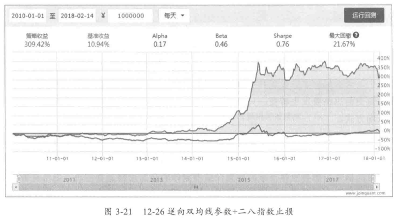
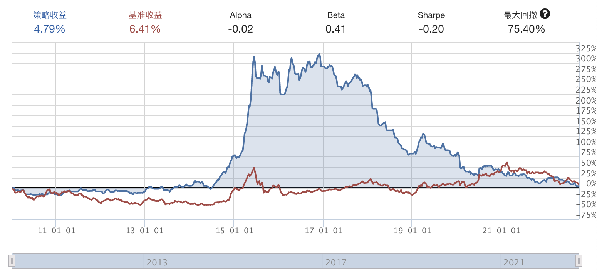

本周尝试了《量化投资技术分析实战》第三章中的另外两个例子。布林带系统的例子是个期货策略，我努力尝试在聚宽上把它改成股票策略跑起来，但没有成功，不知道是实现有问题还是参数不适应股票交易。

第三个策略是个股票策略，逆向双均线交易。这个策略就是所谓的长短期均线交叉，短期均线向上穿过长期均线构成黄金叉，反之短期均线向下穿过长期均线构成死叉。一般认为黄金叉是买入点，但作者测试后发现收益很难看。作者指出 A 股反转特征明显，因此改成反向策略，死叉时买入。买入时尽量购买低价股。

作者书中的回测是很漂亮的，不幸的是这又是一个悲剧例子，我跑了一下 18 年之后的数据，惨不忍睹。这个策略仍然是基本只捕捉到了 15 年牛市，在 17 年之后就失效了，成为一个大亏货。

书中给出的回测曲线，



我跑出的曲线，



太惨了。

书中代码有点小 bug, 这是我修复之后的版本。

```py
def initialize(context):
    # # 选取股票：选取市值表valuation.code的股票代码
    df = get_fundamentals(query(
        valuation.code
    ))
    # 选出DF基本面表格中，列名为code的一列，股票代码
    g.stocklist = list(df['code'])
    # 设定沪深300作为基准
    set_benchmark('000300.XSHG')
    # 开启动态复权模式(真实价格)
    set_option('use_real_price', True)
    # 设置滑点
    set_slippage(FixedSlippage(0))
    # 过滤掉order系列API产生的比error级别低的log
    log.set_level('order', 'error')
    g.top = {} # 记录top值
    
    ### 股票相关设定 ###
    # 股票类每笔交易时的手续费是：买入时佣金万分之三，卖出时佣金万分之三加千分之一印花税, 每笔交易佣金最低扣5块钱
    set_order_cost(OrderCost(close_tax=0.0003, open_commission=0.001, close_commission=0.0007, min_commission=5), type='stock')
    # 将滑点设为千分之2
    set_slippage(FixedSlippage(0))
    # 短期均线、长期均线、大盘择时动量形成期
    g.fast = 12    
    g.slow = 26
    g.lag = 20
    
    
def handle_data(context, data):
    
    # 计算300和500指数的增长率，用于快速清仓
    interval300,Yesterday300 = getStockPrice('000300.XSHG', g.lag)  
    interval500,Yesterday500 = getStockPrice('000905.XSHG', g.lag)  
        
    hs300increase = (Yesterday300 - interval300) / interval300
    zz500increase = (Yesterday500 - interval500) / interval500 
    
    if (hs300increase <= 0 and zz500increase <= 0):
        sell_all_stocks(context)
    else:    
        # 卖出过程
        for security in context.portfolio.positions.keys():
            # 当前的标
            current_positions = context.portfolio.positions[security]
            # 近似的初始价格
            init_cost = current_positions.avg_cost
            # 更新回撤最高点值
            if security not in g.top:
                g.top[security] = (init_cost, 0)
            else:
                # top值为出现过最大的峰值
                if current_positions.price  > g.top[security][0]:
                    g.top[security] = (current_positions.price, 0)
            
            # 追踪止损逻辑
            # 如果当前价格比top低，且处于收益的状态
            # 最高价超过20%，且收益从最高价减少额10%
            high = 0.20
            down = 0.10
            if ( (g.top[security][0] - init_cost) / init_cost >= high
                and (g.top[security][0] - current_positions.price) / g.top[security][0] >= down
                and current_positions.closeable_amount> 0):
                log.info("追踪止损: selling %s %s股" % (security, current_positions.closeable_amount))
                order_target(security, 0)
                
            # 硬止损: 亏损20%   
            stop_loss = 0.20
            if ((current_positions.price - init_cost) / init_cost) <= -stop_loss and current_positions.closeable_amount> 0:
                log.info("硬止损selling %s %s股" % (security, current_positions.closeable_amount))
                order_target(security, 0)

            
        cash = context.portfolio.available_cash
        if context.portfolio.available_cash > 0:
            log.info("Today's Cash %s" % (cash))
            # 记录出现买入信号的股票名单optional_list
            optional_list = []
            # 对应股票买入
            for security in g.stocklist:
                # 历史价格
                close_data = attribute_history(security, g.slow+2, '1d', ['close', 'volume'],df=False)
                # 昨日短期均线
                ma_fast_1 = close_data['close'][-g.fast:-1].mean()
                # 前日短期均线
                ma_fast_2 = close_data['close'][(-g.fast-1):-2].mean()
                # 昨日长期均线
                ma_slow_1 = close_data['close'][-g.slow:-1].mean()
                # 前日长期均线
                ma_slow_2 = close_data['close'][(-g.slow-1):-2].mean()
               
                # 如果满足买入条件
                if (ma_fast_2 > ma_slow_2 
                    and ma_fast_1 <= ma_slow_1 ):  # 短期和长期均线死叉买入
                    optional_list.append((security, close_data['close'][-1]))
                    # log.info("Buying %s" % (security))
                   
            # 按照收盘价进行排序，优先买入便宜的股票
            optional_list.sort(key = lambda l: l[1])
            percent = 0.1
            # 遍历信号股票下单
            # 投资金额为当前可用cash的10%
            use_cash = cash * percent
            for security, close in optional_list:
                current_cash = context.portfolio.available_cash
                # 没钱则结束
                if current_cash <= 0:
                    break
                # 如果所剩余不足10%
                if current_cash < use_cash:
                    use_cash = current_cash
                if use_cash < close * 100:
                    continue
                # 按股数下单
                order_value(security, use_cash)
                log.info("Buying %s" % (security))


# 定义函数sell_all_stocks
# 循环执行，直到全部卖出context.portfolio.positions里的持仓
def sell_all_stocks(context):
    for i in context.portfolio.positions.keys():
            order_target_value(i, 0)
            log.info("sell_all_stocks %s" % i)


# 定义函数 getStockPrice
# 取得股票某个区间内的所有收盘价（用于取前20日和当前 收盘价）
# 输入：stock, interval
# 输出：h['close'].values[0] , h['close'].values[-1]
def getStockPrice(stock, interval): # 输入stock证券名，interval期
    h = attribute_history(stock, interval, unit='1d', fields=('close'), skip_paused=True)
    return (h['close'].values[0] , h['close'].values[-1])
    # 0是第一个（interval周期的值,-1是最近的一个值(昨天收盘价)）


## 收盘后运行函数 
def after_market_close(context):
    log.info(str('函数运行时间(after_market_close):'+str(context.current_dt.time())))
    #得到当天所有成交记录
    trades = get_trades()
    for _trade in trades.values():
        log.info('成交记录：'+str(_trade))
    log.info('一天结束')
    log.info('##############################################################')
```