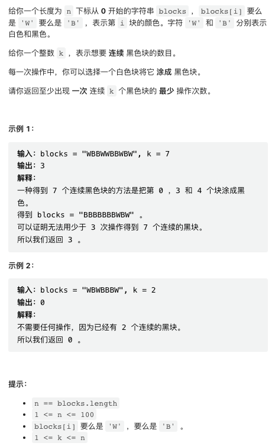
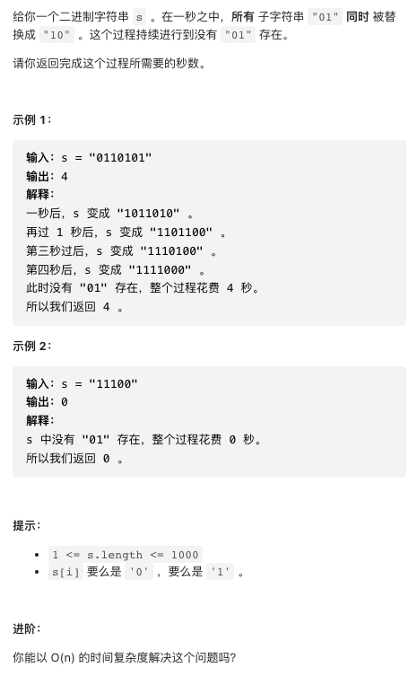
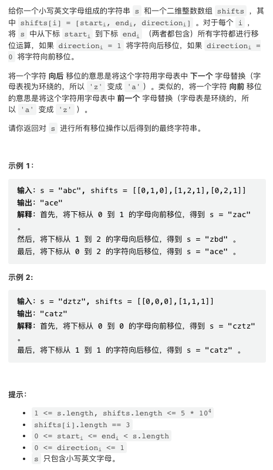
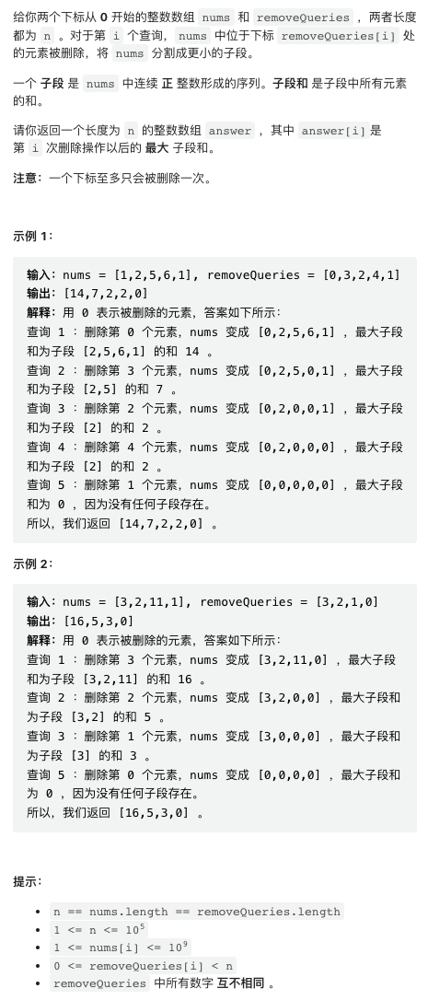

本周双周赛的几道题目使用了一些非常实用的技巧，值得一看！

## [1. 得到 K 个黑块的最少涂色次数](https://leetcode.cn/problems/minimum-recolors-to-get-k-consecutive-black-blocks/)



这里要求最少操作次数，等价于求解所有长度为 k 的区间中，白色块数量的最小值（或者黑色块数量的最大值），类似于求解区间和。

数据规模很小，写一个暴力的 `O(n^2)` 解法，枚举所有的长度为 k 的区间也是可以的。这里给出一个滑动窗口方法，可以以 `O(n)` 的速度求出所有长度为定值的区间和。

滑动窗口有很多写法，可以选择一个自己喜欢的写法，然后总是使用同一种写法，减少出错。

```py
class Solution:
    def minimumRecolors(self, blocks: str, k: int) -> int:
        # 涂色次数最多为 k
        res = k
        # 循环开始之前，计算第一个窗口前 k - 1 个色块中黑色块数量
        cnt = sum(1 for c in blocks[:k - 1] if c == 'B')
        # 枚举所有长度为 k 的区间，共有 n - k + 1 个
        for i in range(len(blocks) - k + 1):
            # 循环开始，更新黑色块数量，此时 cnt 是当前区间和色块总数
            cnt += blocks[i + k - 1] == 'B'
            # 更新结果
            res = min(res, k - cnt)
            # 将不属于下一个区间的色块删除
            cnt -= blocks[i] == 'B'
        return res
```

## [2.  二进制字符串重新安排顺序需要的时间](https://leetcode.cn/problems/time-needed-to-rearrange-a-binary-string/)



该题目 `O(n^2)` 的解法很简单，只需要进行模拟，每一步将所有 01 替换成 10，直到不包含 01 为止。使用 Python 可以非常方便的完成。

```py
class Solution:
    def secondsToRemoveOccurrences(self, s: str) -> int:
        t = 0
        while s.find("01") != -1:
            t += 1
            s = s.replace("01", "10")
        return t
```

但该题目有个追问，能否在 `O(n)` 时间复杂度内求解，这个就有点意思了。

不难发现，将 01 替换成 10 的过程可以形象地理解成将 1 向前移动，并且后方的 1 会被前面的 1 阻挡。所以，整个过程完成的耗时就是最后一个 1 完成移动的耗时。

考虑字符串中任何一个 1，如果这个 1 在移动过程中没有被前方的 1 阻挡，则它移动到最终位置耗时就等于其前方的 0 的个数。而如果它被前方的 1 阻挡，则它至多会落后前方的 1「一步」。这是因为，当后方的 1 被前方的 1 阻挡时，两者的位置是 XXX11XXX，两个 1 都无法移动。而一旦前方的 1 向前移动，字符串就会变成 XX101XXX 之后后方的 1 也可以移动，于是两者之间就会保持只有一个 0，直到前方的 1 停止移动。后方的 1 始终落后前方的 1 最多 1 步。

基于以上分析，给出一个简洁的 DP 解。

```py
class Solution:
    def secondsToRemoveOccurrences(self, s: str) -> int:
        # cnt0 是前方 0 的个数，last 是前一个 1 移动耗时
        cnt0 = last = 0
        for c in s:
            if c == '1':
                # 注意，如果前方 1 移动耗时是 0 意味着无法移动，
                # 则当前 1 只需要越过所有 0 就无法继续移动了
                last = max(cnt0, last + 1) if last else cnt0
            else:
                cnt0 += 1
        return last
```

## [3. 字母移位 II](https://leetcode.cn/problems/shifting-letters-ii/)



这是一个典型问题，其操作可以抽象化为对一个数组中多个区间进行加减操作。这类问题视取值范围、离线或者在线等区别会有各种不同的做法。当前这个问题是最简单的一种，区间有限，并且离线（一次性给出了所有的操作区间）。

直接暴力模拟最坏情况下有 O(n^2) 复杂度，会超时。一种很容易理解的办法是，我们标记所有的区间开始和结束位置，类似于括号深度问题，然后从左到右遍历一边，遍历过程中计数当前位置被「套」在了多少区间之中，就知道当前位置应该移位的值了。

这类算法在实现的时候，注意小心处理区间开闭问题。

```py
class Solution:
    def shiftingLetters(self, s: str, shifts: List[List[int]]) -> str:
        n, m = len(s), len(shifts)

        # delta 代表在当前位置累计 shift 值的变化
        # shift 值变化应当在当前字母执行 shift 之前进行
        delta = [0] * (n + 1)
        
        for start, end, direct in shifts:
            d = 1 if direct == 1 else -1
            # 如果当前点是区间起点，则 +1/-1
            delta[start] += d
            # 如果是终点下一个点，则反向操作
            # 注意 delta 长度是 n + 1 避免越界
            delta[end + 1] -= d

        res = [None] * n
        curr = 0  # 当前 shift 操作值
        for i in range(n):
            curr += delta[i]
            # chr / ord 是 python 的两个函数，用于将字符转换成数字进行运算
            res[i] = chr(ord('a') + (ord(s[i]) - ord('a') + curr) % 26)

        return "".join(res)
```

## [4. 删除操作后的最大子段和](https://leetcode.cn/problems/maximum-segment-sum-after-removals/)



题目很容易理解，也很容易实现一个暴力版本，但暴力版本当然会超时。以下给出两种解法，但不幸的是这两种解法一种使用 C++ 标准库中的冷门数据结构 multiset 以及迭代器操作, 另一种使用特殊数据结构并查集。读者可以根据自己的喜好选择。

如果你对 C++ 标准库足够熟悉，则可以实现一个非常直观的版本，缺点是依赖高等数据结构 multiset (允许重复元素存在的 set), 时间复杂度 O(n log n), 由于 multiset 不是很快，如果数据规模过大可能会超时。

这一个解的基本思路是高速的暴力模拟。我们可以使用前缀和数组快速求解任何子区间的和，因此，我们只需要想办法快速插入和删除这些字区间即可。当我们删除一个数字时，我们需要能够快速的得知这个数字前一个和后一个被删除的数字下标，这样才能确定当前区间的起止点，然后我们把这个区间删除，再生成两个新区间。multiset 恰好可以满足所有的这些操作，并且能够直接得到当前所有区间的最大和。

```cpp
class Solution {
public:
    vector<long long> maximumSegmentSum(vector<int>& nums, vector<int>& removeQueries) {
        int n = nums.size();
        // 生成前缀和数组
        // 注意有一位的偏移，pre[i] 表示的是 nums 0 ~ (i - 1) 的和
        vector<long long> pre(n + 1);
        for(int i = 0; i < n; i++) pre[i + 1] = pre[i] + nums[i];
        
        // 所有的被删除的数，相当于「分切点」split
        // 注意，{-1, n} 也被加入这个数组，相当于给整个数组加上前后端点
        // 这可以简化后文逻辑
        set<int> sp = {-1, n};
        // 当前所有区间的区间和
        // 初始状态只有一个区间，就是整个数组
        multiset<long long> ranges = {pre.back()};
        // 结果数组
        vector<long long> res(n);
        
        for(int i = 0; i < n; i++) {
            int p = removeQueries[i];
            // 将新分切点加入 sp 集合，并拿到这个分切点的指针
            auto iter = sp.insert(p).first;
            // set 的特性是，其中所有元素有序
            // 所以，根据当前迭代器 prev & next 得到当前分切点之前和之后的点
            // 注意由于 {-1, n} 的存在，这个操作一定不会越界
            int left = *prev(iter), right = *next(iter);
            // 计算需要删除的旧区间区间和以及需要插入的新区间区间和
            long long old = pre[right] - pre[left + 1];
            long long new1 = pre[p] - pre[left + 1]
            long long new2 = pre[right] - pre[p + 1];
            // 更新新旧区间
            // 注意，multiset 直接调用 erase 会删掉所有长度符合的区间
            // 使用 x.erase(x.find(val)) 这种特殊写法，能保证只删掉一个 old 值
            ranges.erase(ranges.find(old));
            ranges.insert(new1);
            ranges.insert(new2);
            // 记录当前所有区间和中的最大值
            res[i] = *ranges.rbegin();
        }
        
        return res;
    }
};
```

还有一个比较巧妙的做法，但需要使用「并查集」，不了解这种数据结构的读者需要先读一下相关文章。这个版本更快并且不依赖语言专有数据结构。我们考虑将数字一个一个删除的过程，由于所有的删除序号是一次性给定的（称为「离线问题」），我们可以以任意顺序处理这些删除操作。一个巧妙的处理是，我们可以倒序处理这个过程：初始化整个数组为空，然后将数字逐个加入这个空数组。借助并查集，我们加入一个数字之后，将这个数字之前和之后的数组所在的组合并即可。

这里使用的并查集需要维护每个集合的和。

```py
class Solution:
    def maximumSegmentSum(self, nums: List[int], removeQueries: List[int]) -> List[int]:
        
        n = len(nums)
        
        parent = list(range(n))  # 并查集 parent 节点数组
        total = nums[:] # 并查集每个集合的和，记录在根节点
        # 并查集初始化为每个节点独立构成一个集合

        def find(i):
            return i if parent[i] == i else find(parent[i])
        
        def merge(i, j):
            _i, _j = find(i), find(j)
            parent[_j] = _i
            # 在正常的 merge 操作之外，还需要更新根节点记录的和
            total[_i] += total[_j]
            total[_j] = 0
        
        res = []
        seen = [False] * n  # 标记每个位置是否已经被加入
        curr_max = 0  # 当前最大区间和，初始化为 0
        for q in reversed(removeQueries):
            res.append(curr_max)

            # 将 q 加入并查集
            seen[q] = True
            # 如果 q 之前的数已经被加入，则合并这两个集合
            if q > 0 and seen[q - 1] == True:
                merge(q - 1, q)
            # 如果 q 之后的数已经被加入，则合并这两个集合
            if q + 1 < n and seen[q + 1] == True:
                merge(q, q + 1)
            
            # 用 q 所在区间的和更新当前最大区间和
            curr_max = max(curr_max, total[find(q)])
        
        # 回归正序，返回结果
        return res[::-1]
```
