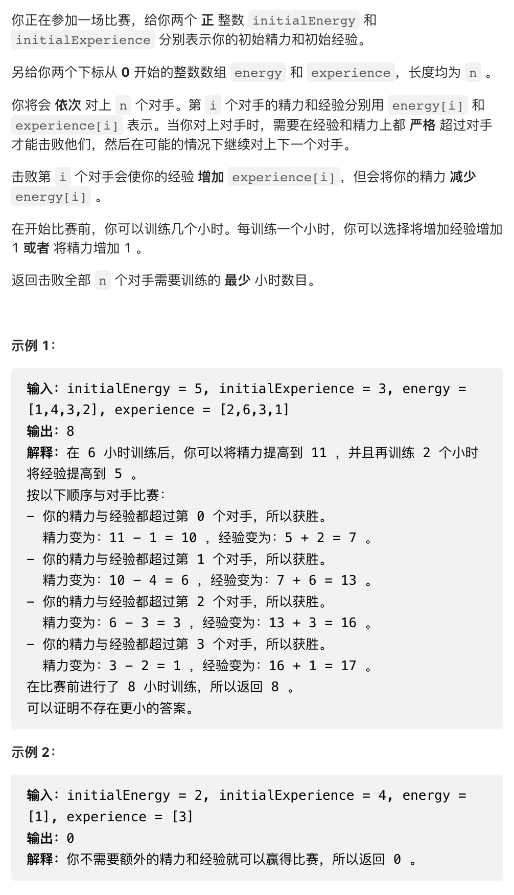
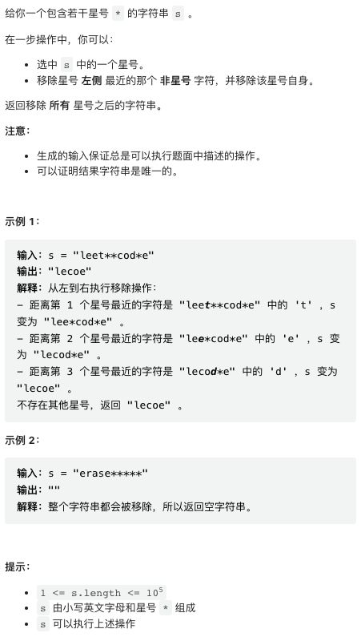
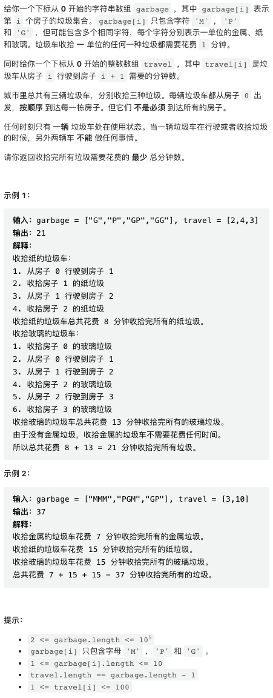
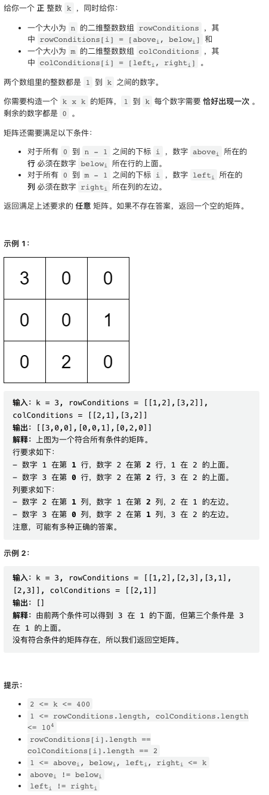

本周周赛前几题较为简单，最后一题尽管代码很短，但难度相当高。

## 1. [赢得比赛需要的最少训练时长](https://leetcode.cn/problems/minimum-hours-of-training-to-win-a-competition/)



第一题很简单，但题干有点啰嗦。直接给出题解代码。

```py
class Solution:
    def minNumberOfHours(self, initialEnergy: int, initialExperience: int, energy: List[int], experience: List[int]) -> int:

        # Energy 在比赛过程中单调递减，所以只要初始值大于 Energy 的和即可
        needEnergy = max(0, sum(energy) + 1 - initialEnergy)
        
        # 当前的能量，类似前缀和
        currExp = initialExperience
        # 需要的能量
        needExp = 0
        for e in experience:

            # Experience 单调递增，所以保证前缀和总是大于下一个元素即可
            if e >= currExp:            
                # 否则，在 Experience 的初始值上加上所需要的差值
                needExp += e - currExp + 1
                currExp = e + 1
            currExp += e
        
        return needEnergy + needExp
```

## 2. [最大回文数字](https://leetcode.cn/problems/largest-palindromic-number/)



第二题甚至比第一题更简单，给定一组数字，求这些数字能够组成的最大回文数。**回文数的序可以完全由其前半段决定**，所以只需要构造最大的回文数前半段，这只需要将大的数字尽可能地（贪心地）向前排列。

需要小心的坑是，注意不能有先导 0（也即 0 不能放在所有数字前面），以及特殊处理一下可能存在的中间一个数字。

```cpp
class Solution {
public:
    string largestPalindromic(string num) {
        vector<int> cnt(10);
        // 数一数各种数字各有多少个
        for(char c: num) cnt[c - '0']++;

        string res;
        int mid = -1; // 记录放在中间的数字是什么
        // 这个数字也即输入中不能两两配对的最大的一个数字，只能有一个

        // 开始构造回文数的前半段，尝试从较大的数字开始构造
        for(int i = 9; i >= 0; i--) {

            // 注意不能有先导 0
            if(res.size() || i != 0) {
                // 每次需要消耗两个数字
                while(cnt[i] >= 2) {
                    res.push_back(i + '0');
                    cnt[i] -= 2;
                }
            }
            // 遇到的第一个无法配对的数字放在整个回文数中间
            if(cnt[i] >= 1 and mid == -1) {
                mid = i;
                cnt[i]--;
            }
        }

        int rightSize = res.size();  // 右半段长度
        if(mid != -1) res.push_back('0' + mid);
        for(int i = rightSize - 1; i >= 0; i--) {
            res.push_back(res[i]);
        }
        return res;
    }
};
```
## 3. [感染二叉树需要的总时间](https://leetcode.cn/problems/amount-of-time-for-binary-tree-to-be-infected/)



第三题也很简单，其实就是求二叉树上距离指定节点最远的节点有多远。由于「感染」是无向的，也即既可以从子节点感染父节点，也可以从父节点感染子节点，所以这棵二叉树其实是一棵无向无环图，BFS 或者 DFS 都很容找到最远节点。DFS 更容易写，这里使用 DFS 实现。

但是在树上没法方便的找到父节点，所以需要一个额外的 DFS 过程，为每个节点找一下父节点。这个过程可以顺便找一下 start 节点的指针。

```py
class Solution:
    def amountOfTime(self, root: Optional[TreeNode], start: int) -> int:
        
        pstart = None
        parent = {}
        # DFS 寻找每个节点的 parent 节点，并寻找 start 节点
        # 由于这是一个无环图，只需要保证不要走「回头路」就能保证每个节点只遍历一次
        # "last" 记录路径中上一个节点，从而保证不走回头路
        def getParent(node, last):
            nonlocal pstart
            if not node:
                return
            if node.val == start:
                pstart = node
            parent[node] = last
            getParent(node.left, node)
            getParent(node.right, node)
        
        getParent(root, None)
        
        maxDist = -1
        # DFS 寻找最远节点
        # dist 记录当前节点与初始节点距离
        def getDist(node, last, dist):
            nonlocal maxDist
            if not node:
                return
            maxDist = max(maxDist, dist)
            if parent[node] and parent[node] != last:
                getDist(parent[node], node, dist + 1)
            if node.left != last:
                getDist(node.left, node, dist + 1)
            if node.right != last:
                getDist(node.right, node, dist + 1)
        
        getDist(pstart, None, 0)
        return maxDist
```

> 补充一下关于 python 中指针作为 key 的 dict 的实现和性能细节，不感兴趣的同学可以跳过
> 
> 这个实现中 parent 字典的 key 是 TreeNode, 这个类并没有定义 hash 函数，在 python 中这样的对象会按照其指针地址生成 hash 值。这样实现有几个需要注意的点，
> 
> 1. 在代码运行全过程中，保证指针不会失效，也即没有 object 的创建和销毁
> 2. 散列表有一定的开销。在 leetcode 上一般不成问题，但在数据规模更大时，使用 node.val 作为 key 直接开一个数字保存指针更有效率


## 4. [找出数组的第 K 大和](https://leetcode.cn/problems/find-the-k-sum-of-an-array/)



第四题尽管题解很短，但难度很大。这一题可以直接描述为「求数组的第 k 大子集和」。这个题目如果之前没有遇到过，基本上是不可能做出来的。甚至评论区很多人给出的题解，也并没有严密的证明自己的答案是对的。有一个[题解](https://leetcode.cn/problems/find-the-k-sum-of-an-array/solution/yong-by-vclip-281y/)指出这题目跟图的最短路算法 Dijstra 算法有关，仔细分析一下，确实如此。

方便分析，首先对题目做一下转换。显然，最大和子序列是所有正数的和，记为 posSum. 然后，第 k 大子序列与 posSum 对应的子序列的差异，这个差异也对应了一个子序列 kSmall，第 k 大子序列相当于将这个 kSmall 序列中的正数移出，将负数加入。于是第 k 大子序列和与最大子序列和的差值刚好是这个 kSmall 子序列的绝对值之和。这个 kSmall 子序列，按照 k 也是有序的。所以求原序列第 k 大，等价于求绝对值序列包含空集的第 k 小，或者不包含空集的第 k - 1 小。

这个题目的解法核心部分是一个递推解法，我们考虑绝对值数组不包含空集的子序列，则其最小子序列就是绝对值最小的那一个元素。考虑如果我们已知第 n 个子序列，将其表示为 $a_{x_1}, a_{x_2} \cdots a_{x_p}$ 则可以再构造两个序列，$a_{x_1}, a_{x_2} \cdots a_{x_p}, a_{x_{p+1}}$, $a_{x_1}, a_{x_2} \cdots a_{x_{p-1}}, a_{x_{p+1}}$ 两者都加入了第 $p+1$ 个元素，区别在于是否同时移除第 $p$ 个元素。我们维护一个优先队列，保证每次取到的都是最小的。代码实现如下，

```cpp
class Solution {
public:
    long long kSum(vector<int>& nums, int k) {
        int n = nums.size();
        // 求最大子序列也即正数之和
        long long posSum = 0;
        for(int x: nums) posSum += max(0, x);

        // 取绝对值，排序
        for(int i = 0; i < n; i++) nums[i] = abs(nums[i]);
        sort(nums.begin(), nums.end());
        
        // 维护一个最小堆，开始尝试寻找绝对值数组的第 k 最小
        long long kSmall = 0;
        // 优先队列维护的状态为：当前和，当前序列最大元素下标
        typedef pair<long long, int> S;
        priority_queue<S, vector<S>, greater<S>> pq;

        // 不考虑空集的第一最小
        pq.push({nums[0], 0});

        while(--k) {
            // 当前最小状态出队并记录
            long long s = pq.top().first, i = pq.top().second;
            pq.pop();
            kSmall = s;

            // 将后续的两个状态入队
            if(i + 1 < n) {
                pq.push({s + nums[i + 1] - nums[i], i + 1});
                pq.push({s + nums[i + 1], i + 1});
            }
        }
        
        return posSum - kSmall;
    }
};
```

以上的论证其实是不严格的。主要问题在于，在第 n 个状态出优先队列之后，如何保证第 n + 1 个状态处于优先队列之中呢？需要注意，每一步入队的两个新状态，并不一定是出队的状态的后续。比如，集合 `[5, 5, 4, 7]` 的一个子集是 `[5, 5]`, 按照和从小到大排序的下一个子集是 `[4, 7]`, 这两个子集并没有这个题解中给出的递推关系。

参考了讨论区大家的意见之后，我发现「下一个状态保证在队列中」这一要求是被两个事实保证的，

- 这种构造方法能够保证构造完所有的所有子列
- 每个子列构造的两个后续子列和都保证大于等于当前子列和

关于第一点的证明，可以选取一个较短的例子手推一下，

```
nums: [1, 2, 3]
subsequences:
               [1]
           /         \
      [1, 2]           [2]
     /     \          /   \
[1, 2, 3] [1, 3]   [2, 3] [3]
```

第 i 层都枚举了前 i 个元素构成的所有子序列。

第二点，nums 是绝对值并且排序，保证了 `nums[i + 1] - nums[i] >= 0` 以及 `nums[i + 1] >= 0`.

有这两个事实保证之后，可以发现，所有的子序列构成了一个二叉树，也即一个无环图，将子节点与当前节点之间的差值记为对应边的权重，则任意一个节点对应的子列和等于根节点子列和加上跟节点到这个节点的距离。于是原问题转换为图的最短路径问题。现在回看题解，会发现题解其实就是在这棵二叉树上运行 Dijstra 算法。

现在再来回顾这个问题，会发现，所有的子集（共有 $2^n$ 个）可以视为一系列节点，节点之间的有向边权重就是对应子集和的差值，于是构成一个图。这个图过于巨大，是无法完全构造的。我们知道初始节点，想要求第 k 近邻节点。为了运行 Dijkstra 算法，我们需要取一个子图，这个子图必须满足，

- 包含原图的所有节点
- 边权重是正的（Dijstra 算法的要求）

我们无法构造这个子图，但是给出了每个节点出边的构造规则，因此 Dijstra 算法可以运行。

从这个题目总结经验。

- 图算法的应用非常广泛，用于求解序列相关问题并不罕见
- 第 k 大  / 小问题可以转换为状态空间中的第 k 近邻问题
- Dijstra 算法能够在无法完整构造的图上运行，只要给定出边构造规则即可
- 递推构造解法，其实并不要求从一个状态构造下一个状态，而是要保证能够构造完所有元素

> 这里复盘一下我竞赛时的思路。没有兴趣的同学可以略过。
> 
> 对这个问题直观感受是，如果不限制 k 的取值，它的难度不低于背包问题。仔细想想是可以证明的，背包问题有一个简化版本是，给定一组数，求是否存在一个子集，其和等于给定值。该问题如果不限制 k 的取值，则解决该问题后，可以使用二分法求出该背包问题。输入取值范围很有限的背包问题是可以用 DP 求解的，但这个问题的输入范围很大，则不限定 k 取值的该问题是个 NP hard 问题。
>
> 通过这些分析，可以确定这个问题的解的时间复杂度一定是跟 k 相关的。该问题的输入范围 `k < 2000` 也强烈指示题解时间复杂度跟 k 相关。我们很容易受到诸如堆排序之类的算法启发，尝试从最大的子集和（显然是所有正数的和）开始，一个一个构造下去。
>
> 这个问题的难点就在于，给定一个子集，无法找到按顺序下一个子集是什么。这类集合问题，按顺序相邻的两个集合可以「完全不相关」。因此，在按顺序构造时，很难从上一个集合，推定下一个集合有什么特征。
>
> 到此为止，我就无计可施了。尝试的两个错误思路包括，一是试图使用类似背包问题的 DP 算法，二是尝试了几种错误的递推方案。浪费了一些时间之后，耗尽比赛时间。竞赛结束后仔细确认了一下以上逻辑，直奔题解区。

