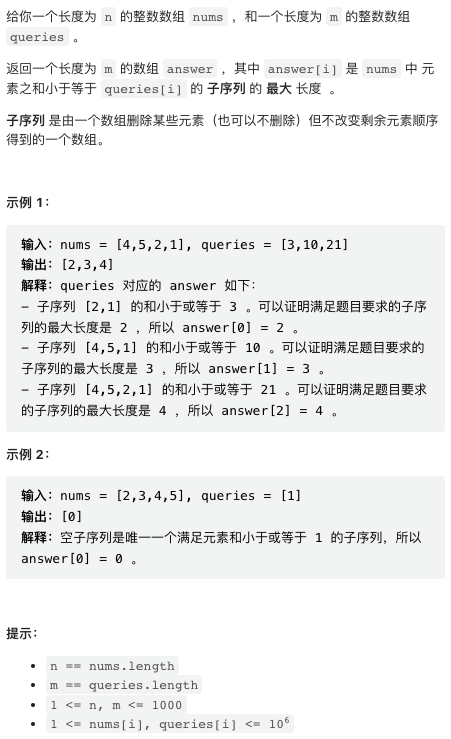
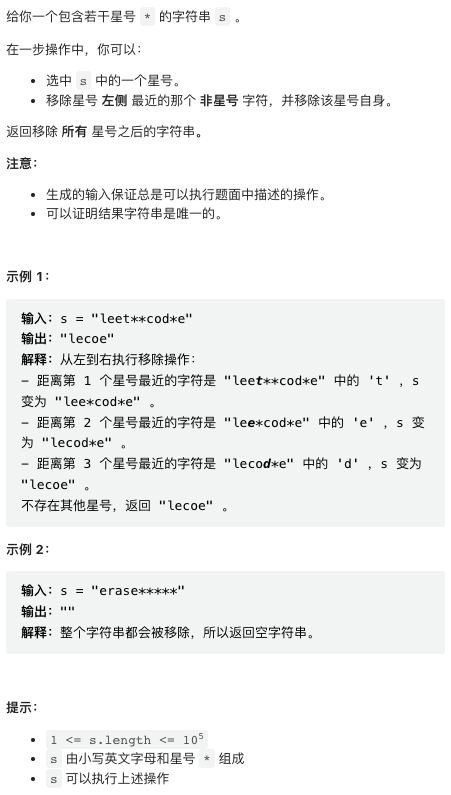
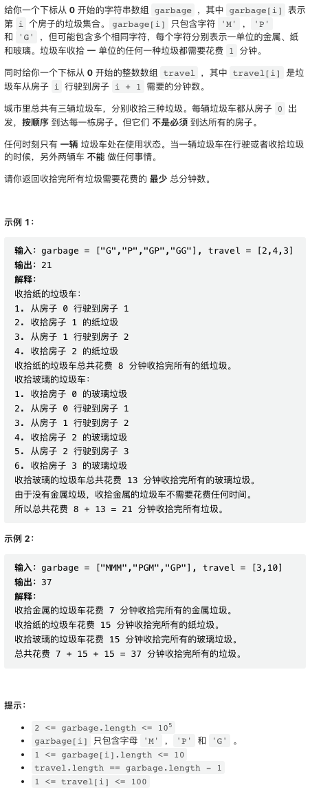

本周的几道题目较为简单，最后一题使用拓扑排序。

## [1. 和有限的最长子序列](https://leetcode.cn/problems/longest-subsequence-with-limited-sum/)



第一题较为简单，注意子序列并不要求是相邻的，求和操作也是无序的，因此可以先把原数组排序，然后从小到大求前缀和，前缀和最后一个满足条件的位置即为所求。

暴力实现这个过程，算法复杂度是 `O(MN)` 可以满足要求。也可以使用一点技巧优化到 `O(N log N + M log M)` 但对这个题目大可不必。

简洁起见，这里使用了 python 的 next 函数，这个函数返回迭代器中下一个元素，在这里返回迭代器中第一个元素。

```python
class Solution:
    def answerQueries(self, nums: List[int], queries: List[int]) -> List[int]:
        n, m = len(nums), len(queries)
        
        # 求排序数组前缀和
        pre = sorted(nums)
        for i in range(1, n):
            pre[i] += pre[i - 1]
        
        res = []
        for q in queries:
            # next 返回满足条件的第一个元素，也即 x > q 的第一个下标
            # 如果没有满足条件的元素，则返回 n 也即整个数组
            # 注意下标是从 0 计数的，所以第一个 x > q 的下标就是前一位置的数组长度
            res.append(next((i for i, x in enumerate(pre) if x > q), n))
        
        return res
```

## [2. 从字符串中移除星号](https://leetcode.cn/problems/removing-stars-from-a-string/)



这个题目可以方便地使用栈来实现。如果读到一个正常字符就入栈，读到 * 则出栈一个字符。C++ 的 string 本身就支持入栈和出栈两个操作。

```cpp
class Solution {
public:
    string removeStars(string s) {
        string res;
        for(char c: s) {
            if(c != '*') {
                res.push_back(c);
            } else {
                res.pop_back();
            }
        }
        return res;
    }
};
```

## [3. 收集垃圾的最少总时间](https://leetcode.cn/problems/minimum-amount-of-time-to-collect-garbage/)



这个题目的题干很长，但实际操作并不复杂。对于每种垃圾，只需要逐个检查每个位置是否有垃圾，如果有，就把垃圾收集车移动到该位置，并记录移动开销和在当前点的开销即可。每个点的字符串长度不超过 10, 可以暴力检查。

```python
class Solution:
    def garbageCollection(self, garbage: List[str], travel: List[int]) -> int:
        n = len(garbage)
        # 总开销
        total = 0
        # 逐个枚举每种垃圾类型
        for pick in "MPG":
            # dist 是垃圾收集车与当前检查点的距离
            # cost 是当前总开销
            dist = cost = 0
            for i in range(n):
                cnt = garbage[i].count(pick)
                if cnt > 0:
                    # 如果当前位置有着一种垃圾
                    # 则把垃圾收集车开到当前位置
                    # 开销为移动开销 + 当前点开销
                    cost += dist + cnt
                    # 已经移动到当前位置，所以 dist 清零
                    dist = 0
                if i < n - 1:
                    # 否则，更新一下 dist
                    dist += travel[i]
            total += cost
        return total
```

## [4. 给定条件下构造矩阵](https://leetcode.cn/problems/build-a-matrix-with-conditions/)


这个题目需要使用拓扑排序算法。本周周中会更新一篇文章介绍拓扑排序。

本题中 rowConditions 和 colConditions 其实可以分别处理。以 rowConditions 为例，每一个 condition 其实是指定了一对数字的相对顺序。因此只要找到一个排序，能够满足所有的相对顺序即可。这个问题是标准的拓扑排序问题。

简要介绍一下拓扑排序算法。对于该问题，我们可以先将所有的相对顺序关系建立一个图，图的边也即相对顺序关系。我们首先找到所有入度为 0 的节点，将其加入排序输出序列，同时将这些节点的后继节点入度减一，如果度数变为 0 则将这些节点也加入输出序列。实现如下。

```cpp
class Solution {
public:
    vector<vector<int>> buildMatrix(int k, vector<vector<int>>& rowConditions, vector<vector<int>>& colConditions) {

        // 行、列需要摆放的数字的拓扑排序
        vector<int> row, col;
        // 执行拓扑排序，拓扑排序顺便检查是否有环，如果有环则返回 false
        if(not topo(rowConditions, k, row) or not topo(colConditions, k, col)) return {};

        // 我们需要将拓扑排序结果「反转」
        // 将每个数字在拓扑排序中的序号作为其行、列坐标
        vector<int> x(k + 1), y(k + 1);
        for(int i = 0; i < k; i++) {
            x[row[i]] = i, y[col[i]] = i;
        }
        // 根据行、列坐标，构造输出结果
        vector<vector<int>> res(k, vector<int>(k));
        for(int i = 1; i <= k; i++) {
            res[x[i]][y[i]] = i;
        }
        return res;
    }

    bool topo(vector<vector<int>>& cond, int k, vector<int>& res) {
        // 建图，并统计各个节点的初始入度
        vector<int> degree(k + 1);
        vector<vector<int>> graph(k + 1);
        for(auto& p: cond) {
            degree[p[1]]++;
            graph[p[0]].push_back(p[1]);
        }

        // 使用队列保存当前所有入度为 0 的节点
        // 本题情境中，入度为 0 就意味着这个节点之前不用放置其他节点
        queue<int> q;
        for(int i = 1; i <= k; i++) {
            if(degree[i] == 0) {
                q.push(i);
            }
        }

        res.clear();
        while(q.size()) {
            // 出队一个入度为 0 的节点，并加入输出结果
            int node = q.front();
            q.pop();
            res.push_back(node);

            // 将这个节点所有后继的入度减一
            for(int child: graph[node]) {
                degree[child]--;

                // 如果后继的入度为 0 则加入队列
                if(degree[child] == 0) {
                    q.push(child);
                }
            }
        }

        // 如果图中有环，则拓扑排序算法无法输出所有节点
        // 此时在本题目中意味着没有可行解
        return res.size() == k;
    }
};
```
