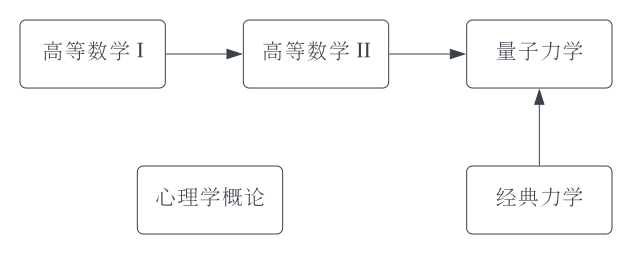

介绍一下上周周赛使用的拓扑排序算法。

拓扑排序算法一个非常经典的引入情景，是选课问题：在大学校园里，我们每门课都有一定的先修课要求，选修某门课程之前必须先选修先修课。那么，给定每门课程的先修课，请问如何给出一个选课顺序？拓扑排序这个名字，是因为这一问题是拓扑学（数学的一个分支）的一个经典研究主题。

「先修课要求」可以用一个有向图表示。节点也即课程，边表示依赖关系。这个图不一定是联通的。比如选修量子力学之前需要学完高等数学 II，而选修高等数学 II 之前当然要学习高等数学 I. 心理学概论这门课程则跟其他课程没有先修关系。



即使第一次遇到拓扑排序问题，其实也不难想到一个解法：先把没有先修课的课程全部修完，然后检查一下有哪些课先修课程已经全部满足，继续修这些课即可。实际的拓扑排序算法基本就是高效的实现上述过程。我们可以预先统计每门课有多少先修课，也即指向每个节点的边的总数（图论中称为节点的入度）。之后，我们维护一个队列，我们把所有初始入度即为 0 的节点加入队列，然后逐个 pop, 每次 pop 出一个节点后，就把这个节点的后继节点（也即这个节点出边指向的节点）的度数减一，并立即检查减一之后的度数，如果该后继节点的度数减为 0, 则也把这个节点加入队列。

先修课一般是不会出现「死循环」的，但有些依赖问题是会的。比如找一份好工作需要有漂亮的简历，而漂亮的简历需要有一份好工作，于是这就得到一个死循环。形式化表述为，如果图是有环的，我们没有办法给出所有节点的拓扑排序。但此时上述拓扑排序算法仍然是可以运行的，运行结束后，成环的节点在算法运行过程中不会入队也不会出队，因为它们的入度始终不会变成 0. 因此，只需要在算法结束后统计一下出队节点个数是否与节点总数相等即可确认图中是否有环。对于没有成环的节点，拓扑排序算法仍然能给出这部分节点的拓扑排序结果。因此，运行拓扑排序算法之前，不需要检查图中是否有环。

我们在这里复习一下周赛第四题版本的拓扑排序算法。

```cpp
bool topo(vector<vector<int>>& cond, int k, vector<int>& res) {
    // cond 实际上即为有向图的边列表，[x, y] 代表一条从 x 指向 y 的边
    // k 为节点总数，节点编号 [1, k]
    // res 保存拓扑排序结果

    // 建图，并统计各个节点的初始入度
    // 注意这个版本的节点编号是 [1, k]
    vector<int> degree(k + 1);
    vector<vector<int>> graph(k + 1);
    for(auto& p: cond) {
        degree[p[1]]++;
        graph[p[0]].push_back(p[1]);
    }

    // 使用队列保存当前所有入度为 0 的节点
    queue<int> q;
    for(int i = 1; i <= k; i++) {
        if(degree[i] == 0) {
            q.push(i);
        }
    }

    res.clear();
    while(q.size()) {
        // 出队一个入度为 0 的节点，并加入输出结果
        int node = q.front();
        q.pop();
        res.push_back(node);

        // 将这个节点所有后继的入度减一
        for(int child: graph[node]) {
            degree[child]--;

            // 如果后继的入度为 0 则加入队列
            if(degree[child] == 0) {
                q.push(child);
            }
        }
    }

    // 如果图中有环，则拓扑排序算法无法输出所有节点
    // 此时在本题目中意味着没有可行解
    return res.size() == k;
}
```

拓扑排序算法非常直观，也不太复杂，只需要记住使用入度、使用一个队列维护当前入度为 0 的节点、节点出队后更新后继节点入度，并立即检查更新后的入度是否为 0 这几个要点即可。因此一般不需要使用模板。

另外一个不使用模板的理由是，拓扑排序问题中，给出图的方式比较多样化。上文中代码是以有向边的形式给出图的。由于这是一个有向图，需要特别注意不要把边的方向搞反了，拓扑排序运行过程中需要使用的是「从被依赖节点指向后继节点」的图。有时候可能拿到的是反向的图（比如知道每门课程的依赖课程，但不知道每门被依赖课程的后继课程），此时需要先对图求逆。求逆只需要遍历图的所有的边，并反向加入逆图即可。

```cpp
void reverse(vector<vector<int>>& graph, vector<vector<int>>& reversed, vector<int>& degree) {
    // graph[i] 代表节点 i 的所有依赖节点
    // 对 graph 求逆得到逆图 reversed
    // 顺便统计入度
    int n = graph.size();
    reversed.clear(), reversed.resize(n);
    degree.clear(), degree.resize(n);
    for(int i = 0; i < n; i++) {
        for(int j: graph[i]) {
            reversed[j].push_back(i);
        }
        degree[i] = graph[i].size();
    }
}
```

还有一种简化情景，是对于树的拓扑排序。此时可以正常运行拓扑排序算法，但也可以简化一点：如果有向边的方向是从根节点指向叶节点，则树的前序遍历就是它的一个拓扑排序。如果有向边的方向是从叶节点指向根节点，则树的后序遍历就是它的一个拓扑排序。（如果不幸忘记前序遍历和后序遍历是什么了，提示一下：就是 DFS 遍历整棵树，前序遍历是先输出当前节点，再递归。后序遍历是先递归，再输出当前节点。）

比较容易看出，拓扑排序一般不是唯一的。算法运行的任意时刻，入度为 0 的节点如果不是唯一的，此时先输出任何一个节点都是可以的。明白这一点后不难发现，其实拓扑排序不一定要用队列实现，用栈也是可以的。两者的区别类似于 DFS 和 BFS. 只是习惯上，常常使用队列实现。