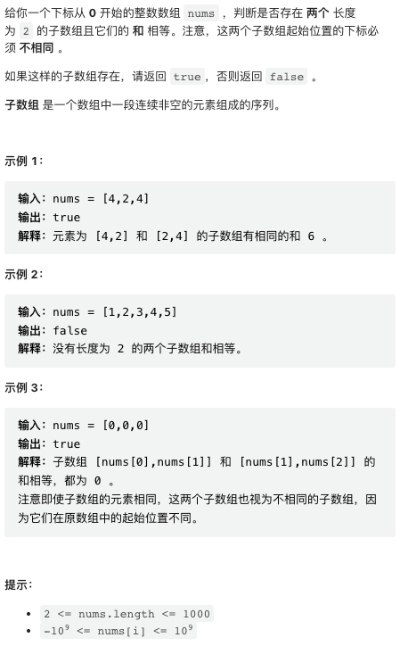
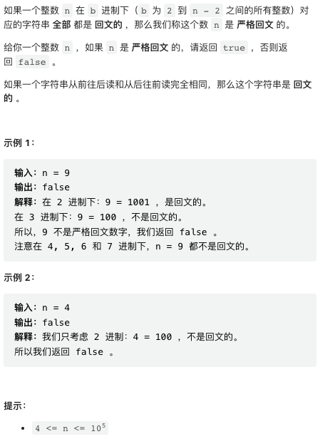
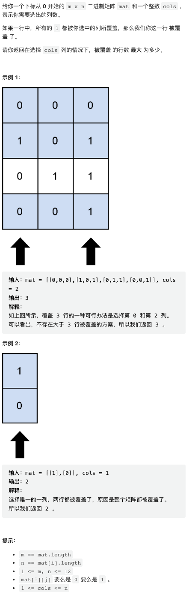
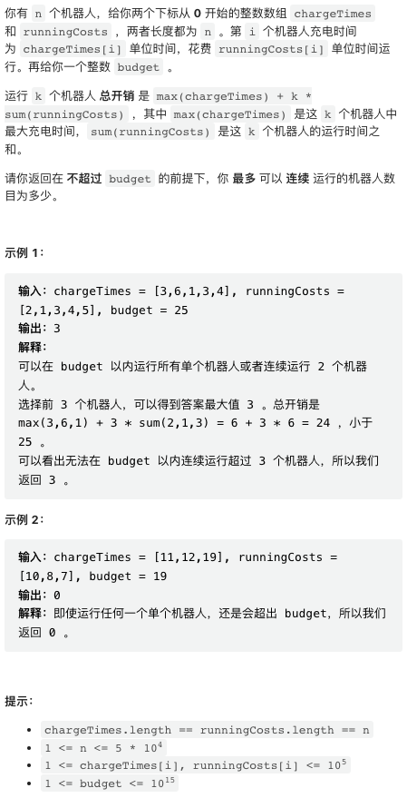

## [1. 和相等的子数组](https://leetcode.cn/problems/find-subarrays-with-equal-sum/)



暴力枚举即可。

```py
class Solution:
    def findSubarrays(self, nums: List[int]) -> bool:
        sums = set()
        for i in range(len(nums) - 1):
            s = nums[i] + nums[i + 1]
            if s in sums:
                return True
            sums.add(s)
        return False
```

## [2. 严格回文的数字](https://leetcode.cn/problems/strictly-palindromic-number/)



本题也是暴力枚举。要验证 `n base x` 是不是回文数，求出各个数位并验证即可。

```cpp
class Solution {
public:
    bool isStrictlyPalindromic(int n) {
        // 逐个暴力验证
        for(int base = 2; base <= n - 2; base++) {
            if(not pali(n, base)) return false;
        }
        return true;
    }
    vector<int> nums;
    bool pali(long long n, long long base) {
        nums.clear();
        // 求出各个数位
        while(n) {
            nums.push_back(n % base);
            n /= base;
        }
        // 验证回文数
        for(int i = 0, j = int(nums.size()) - 1; i <= j; i++, j--) {
            if(nums[i] != nums[j]) return false;
        }
        return true;
    }
};
```

这个版本是最容易理解、最容易实现的版本。但本实现中的 `pali` 函数，还有一种空间复杂度是 `O(1)` 的实现。这在比赛中其实没什么大用处，但可以应付面试官。

```cpp
bool pali(long long n, long long base) {
    // 将 left, right 分别指向 n 的最高、最低有效位 1 代表的数值
    long long left = 1, right = 1;
    while(left * base <= n) left *= base;

    // 然后，对称移动双指针，检查对应位置是否相等
    while(left > right) {
        // n / right % base 就是 n 在 right 对应的位置的数字
        if(n / right % base != n / left % base) return false;
        left /= base, right *= base;
    }
    return true;
}
```

有种直觉，这题目的条件非常苛刻，并且给出的例子都是 false. 有理由怀疑，并不存在满足要求的数。可以暴力枚举验证，确实不存在这样的数。因此本题最简单的代码是，

```cpp
class Solution {
    bool isStrictlyPalindromic(int n) {
        return false;
    }
}
```

这也不难证明。 `n = 4` 已经有验证不满足。当 `n >= 5` 时，总会有 `n = 12 (base n - 2)`. 所以所有的数都不满足要求。

## [3. 被列覆盖的最多行数](https://leetcode.cn/problems/maximum-rows-covered-by-columns/)



本题是 bit mask 暴力枚举，这周题目有太多暴力枚举。由于数据规模较小，借助 bit mask 暴力枚举所有可能的 cols 组合并一一验证即可。

```cpp
class Solution {
public:
    int maximumRows(vector<vector<int>>& mat, int cols) {
        int m = mat.size(), n = mat[0].size(), res = 0;

        // mask 每一个比特位代表一列是否被选中
        for(unsigned mask = 1; mask <= (1 << n) - 1; mask++) {

            // 这是一个 G++ 编译器内置函数，可以求指定数字的二进制表示中有多少 1
            // 这个函数并不总是可用，提交前记得先试一下
            if(__builtin_popcount(mask) != cols) continue;
            
            // 计数有多少行满足条件
            int cnt = 0;
            for(int i = 0; i < m; i++) {
                bool cover = true;
                // 检查某一行是否满足条件
                for(int j = 0; j < n and cover; j++) {
                    if(mat[i][j] and not (mask & (1 << j))) cover = false;
                }
                cnt += cover;
            }

            // 更新最大满足条件的行数
            res = max(res, cnt);
        }
        return res;
    }
};
```

## [4. 预算内的最多机器人数目](https://leetcode.cn/problems/maximum-number-of-robots-within-budget/)



最近好多滑动窗口。。

本题使用滑动窗口的前提是，尽管总开销的计算公式比较复杂，但它是单调递增的，并且加入、减去一个元素的更新计算都不困难。滑动窗口计算 sum(runningCosts) 很容易，计算 max(chargeTimes) 稍微复杂一点。如果不记得双端队列滑动窗口最大值写法了，可以用 multiset 应付一下。

```cpp
class Solution {
public:
    int maximumRobots(vector<int>& chargeTimes, vector<int>& runningCosts, long long budget) {
        // 窗口中所有 chargeTimes, multiset 可以快速求最大值
        multiset<int> mwin;
        // 窗口中总 cost
        long long cost = 0;
        // left: 窗口 left 指针
        int res = 0, left = 0, n = chargeTimes.size();
        for(int i = 0; i < n; i++) {
            // 将 i 加入窗口
            mwin.insert(chargeTimes[i]);
            cost += runningCosts[i];
            // 左侧元素移出窗口，直到满足条件
            while(left <= i and *mwin.rbegin() + (i - left + 1) * cost > budget) {
                mwin.erase(mwin.find(chargeTimes[left]));
                cost -= runningCosts[left];
                left++;
            }
            res = max(res, i - left + 1);
        }
        return res;
    }
};
```

这道题目比较漂亮的写法是使用双端队列求滑动窗最大值，双端队列比 multiset 效率更高。

双端队列求滑动窗最大值这个算法在 leetcode 比较常见。以本题为例，队列中保持元素单调递减，并从左侧 pop 需要出队的元素。这样一来，就能保证最左侧元素一直都是窗口中最大元素。

```cpp
class Solution {
public:
    int maximumRobots(vector<int>& chargeTimes, vector<int>& runningCosts, long long budget) {
        int n = chargeTimes.size();
        // 单调递减队列，用于求解窗口最大值
        deque<int> mwin;
        // 窗口中总 cost
        long long cost = 0;
        int res = 0, left = 0;
        for(int i = 0; i < n; i++) {
            // 将队列右侧比当前元素小的元素全部 pop
            while(mwin.size() and chargeTimes[mwin.back()] < chargeTimes[i]) { mwin.pop_back(); }
            // 当前元素入队
            mwin.push_back(i);
            // 更新 cost
            cost += runningCosts[i];
            // pop 左侧元素，直到满足 budget 要求
            while(left <= i and chargeTimes[mwin[0]] + (i - left + 1) * cost > budget) {
                left++;
                // 从队列中 pop 左侧元素
                if(mwin.size() and mwin[0] < left) mwin.pop_front();
                // 更新 cost
                cost -= runningCosts[left - 1];
            }
            res = max(res, i - left + 1);
        }
        return res;
    }
};
```