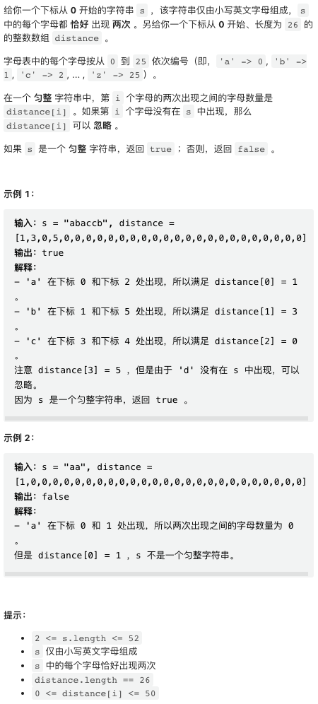
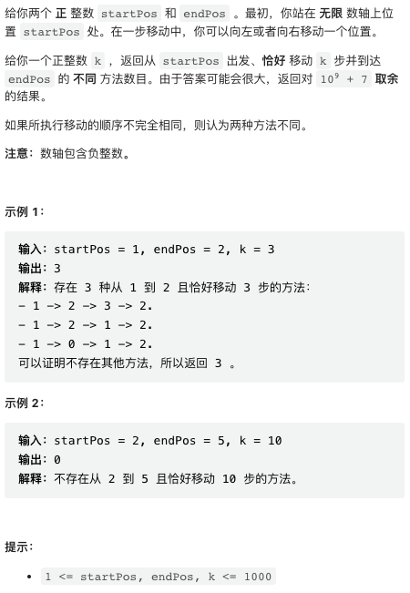
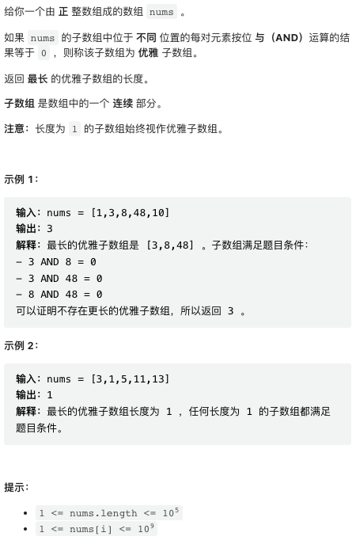
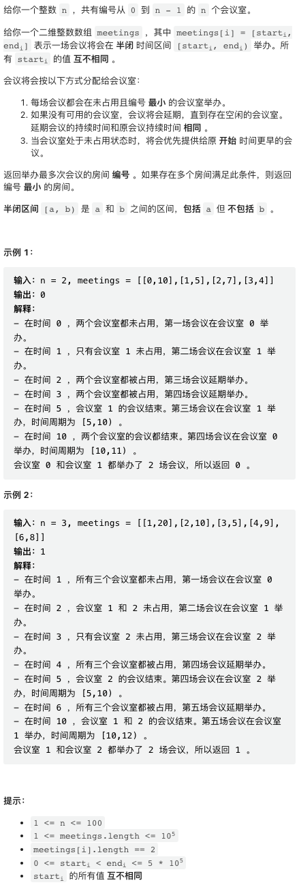

## [1. 检查相同字母间的距离](https://leetcode.cn/problems/check-distances-between-same-letters/)



本题较为简单，直接模拟即可。

```py
class Solution:
    def checkDistances(self, s: str, distance: List[int]) -> bool:
        # 记录每个字母第一次出现的位置，-1 表示从未出现
        first = [-1] * 26
        for i, c in enumerate(s):
            x = ord(c) - ord('a')
            # 如果是第一次出现，记录位置
            if first[x] == -1:
                first[x] = i
            # 否则，检查是否满足 distance 条件
            elif i - first[x] - 1 != distance[x]:
                return False
        return True
```

## [2. 恰好移动 k 步到达某一位置的方法数目](https://leetcode.cn/problems/number-of-ways-to-reach-a-position-after-exactly-k-steps/)



这个问题稍偏数学。从 start 到 end 要移动 delta = end - start 步（先假设向右，向左同理），但总共要移动 k 步，那么只能向右「净移动」 delta 步，另外向左向右分别移动 (k - delta) / 2 步互相抵消。如果 k - delta 是个奇数，就无法到达了。如果 k < delta 也是无法到达的。

一旦确定移动方案是向一个方向移动 (k - delta) / 2 步，向另一个方向移动剩余的步数，则总方案数其实就是组合数 Comb(k, (k - delta) / 2), 也即从 k 步里挑选 (k - delta) / 2 步向一个方向移动即可。

使用 C++ / Java 等语言实现组合数 MOD 10^9 + 7 牵扯到一些数论知识。这里偷懒一下，利用 Python comb 函数实现。Python 3 默认无限精度整数，不会溢出。特别注意，这个函数在数字很大时比较慢，提交之前用一些比较大的例子测试一下会不会超时。

```py
class Solution:
    def numberOfWays(self, startPos: int, endPos: int, k: int) -> int:
        delta = endPos - startPos
        if k < delta or (k - delta) % 2 != 0: return 0
        return math.comb(k, (k - delta) // 2) % (10 ** 9 + 7)
```

## [3. 最长优雅子数组](https://leetcode.cn/problems/longest-nice-subarray/)



本题跟位运算以及滑动窗口有关，类似于滑动窗口求和。

本题的关键在于，题目条件中的「两两按位与为 0」其实等价于这个字串内所有的数字都不能有同时为 1 的比特位。因此，只需要将窗口内所有的数字求按位或，如果新数字跟该结果按位与不为零，就缩减窗口即可。

```cpp
class Solution {
public:
    int longestNiceSubarray(vector<int>& nums) {
        // window 是滑动窗口内所有数字的按位或
        int window = 0, res = 0, n = nums.size();
        for(int left = 0, right = 0; right < n; right++) {
            // 如果新数字无法加入滑动窗口，则移除最左侧数字
            // 异或操作可以移除 window 中跟 nums[left] 相同的比特位
            while(window & nums[right]) window ^= nums[left++];
            // 当前数字加入滑动窗口
            window |= nums[right];
            // 更新结果
            res = max(res, right - left + 1);
        }
        return res;
    }
};
```

## [4. 会议室 III](https://leetcode.cn/problems/meeting-rooms-iii/)



本题难度不高，是非常直接的模拟思路，但比较啰嗦。这里给出的解法并不是最简洁的解法，但该解法思路上比较直白通用。

「模拟」是最直白的思路，就是直接模拟所有会议逐个开会的整个过程。当一个会议将要开会时，如果有空闲会议室，就立即开会，并标记一下这个会议室什么时候空出来。于是我们需要有一个数据结构快速得到当前空闲的、编号最小的会议室，优先队列可以满足要求。我们在开新的会议之前也需要检查一下之前正在进行的会议有没有结束。可以使用另一个优先队列，将正在进行的会议按照结束时间排序。

这个思路有个问题是，需要小心处理时间点问题，不要错过关键时间点，也即会议的开始和结束。本题的时间线可以长达 `10^5 * 5*10^5 = 5*10^10` 不能暴力枚举所有时间点，同时也小心溢出。所以，我们需要小心的将所有会议的开始时间点和结束时间点再用一个优先队列维护，在每一个关键时点检查是否有事件发生（会议开始和结束）。

本题有个比较方便的地方，就是会议一定是按照顺序举行的，因此可以把存放会议的数组作为一个栈来使用，逐个开会。

题解区有更简洁的解法，主要是不用处理时间点问题。维护关键时间点虽然比较麻烦，但这个思路的优势是，即使情景更复杂一点（比如同一时间点可以有多个会议开始），也能轻松应对。

```cpp
class Solution {
public:
    typedef pair<long long, long long> pll;
    typedef priority_queue<pll, vector<pll>, greater<pll>> pqll;
    typedef priority_queue<long long, vector<long long>, greater<long long>> pql;
    
    int mostBooked(int n, vector<vector<int>>& meetings) {
        // min 优先队列，维护当前正在进行的会议
        // 存放数据结构为 <end_time, room_id>
        pqll running;
        
        // min 优先队列，存放当前空闲的会议室
        pql rooms;
        for(long long i = 0; i < n; i++) rooms.push(i);

        // 记录每个会议室举行了多少会议
        vector<int> held(n);
        
        // min 优先队列，存放关键时间点
        // 初始化将所有会议开始时间加入关键时间点
        pql times;
        for(auto& p: meetings) times.push(p[0]);
        
        // 将所有会议按照开始时间反向排序
        // 然后原地把这个数组当作栈使用，逐个开会
        sort(meetings.begin(), meetings.end());
        reverse(meetings.begin(), meetings.end());

        while(times.size()) {
            // 在关键时间点上触发检查
            long long t = times.top();
            times.pop();
            
            // 检查有没有会议结束
            if(running.size() and running.top().first <= t) {
                // 处理结束事件，将空闲会议室放回会议室队列
                rooms.push(running.top().second);
                running.pop();
            }
            
            // 如果有会议室空闲，并且当前有会议正在等待，处理会议开始事件
            auto& p = meetings.back();
            if(meetings.size() and rooms.size() and p[0] <= t) {
                // 占用一个会议室
                int r = rooms.top();
                rooms.pop();
                held[r]++;
                
                // 将这个会议加入开会队列
                running.push({p[1] + t - p[0], r});
                // 把结束事件加入时间点队列
                times.push(p[1] + t - p[0]);
                meetings.pop_back();
            }
        }

        // max_element 函数返回最大元素的迭代器
        return max_element(held.begin(), held.end()) - held.begin();
    }
};
```