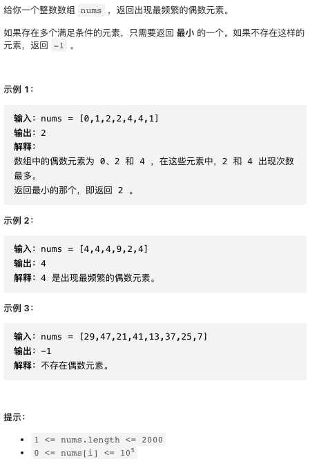
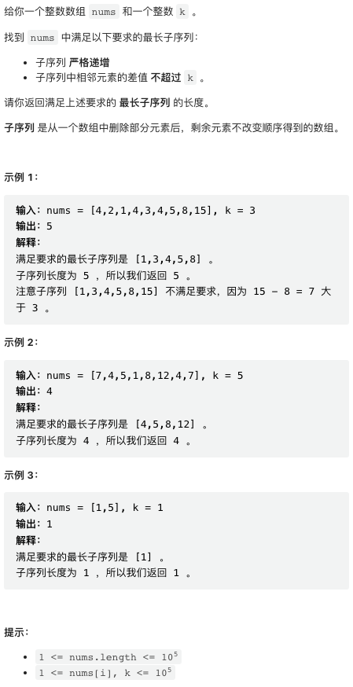

本周四道题目都非常简洁漂亮，最后一题需要对最长递增子列问题理解的比较透彻，并需要使用线段树数据结构。

## [1. 出现最频繁的偶数元素](https://leetcode.cn/problems/most-frequent-even-element/)



非常简单，小心一点处理「多个满足条件元素」的情况即可。

```py
class Solution:
    def mostFrequentEven(self, nums: List[int]) -> int:
        # 这个容器为所有的偶数统计出现频率，也即 {value: count}
        cnt = collections.Counter(x for x in nums if x % 2 == 0)
        # 题目要求等价于按照 count 正序排序，出现 tie 时按照 key 逆序排序
        # 然后取最末尾元素
        pairs = sorted((cnt[key], -key) for key in cnt)
        # 注意检查如果偶数，返回 -1
        return -1 if len(pairs) == 0 else -pairs[-1][1]
```

## [2. 子字符串的最优划分](https://leetcode.cn/problems/optimal-partition-of-string/)


这个问题比较容易直觉的判断，贪心的划分就是最优的划分。贪心也即从第一个子串开始，就尽可能的多包含字符。这个贪心法很容易证明确实是最优的：从第一个区间开始，尽可能的多包涵一些字符，剩下的字符串会比较短，而比较短的字符串需要的划分次数一定更少。

具体到实现上，可以使用一个 bit mask 来标记每个字符是不是已经在当前区间出现过了。

```cpp
class Solution {
public:
    int partitionString(string s) {
        // bit mask, 标记当前区间出现过的字符串
        // 个人习惯，所有的位运算尽可能使用 unsigned 类型
        unsigned seen = 0;
        // res 即为区间总数
        int res = 0;
        for(char c: s) {
            // 将当前字符用一个比特位表示
            unsigned m = 1 << (c - 'a');
            if(seen & m) {
                // 如果该字符在当前区间出现过，
                // 从该字符开始，生成一个新区间
                // 新区间包含该字符
                seen = m;
            } else {
                // 如果该字符第一次出现，标记
                seen |= m;
                res++;
            }
        }
        // 注意，以上循环是在区间末尾计数的，
        // 因此不会计数最后一个区间，需要单独检查一下
        return res + (seen != 0);
        // seen == 0 实际上是只在输入为空时出现，本题输入不会有这种情况
        // return res + 1;
    }
};
```

## [3. 将区间分为最少组数](https://leetcode.cn/problems/divide-intervals-into-minimum-number-of-groups/)


这个问题有种强烈的直觉是跟括号深度问题等价，直接将区间视为括号，检查括号最深深度即可。大着胆子提交了一下，果然过了。以下代码是所谓「括号匹配最大深度」问题的经典写法。

```py
class Solution:
    def minGroups(self, intervals: List[List[int]]) -> int:
        # 将区间端点全部加入一个 list 并排序
        p = []
        for x in intervals:
            # 在 x[0] 位置，深度 + 1
            p.append((x[0], 1))
            # 在 x[1] + 1 位置，深度 -1
            p.append((x[1] + 1, -1))
        p.sort()
        
        curr = res = 0
        for x, d in p:
            # 统计当前深度并更新最大深度
            curr += d
            res = max(res, curr)
        return res
```

该解法写起来容易，证明起来却非常的困难。我们要证明最少划分等于重合数最多的一个点的重合深度。竞赛之后，我想了好久，给出了一个数学归纳法证明。这个证明比较复杂，这里文本比较简略难懂，不感兴趣的同学也可以跳过。

显然，最大重合深度是 1 时（没有重合），该结论成立。假设该结论对重合深度为 N - 1 成立。

假设最大重合深度为 N, 若只有一个连续区间的重合深度是 N, 则只要在覆盖该子区间的所有输入区间（输入数据中给出的那些区间）中任取一个，单独作为一组，就能令重合深度降为 N - 1.

重点讨论当有多个连续区间重合深度为 N 的情景。

考虑其中某个两个重合深度为 N 的区间 A, B, 不妨假设 A 在 B 左侧，我们要证明，覆盖 B 的任意一个输入区间 X, A 中一定存在一个区间 Y 与之不重合。使用反证法，如果 A 中不存在这样的区间，则 A 中所有区间都与 B 重合，于是 B 右侧端点重合深度为 N + 1, 与当前最大重合深度为 N 矛盾。显然，覆盖 A 的任意一区间，B 中也存在一个区间与之不重合。

于是，对于有多个连续区间重合深度为 N 的情景，我们可以从左侧第一个区间开始，先任意选取一个覆盖该区间的输入区间，按照上述证明，我们可以向右连续的选下去，直到选到一组彼此不重合的输入区间，且所有的深度为 N 的区间都被这组输入区间覆盖一次。这些区间构成一组，可以令余下输入区间重合深度降为 N - 1.

找数学归纳法，证明完毕。

## [4. 最长递增子序列 II](https://leetcode.cn/problems/longest-increasing-subsequence-ii/)



顺利求解该问题有两个前提条件：一是足够理解最长递增子序列问题，而不仅仅是记住了写法。二是，需要知晓一种能够快速求解区间最大值问题的数据结构，比如线段树。

我将在本周周中以一篇文章专门讲解线段树，本文只讲解该问题本身，将线段树作为抽象数据结构使用。

最长递归子列问题的经典解法是一个特殊的 DP 解法。若要求解以第 i 个数（记为 X(i)）结尾的最长递增子列，则需要检查左侧所有小于 X(i) 的数，以它们结尾的最长递归子列是什么，然后在此基础上加一即可。如果暴力的实现这个算法，能够得到一个 O(N^2) 的最长递归子列问题的解。我们常常看到的那个非常精妙的解法是在这个解的基础上，做了很多优化得到的。

我们在这里不用去仔细复习那些优化了，因为这个问题的情景下，那些优化统统没有用了。这个问题限制了子列中相邻元素差值不超过 k, 于是，对于 X(i), 需要检查左侧位于 [X(i) - k, X(i) - 1] 区间中的值，得到以这些值结尾的最长子列。

我们记以 i 结尾的最长子列为 A(i). 原版的最长递增子列问题，最重要的优化在于，对于 i 左侧所有的位置，如果某个位置 j, 存在另一个位置 p, A(j) <= A(p) 并且 X(j) > X(p), 则 j 就没有存在的必要了，可以不存储也不检查 j 的状态，因为 p 一定是更优的选择。但该问题里，这个事实不成立了，因此我们需要存储、检查所有的状态。

于是，我们需要一个数据结构，它对于所有 X(j), 能够存储一个值 A(j). 我们需要查询对于所有位于区间 [X(i) - k, X(i) - 1] 中的 X(j), 对应的 A(j) 最大值是什么。并且，该数据结构的查询、更新需要有低于 O(N) 的复杂度，才能把这个解的复杂度控制在 O(N^2) 以下。

当 X(j) 的取值范围有限时，能够满足这个要求的数据结构是线段树。今天略过不讲，仅仅将其作为抽象数据结构使用。

明白了这些问题，最终的实现非常简洁。

```cpp

// 线段树模板，可以先跳过
template <typename NUM>
struct SegmentTree {
    // a + b or max(a, b) or min(a, b)
    inline NUM func(NUM a, NUM b) { return max(a, b); }
    // VOID == 0 for sum, NUM_MAX for min, NUM_MIN for max
    const static NUM VOID = 0;

    int size;
    std::vector<NUM> tree;  // 1-indexed full tree
    inline NUM get(int idx) { return tree[idx + size]; }
    SegmentTree(std::vector<NUM>& data) { init(data); }

    // SegmentTree(int size) : size(size), tree(size * 2, VOID) {}
    // LeetCode didn't support below!!! use the this one instead:
    SegmentTree(int size) { this->size = size, this->tree.resize(size * 2); }

    void init(std::vector<NUM>& data) {
        size = int(data.size());
        tree.resize(size * 2);
        std::copy(data.begin(), data.end(), tree.begin() + size);
        for (int i = size - 1; i > 0; i--) {
            tree[i] = func(tree[i * 2], tree[i * 2 + 1]);
        }
    }

    void update(int idx, NUM val) {
        idx += size;
        tree[idx] = val;
        while (idx != 0) {
            idx /= 2;
            tree[idx] = func(tree[2 * idx], tree[2 * idx + 1]);
        }
    }

    NUM query(int left, int right) {
        left += size, right += size;
        NUM res = VOID;
        while (left <= right) {
            if (left % 2 == 1) res = func(res, tree[left++]);
            if (right % 2 == 0) res = func(res, tree[right--]);
            left /= 2, right /= 2;
        }
        return res;
    }
};

class Solution {
    public:
    int lengthOfLIS(vector<int>& nums, int k) {
        
        const int M = 1E5 + 8;
        
        // 线段树
        // 维护对于任何一个值 nums[j], 以它结尾的 LIS 最大长度
        SegmentTree<int> lis(M);

        for(int x: nums) {
            // nums[j] in [max(1, x - k), x - 1]
            int left = max(1, x - k), right = x - 1;
            // 查询 [max(1, x - k), x - 1] 区间内最大值
            int r = lis.query(left, right) + 1;
            // 更新 nums[i] 对应的 LIS 长度
            lis.update(x, r);
        }
        // 最终结果是以任意值结尾的 LIS
        return lis.query(1, M - 1);
    }
};
```