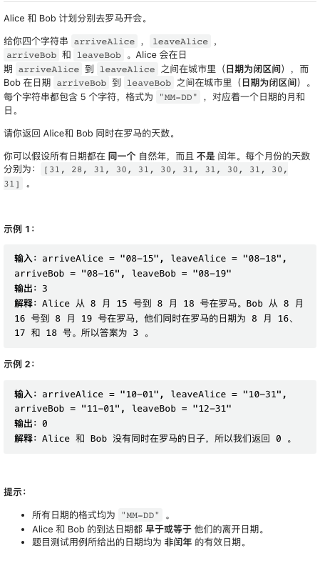
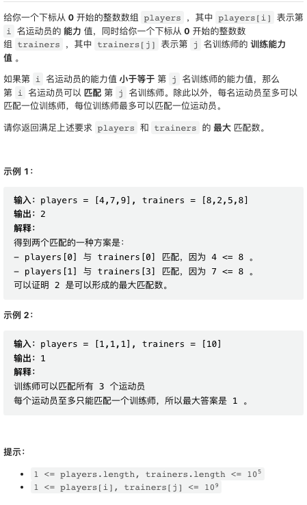
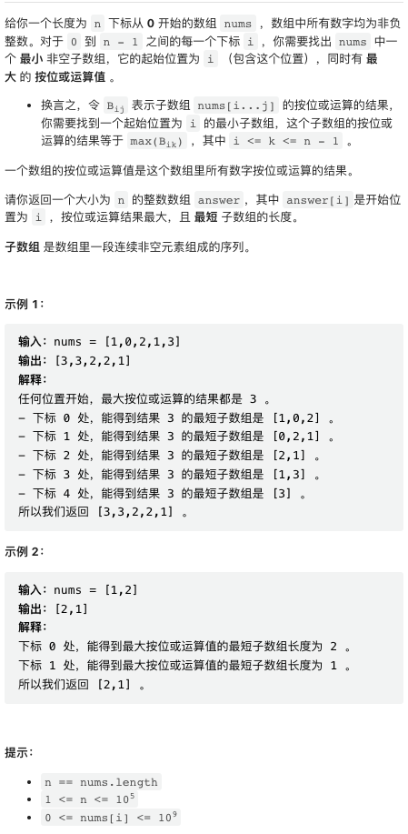
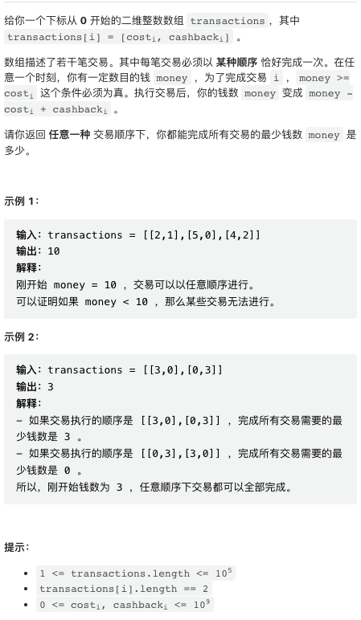

LeetCode 除了每周周日有个周赛之外，还在双周周六有个双周赛。由于本人太懒，这个双周赛题解愣是拖了一周。本周双周赛第三题位运算有点意思，第四题实现毫无难度。

## [1. 统计共同度过的日子数](https://leetcode.cn/problems/count-days-spent-together/)



最好能够熟练使用任意语言的日期库，否则手写日期处理比较麻烦。

```py
class Solution:
    def countDaysTogether(self, arriveAlice: str, leaveAlice: str, arriveBob: str, leaveBob: str) -> int:
        strptime = datetime.datetime.strptime
        x1 = strptime(arriveAlice, "%m-%d")
        y1 = strptime(leaveAlice, "%m-%d")
        x2 = strptime(arriveBob, "%m-%d")
        y2 = strptime(leaveBob, "%m-%d")
        if x1 > x2:
            x1, y1, x2, y2 = x2, y2, x1, y1
        delta = (min(y1, y2) - x2).days + 1
        return max(0, delta, )
```

## [2. 运动员和训练师的最大匹配数](https://leetcode.cn/problems/maximum-matching-of-players-with-trainers/)



将运动员和训练师分别排序，然后贪心的匹配即可。

```py
class Solution:
    def matchPlayersAndTrainers(self, players: List[int], trainers: List[int]) -> int:
        players.sort()
        trainers.sort()
        it = res = 0
        for p in players:
            while it < len(trainers) and trainers[it] < p:
                it += 1
            if it >= len(trainers):
                break
            res += 1
            it += 1
        return res
```

## [3. 按位或最大的最小子数组长度](https://leetcode.cn/problems/smallest-subarrays-with-maximum-bitwise-or/)



这个题目有点意思。这里贴出来的 python 解是讨论区 Lee 的解。下面的 C++ 是我比赛时写出的解，时间复杂度、思路都是一样的，但没有优化到这么漂亮。

```py
class Solution:
    def smallestSubarrays(self, nums: List[int]) -> List[int]:
        m = 32
        n = len(nums)
        last = [0] * 32
        res = [0] * n
        for i in range(n - 1, -1, -1):
            for j in range(m):
                if nums[i] & (1 << j):
                    last[j] = i
            res[i] = max(1, max(last) - i + 1)
        return res
```

```cpp
class Solution {
public:
    vector<int> smallestSubarrays(vector<int>& nums) {
        int N = 32, n = nums.size();
        
        vector<int> suf = nums;
        for(int i = n - 2; i >= 0; i--) suf[i] |= suf[i + 1];
        
        vector<vector<int>> pos(N);
        for(int i = n - 1; i >= 0; i--) {
            for(int j = 0; j < N; j++) {
                if(nums[i] & (1 << j)) {
                    pos[j].push_back(i);
                }
            }
        }
        
        vector<int> res(n);
        for(int i = 0; i < n; i++) {
            int x = i;
            for(int j = 0; j < N; j++) {
                if(suf[i] & (1 << j)) {
                    x = max(x, pos[j].back());
                }
                if(nums[i] & (1 << j)) {
                    pos[j].pop_back();
                }
            }
            res[i] = x - i + 1;
        }
        
        return res;
    }
};
```

## [4. 完成所有交易的初始最少钱数](https://leetcode.cn/problems/minimum-money-required-before-transactions/)



这个题目的关键在于找到「最差」交易策略。最差交易策略是，先完成所有赔钱的策略，然后再做赚钱的策略。重点在于最后一个赔钱策略和第一个赚钱策略的选取。最后一个赔钱策略，应该选取 cashback 最多的那个交易。第一个赚钱策略，应该选择 cost 最多的那个交易。

一旦完成推理，这道题目的实现是 easy 级别的。

```py
class Solution:
    def minimumMoney(self, transactions: List[List[int]]) -> int:
        
        neg_delta = [p[0] - p[1] for p in transactions if p[1] <= p[0]]
        neg_remain = [p[1] for p in transactions if p[1] <= p[0]]
        pos_cost = [p[0] for p in transactions if p[1] > p[0]]
        
        first_pos = max(pos_cost) if len(pos_cost) else 0
        r = max(neg_remain) if len(neg_remain) else 0
        return sum(neg_delta) + max(r, first_pos)
```