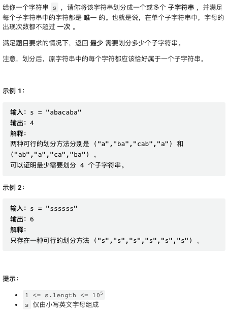

本周的题目比较简单。从本周开始，我将会侧重视频题解，文字版从简。视频题解信息量更大，讲解更清晰！

## [1. 最小偶倍数](https://leetcode.cn/problems/smallest-even-multiple/)


非常简单，直接实现。

```py
class Solution:
    def smallestEvenMultiple(self, n: int) -> int:
        return n if n % 2 == 0 else n * 2
```

## [2. 最长的字母序连续子字符串的长度](https://leetcode.cn/problems/length-of-the-longest-alphabetical-continuous-substring/)



同样简单，直接实现。

```cpp
class Solution {
public:
    int longestContinuousSubstring(string s) {
        int n = s.size();
        int res = 0, curr = 0;
        for(int i = 0; i < n; i++) {
            if(i != 0 and s[i] == s[i - 1] + 1) {
                curr++;
            } else {
                curr = 1;
            }
            res = max(res, curr);
        }
        return res;
    }
};
```

## [3. 反转二叉树的奇数层](https://leetcode.cn/problems/reverse-odd-levels-of-binary-tree/)


层次广度优先遍历。

```py
class Solution {
public:
    TreeNode* reverseOddLevels(TreeNode* root) {
        vector<TreeNode*> nodes = {root}, _nodes;
        bool rev = true;
        while(nodes.size()) {
            _nodes.clear();
            for(auto& n: nodes) {
                if(n && n->left) _nodes.push_back(n->left);
                if(n && n->right) _nodes.push_back(n->right);
            }
            if(rev) {
                int m = _nodes.size();
                for(int i = 0, j = m - 1; i < j; i++, j--) {
                    swap(_nodes[i]->val, _nodes[j]->val);
                }
            }
            swap(_nodes, nodes);
            rev = !rev;
        }
        return root;
    }
};
```

## [4. 最长递增子序列 II](https://leetcode.cn/problems/sum-of-prefix-scores-of-strings/)


字典树 Trie.

```cpp
struct Trie {
    int count;
    Trie* childs[26];
    Trie(): count(0) { fill(childs, childs + 26, nullptr); }
};

class Solution {
    vector<Trie> nodes;
    void insert(string& s) {]
        if(nodes.size() == 0) nodes.emplace_back();
        Trie* curr = &nodes[0];
        for(char c: s) {
            int i = c - 'a';
            auto& next = curr->childs[i];
            if(!next) next = &nodes.emplace_back();
            next->count++;
            curr = next;
        }
    }
    int total_score(string& s) {
        int score = 0;
        Trie* curr = &nodes[0];
        for(char c: s) {
            int i = c - 'a';
            auto next = curr->childs[i];
            score += next->count;
            curr = next;
        }
        return score;
    }
public:
    vector<int> sumPrefixScores(vector<string>& words) {
        nodes.clear();
        nodes.reserve(words.size() * 1024);
        for(string& s: words) insert(s);
        vector<int> res;
        for(string& s: words) res.push_back(total_score(s));
        return res;
    }
};
```