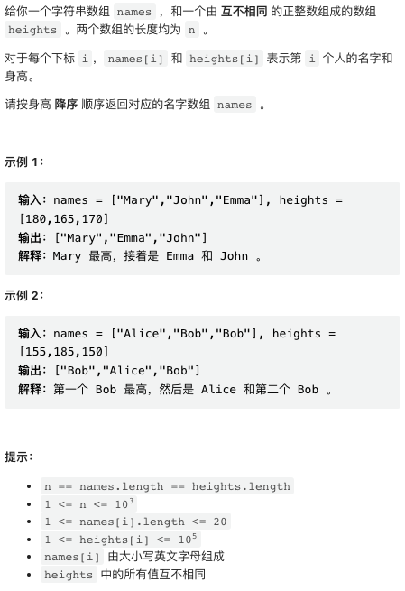
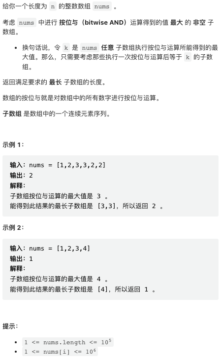
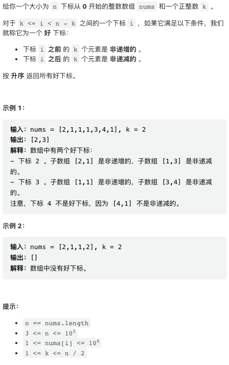
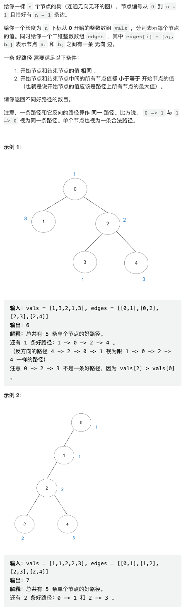
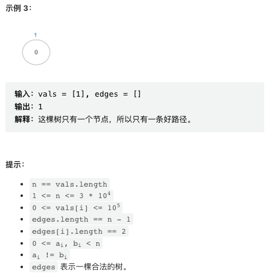

本周几道题目难度一般，最后一题比较精巧，需要使用并查集，难倒一片选手。

## [1. 按身高排序](https://leetcode.cn/problems/sort-the-people/)



非常简单的一道题目，排序输出即可。

```py
class Solution:
    def sortPeople(self, names: List[str], heights: List[int]) -> List[str]:
        p = sorted(zip(heights, names), reverse=True)
        return [x[1] for x in p]
```

## [2. 按位与最大的最长子数组](https://leetcode.cn/problems/longest-subarray-with-maximum-bitwise-and/)



本题的要点在于，「按位与最大的最长子数组」就是数组中最长的连续的最大值。

```py
class Solution:
    def longestSubarray(self, nums: List[int]) -> int:
        maxVal = repeat = res = -1
        for i in range(len(nums)):
            if nums[i] > maxVal:
                maxVal = nums[i]
                res = repeat = 1
            elif nums[i] == maxVal:
                if i != 0 and nums[i - 1] == maxVal:
                    repeat += 1
                else:
                    repeat = 1
                res = max(res, repeat)
        return res
```

## [3. 找到所有好下标](https://leetcode.cn/problems/find-all-good-indices/)



DP 求每个位置之前的递减字串长度和之后的递增字串长度。

```py
class Solution:
    def goodIndices(self, nums: List[int], k: int) -> List[int]:
        n = len(nums)
        dec, inc = [0] * n, [0] * n
        
        for i in range(1, n):
            if i != 1 and nums[i - 1] <= nums[i - 2]:
                dec[i] = dec[i - 1] + 1
            else:
                dec[i] = 1

        for i in range(n - 2, -1, -1):
            if i != n - 2 and nums[i + 1] <= nums[i + 2]:            
                inc[i] = inc[i + 1] + 1
            else:
                inc[i] = 1

        return [i for i in range(n) if inc[i] >= k and dec[i] >= k]
```

## [4. 好路径的数目](https://leetcode.cn/problems/number-of-good-paths/)




这个题目稍有难度。

首先要注意，本题的数据规模非常大。节点两两之间都有路径，因此好的路径数目最多可以达到 `O(n^2)` 量级，本题的数据规模高达 `n = 3 * 10 ^ 4`, 因此所有「逐一验证」（也就是一个一个数）的方法都会超时，必须给出一个复杂度低于 `O(n^2)` 的解法。

一个很有启发性的点是，对于 vals 都等于最大值最大的一组节点，它们两两之间的路径都必然是好路径。进一步思考，一个自然的思路就是，考虑一组 vals 相等（等于 x）的节点，先只考虑两个端点都小于等于 x 的边构成的子图，在这个子图上彼此连通的点之间的路径，都是好路径。

基于这个思路，使用一系列「小技巧」，并使用并查集，能够把时间复杂度控制在接近 `O(n log n)`.

```py
class Solution:
    def numberOfGoodPaths(self, vals: List[int], edges: List[List[int]]) -> int:
        n = len(vals)
        
        pvals = sorted([(x, i) for i, x in enumerate(vals)])
        we = sorted([(max(vals[x], vals[y]), x, y) for x, y in edges])
        
        mfs = list(range(n))
        def find(x):
            if mfs[x] == x:
                return x
            mfs[x] = find(mfs[x])
            return mfs[x]
        def merge(x, y):
            mfs[find(y)] = find(x)

        gcnt = [0] * n
        res = 0
        i = j = p = q = 0
        
        while(i < n):
            limit = pvals[i][0]
            while(j < n and pvals[j][0] == limit):
                j += 1
            while(q < n - 1 and we[q][0] <= limit):
                q += 1
            
            for k in range(p, q):
                merge(we[k][1], we[k][2])
            for k in range(i, j):
                gcnt[find(pvals[k][1])] += 1
            for k in range(i, j):
                g = find(pvals[k][1])
                gc = gcnt[g]
                gcnt[g] = 0
                res += gc * (gc + 1) // 2
            i, p = j, q
        
        return res
```

```cpp
class Solution {
    struct MergeFindSet {
        std::vector<int> p;
        MergeFindSet(int n) : p(n) { init(); }
        int find(int x) { return p[x] == x ? x : p[x] = find(p[x]); }
        void merge(int root, int child) { p[find(child)] = find(root); }
        void init() {
            for (int i = 0; i < int(p.size()); i++) p[i] = i;
        }
    };
    
public:
    int numberOfGoodPaths(vector<int>& vals, vector<vector<int>>& edges) {
        int n = vals.size();
        
        vector<pair<int, int>> pvals;
        for(int i = 0; i < n; i++) {
            pvals.push_back({vals[i], i});
        }
        sort(pvals.begin(), pvals.end());
        
        vector<tuple<int, int, int>> we;
        for(int i = 0; i < n - 1; i++) {
            int x = edges[i][0], y = edges[i][1];
            we.push_back({max(vals[x], vals[y]), x, y});
        }
        sort(we.begin(), we.end());

        vector<int> gcnt(n);
        MergeFindSet mfs(n);
        int res = 0;
        
        for(int i = 0, j = 0, p = 0, q = 0; i < n; p = q, i = j) {
            int limit = pvals[i].first;
            while(j < n and pvals[j].first == limit) j++;
            while(q < n - 1 and get<0>(we[q]) <= limit) q++;
            
            for(int k = p; k < q; k++) {
                mfs.merge(get<1>(we[k]), get<2>(we[k]));
            }
            for(int k = i; k < j; k++) {
                int g = mfs.find(pvals[k].second);
                gcnt[g]++;
            }
            for(int k = i; k < j; k++) {
                int g = mfs.find(pvals[k].second);
                int gc = gcnt[g];
                gcnt[g] = 0;
                res += gc * (gc + 1) / 2;
            }
        }
        
        return res;
    }
};
```