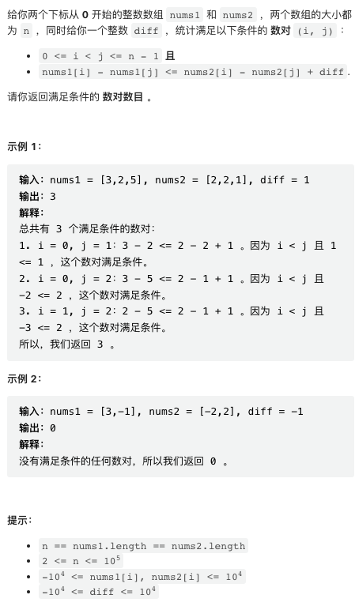

LeetCode 周赛之外，还有个双周赛。本周开始，我会更新双周赛的文字版题解！

[中国站传送门](https://leetcode.cn/contest/biweekly-contest-88/) | [国际站传送门](https://leetcode.com/contest/biweekly-contest-88/)

## 1. 删除字符使频率相同


比较简单，逐个删除，然后检查即可。

这个问题是有时间复杂度更低的解的，但这个最粗暴的解足够过掉了。

```py
class Solution:
    def equalFrequency(self, word: str) -> bool:
        def check(s):
            return len(set(Counter(s).values())) == 1
        for i in range(len(word)):
            if check(word[:i] + word[i + 1:]):
                return True
        return False
```

## 2. 最长上传前缀


题目有点难懂，仔细读一下题。

```py
class LUPrefix:
    def __init__(self, n: int):
        self.curr_longest = 0
        self.uploaded = [False] * (n + 2)

    def upload(self, video: int) -> None:
        self.uploaded[video] = True
        while self.uploaded[self.curr_longest + 1] == True:
            self.curr_longest += 1

    def longest(self) -> int:
        return self.curr_longest
```

## 3. 所有数对的异或和


这是一个数学题目。你需要知道，XOR 运算满足交换律、结合律，并且对任意 `x` 都有 `x xor x == 0`.

```py
class Solution:
    def xorAllNums(self, nums1: List[int], nums2: List[int]) -> int:
        res = 0
        if len(nums2) % 2 == 1:
            for x in nums1:
                res = res ^ x
        if len(nums1) % 2 == 1:
            for x in nums2:
                res = res ^ x
        return res

```

## 4. 满足不等式的数对数目



最近我们用了很多次 SegmentTree 模板。这个题目有更精巧的解，但 SegmentTree 是这种不等式范围查询题目的捷径。

```cpp
template <typename NUM>
struct SegmentTree {
    // a + b or max(a, b) or min(a, b)
    inline NUM func(NUM a, NUM b) { return a + b; }
    // VOID == 0 for sum, NUM_MAX for min, NUM_MIN for max
    const static NUM VOID = 0;

    int size;
    std::vector<NUM> tree;  // 1-indexed full tree
    inline NUM get(int idx) { return tree[idx + size]; }
    SegmentTree(std::vector<NUM>& data) { init(data); }

    // SegmentTree(int size) : size(size), tree(size * 2, VOID) {}
    // LeetCode didn't support below!!! use the this one instead:
    SegmentTree(int size) { this->size = size, this->tree.resize(size * 2); }

    void init(std::vector<NUM>& data) {
        size = int(data.size());
        tree.resize(size * 2);
        std::copy(data.begin(), data.end(), tree.begin() + size);
        for (int i = size - 1; i > 0; i--) {
            tree[i] = func(tree[i * 2], tree[i * 2 + 1]);
        }
    }

    void update(int idx, NUM val) {
        idx += size;
        tree[idx] = val;
        while (idx > 1) {
            idx /= 2;
            tree[idx] = func(tree[2 * idx], tree[2 * idx + 1]);
        }
    }

    NUM query(int left, int right) {
        left += size, right += size;
        NUM res = VOID;
        while (left <= right) {
            if (left % 2 == 1) res = func(res, tree[left++]);
            if (right % 2 == 0) res = func(res, tree[right--]);
            left /= 2, right /= 2;
        }
        return res;
    }
};

class Solution {
public:
    long long numberOfPairs(vector<int>& nums1, vector<int>& nums2, int diff) {
        // nums1[i] - nums1[j] <= nums2[i] - nums2[j] + diff
        // nums2[j] - nums1[j] <= nums2[i] - nums1[i] + diff

        int n = nums1.size();
        vector<int> delta(n);
        for(int i = 0; i < n; i++) delta[i] = nums2[i] - nums1[i];

        int size = 1E5 + 8, bias = 5E4;
        SegmentTree<int> st(size);
        for(int i = 0; i < n; i++) {
            int x = delta[i] + bias;
            st.update(x, st.get(x) + 1);
        }

        long long res = 0;
        for(int i = 0; i < n; i++) {
            int x = delta[i] + bias;
            st.update(x, st.get(x) - 1);
            res += st.query(0, delta[i] + diff + bias);
        }
        return res;
    }
};
```
