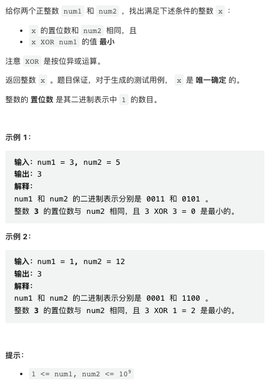
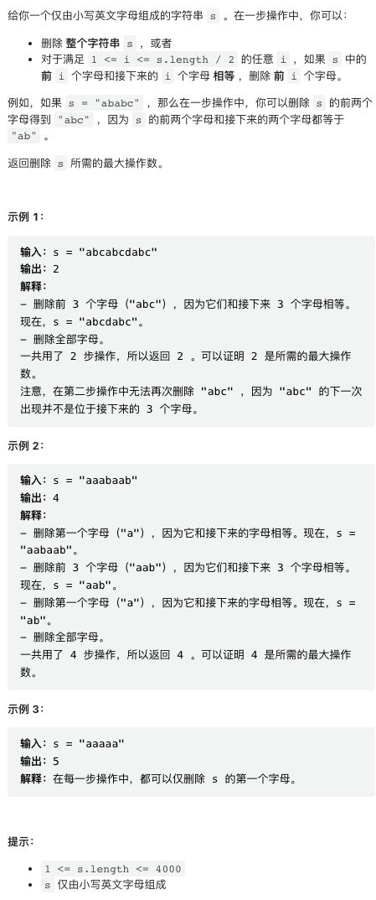

本周几道题目难度一般，最后一题并不是很难，但数据规模稍微有点大 Python 代码容易超时。

[中国站传送门](https://leetcode.cn/contest/weekly-contest-313/) | [国际站传送门](https://leetcode.com/contest/weekly-contest-313/)

## 1. 公因子的数目


比较简单，逐个检查即可。Python 代码只需要一行。

```py
class Solution:
    def commonFactors(self, a: int, b: int) -> int:
        return sum(1 for x in range(1, min(a, b) + 1) if a % x == 0 and b % x == 0)
```

## 2. 沙漏的最大总和


同样非常简单，遍历即可，注意不要越界。

```py
class Solution:
    def maxSum(self, grid: List[List[int]]) -> int:
        m, n = len(grid), len(grid[0])
        res = 0
        for i in range(m - 2):
            for j in range(n - 2):
                res = max(
                    res,
                    grid[i][j] + grid[i][j + 1] + grid[i][j + 2] +
                    grid[i + 1][j + 1] + 
                    grid[i + 2][j] + grid[i + 2][j + 1] + grid[i + 2][j + 2]
                )
        return res
```

## 3. 最小 XOR




题目本身不困难，但实现时务必小心，这种精细操作题目比较出 BUG.

```py
class Solution:
    def minimizeXor(self, num1: int, num2: int) -> int:
        def pop_count(x):
            return bin(x).count('1')
        
        c1, c2 = pop_count(num1), pop_count(num2)

        if c1 >= c2:
            # most significant bit 
            ms = 1 << (len(bin(num1)) - 3)
            mask = ms
            while pop_count(num1 & mask) < c2:
                mask = (mask >> 1) + ms
            return num1 & mask
        
        else:  # c1 < c2
            mask = 1
            while pop_count((~num1 & mask)) + c1 < c2:
                mask = (mask << 1) + 1
            return num1 | mask
```

## 4. 对字母串可执行的最大删除数



这个题目本身并不是特别困难，但题目数据规模有点大，Python 代码容易超时。

```py
class Solution:
    def deleteString(self, s: str) -> int:
        n = len(s)
        # lp[i][j] is longest prefix for i and j
        lp = [[0] * (n + 1) for _ in range(n + 1)]

        for i in range(n - 1, -1, -1):
            for j in range(i, n):
                if s[i] == s[j]:
                    lp[i][j] = lp[i + 1][j + 1] + 1

        res = [1] * n
        for i in range(n - 2, -1, -1):
            for j in range(i + 1, n):
                if j + j - i > n:
                    break
                if lp[i][j] >= j - i:
                    res[i] = max(res[i], res[j] + 1)

        return res[0]
```
