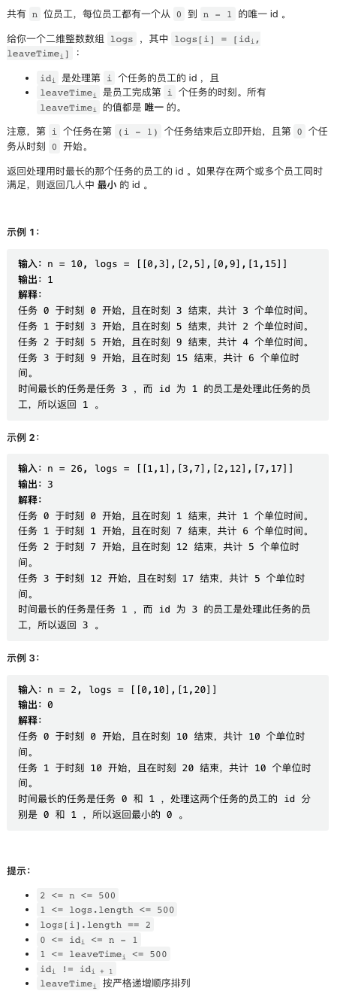
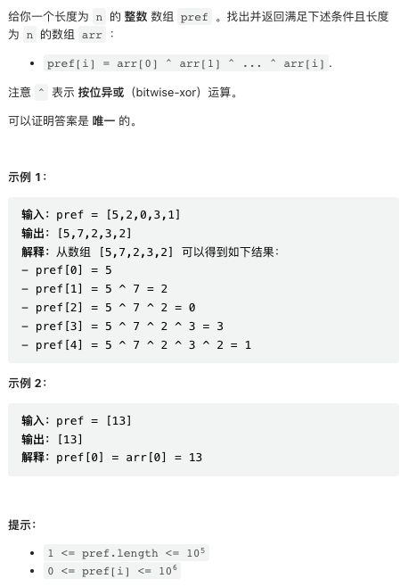
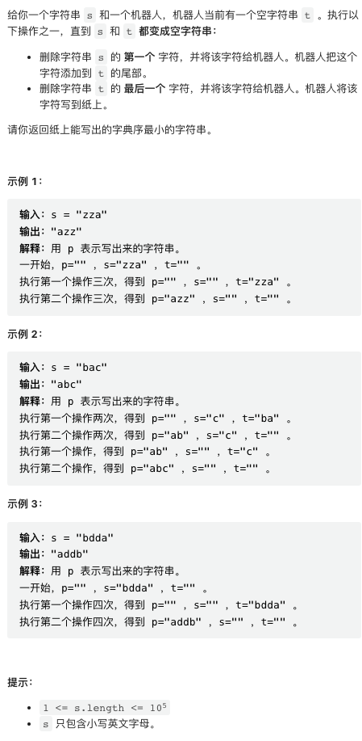
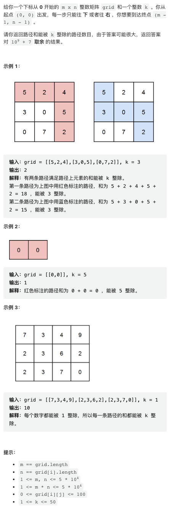

本周感觉前几道题目比较有意思，第三题和第四题数据规模比较大，用 Python 需要小心一点。

[中国站传送门](https://leetcode.cn/contest/weekly-contest-314/) | [国际站传送门](https://leetcode.com/contest/weekly-contest-314/)

## 1. 处理用时最长的那个任务的员工



这个题目的题干看了好久才看明白是什么意思。需要注意一下单独处理耗时相同的情况。

```py
class Solution:
    def hardestWorker(self, n: int, logs: List[List[int]]) -> int:
        cost = res = 0
        for i, (emp, end) in enumerate(logs):
            c = end if i == 0 else end - logs[i - 1][1]
            if c > cost:
                cost = c
                res = emp
            elif c == cost:
                res = min(emp, res)
        return res
```

## 2. 找出前缀异或的原始数组



这是一道数学题，可以一行代码搞定。仔细看一下公式，注意 `x ^ x = 0`

```py
# pref[i] = arr[0] ^ arr[1] ... arr[i - 1] ^ arr[i]
# pref[i - 1] = arr[0] ^ arr[1] ... arr[i - 1]
# so:
# arr[i] = pref[i] ^ pref[i - 1]
class Solution:
    def findArray(self, pref: List[int]) -> List[int]:
        return [pref[i] ^ pref[i - 1] if i else pref[i] for i in range(len(pref))]
```

## 3. 使用机器人打印字典序最小的字符串



这个题目可以贪心的构造。在任意时刻，如果后续的字母中还有比当前 t 末尾字母小的，就不应该从 t 中将字母写到纸上，否则，总是可以贪心的将字母写出。

每个位置后续最小字母可以预计算。算法复杂度 O(n).

```py
class Solution:
    def robotWithString(self, s: str) -> str:
        seen = set()
        suf_min = []
        for c in s[::-1]:
            if not suf_min or (c not in seen and c < suf_min[-1]):
                suf_min.append(c)
                seen.add(c)
            else:
                suf_min.append(suf_min[-1])
        
        res, t = [], []
        for c in s:
            t.append(c)
            suf_min.pop()
            
            while len(t) and (not suf_min or suf_min[-1] >= t[-1]):
                res.append(t.pop())

        return "".join(res)
```

## 4. 矩阵中和能被 K 整除的路径



这是一个难度很一般 DP. 但是数据规模有点大，需要在循环中尽量减少判断和下标操作，否则容易超时。

```py
class Solution:
    def numberOfPaths(self, grid: List[List[int]], k: int) -> int:
        
        mod = 10 ** 9 + 7
        m, n = len(grid), len(grid[0])
        
        dp = [[[0] * k for _ in range(n + 1)] for _ in range(m + 1)]
        dp[1][1][grid[0][0] % k] += 1
        
        for i in range(m):
            p = dp[i + 1]
            for j in range(n):
                q = p[j + 1]
                for x in range(k):
                    y = (x + grid[i][j]) % k
                    q[y] = (dp[i][j + 1][x] + q[y]) % mod
                    q[y] = (dp[i + 1][j][x] + q[y]) % mod

        return dp[m][n][0]
```
