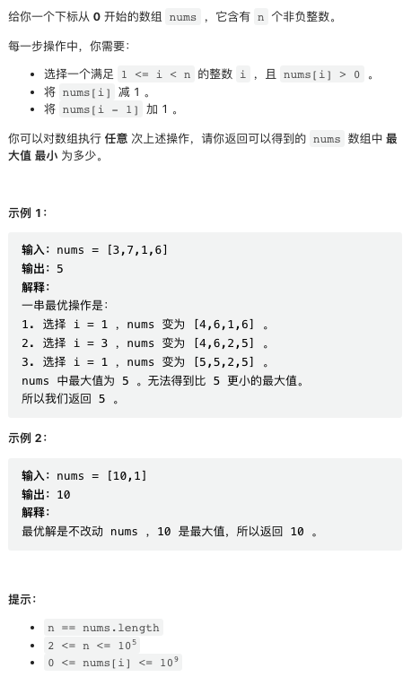

[中国站传送门](https://leetcode.cn/contest/biweekly-contest-89/) | [国际站传送门](https://leetcode.com/contest/biweekly-contest-89/)

双周赛笔记从简，有兴趣可以留言讨论。

## 1. 有效时间的数目


这种题目千万不要用花哨的方法，能暴力枚举就不要废话。

```py
class Solution:
    def countTime(self, s: str) -> int:
        cnt = 0
        for h in range(24):
            for m in range(60):
                t = "%02d:%02d" % (h, m)
                match = True
                for p, q in zip(s, t):
                    if p != q and p != '?':
                        match = False
                        break
                cnt += 1 if match else 0
        return cnt
```

## 2. 二的幂数组中查询范围内的乘积


看上去很难，实际上很简单。注意 powers 长度不会超过 所以暴力枚举即可。

```py
class Solution:
    def productQueries(self, n: int, queries: List[List[int]]) -> List[int]:
        powers = []
        curr = 1
        while n:
            if n & 1:
                powers.append(curr)
            curr <<= 1
            n >>= 1
        
        mod = 10 ** 9 + 7
        res = []
        for left, right in queries:
            p = 1
            for i in range(left, right + 1):
                p = p * powers[i] % mod
            res.append(p)
        return res
```

## 3. 最小化数组中的最大值



数学题。注意我们可以随意的把一个数的值移动到之前的数上，待求结果等于每个位置「前缀平均值向上取整」的最大值。

```py
class Solution:
    def minimizeArrayValue(self, nums: List[int]) -> int:
        res = prefix = 0
        for i, x in enumerate(nums):
            prefix += x
            res = max(res, prefix // (i + 1) + (prefix % (i + 1) != 0))
        return res
```

## 4. 创建价值相同的连通块


这个题目有点难度，比赛时差点翻车。

思路的突破点有两个。

其一是，这个问题属于检验比求解要简单的题目，也即我们先假设分割之后的每个子图和为 t, 检查给定 t 值的合法性要比求解 t 值容易。并且由于 t 必须是原图节点之和的因数，它的候选集不会太大。

其二是检验方法。考虑原图（实际上是一棵树）的一个叶节点，
- 如果其值大于 t, 则无法分割，t 不合法
- 如果其值等于 t, 则这个叶节点必须独立成一个子图，我们可以将其从图上删去
- 如果其值小于 t, 则必须将其与其父节点归为一个子图。方便起见，我们可以将其值加到父节点上，然后将其删去

由于原图是一棵树，我们可以反复执行这个操作，直到整个图全部删除，或者监测到某个节点无法分割。

```cpp
class Solution {
public:
    int componentValue(vector<int>& nums, vector<vector<int>>& edges) {
        
        int n = nums.size();
        vector<vector<int>> g(n);
        for(auto& p: edges) { 
            g[p[0]].push_back(p[1]);
            g[p[1]].push_back(p[0]);
        }
        
        int total = accumulate(nums.begin(), nums.end(), 0);
        int large = *max_element(nums.begin(), nums.end());
        for(int t = large; t <= total; t++) {
            if(total % t == 0) {
                if(dfs(g, nums, 0, -1, t) == 0) {
                    return total / t - 1;
                }
            }
        }
        
        return 0;
    }
    
    int dfs(vector<vector<int>>& g, vector<int>& nums, int curr, int pre, int t) {
        int total = nums[curr];
        for(int child: g[curr]) {
            if(child != pre) {
                int r = dfs(g, nums, child, curr, t);
                if(r == -1) return -1;
                total += r;
            }
        }
        return total > t ? -1 : (total == t ? 0 : total);
    }
};
```
