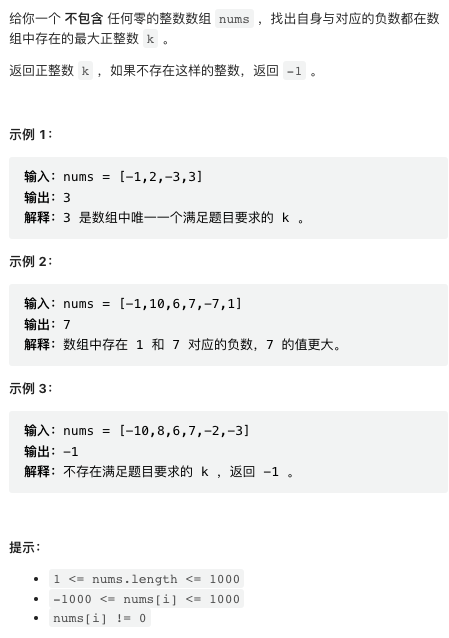
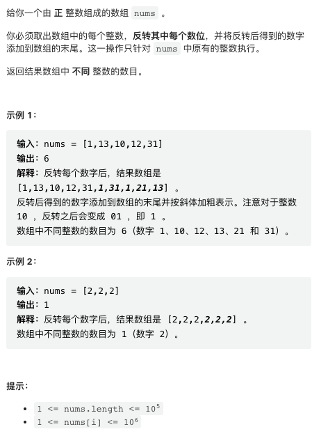
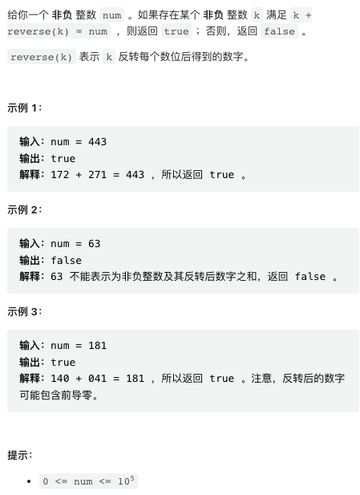
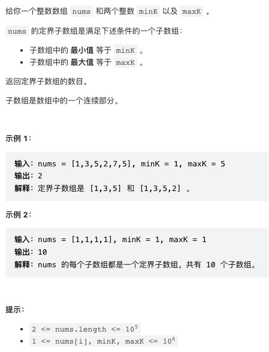

本周周赛严重放水，十行代码过四题，而且并没有使用什么奇葩的技巧。。。

[中国站传送门](https://leetcode.cn/contest/weekly-contest-315/) | [国际站传送门](https://leetcode.com/contest/weekly-contest-315/)

## 1. 与对应负数同时存在的最大正整数



非常简单，可以一行搞定。

```py
class Solution:
    def findMaxK(self, nums: List[int]) -> int:
        return max([x for x in nums if -x in nums] + [-1])
```

## 2. 反转之后不同整数的数目



同样简单，同行一行搞定。

```py
class Solution:
    def countDistinctIntegers(self, nums: List[int]) -> int:
        return len(set(nums + [int(str(x)[::-1]) for x in nums]))
```

## 3. 反转之后的数字和



我感觉这个题目本意是想让我们搞出个 O(1) 解法，但题目数据规模太小，直接暴力求解。

O(1) 解法太麻烦，放弃了。

```py
class Solution:
    def sumOfNumberAndReverse(self, num: int) -> bool:
        # any 在 bool 迭代器中有一个为 true 时返回 true
        return any(i + int(str(i)[::-1]) == num for i in range(num + 1))
```

## 4. 统计定界子数组的数目



这里给出一种比较简洁的思路。对于 nums 中任意数字 x, 如果它小于 minK 或者大于 maxK, 则所有的合法字数组都不能包含这个数字，我们可以将其视为「断点」。

在任意位置 i，我们考虑以 i 开头的字数组，它必须至少包含一个 minK 和一个 maxK, 所以这些字数组结尾位置必须在 i 后方第一个 minK 和第一个 maxK 之后，而且在第一个「断点」之前。所以只要能够求出任意位置后方第一个 minK, maxK 和断点的位置，就能快速解决问题。

可以从后向前扫描，使用 DP 求解每个位置后方第一个 minK, maxK, 断点的位置。

```py
class Solution:
    def countSubarrays(self, nums: List[int], minK: int, maxK: int) -> int:
        n = len(nums)
        
        # 任意位置后方第一个 minK, maxK, 断点位置；初始化为 n
        lim1, lim2, block = [n] * (n + 1), [n] * (n + 1), [n] * (n + 1)
        # DP 求解三个数组
        for i in range(n - 1, -1, -1):
            lim1[i] = i if nums[i] == minK else lim1[i + 1]
            lim2[i] = i if nums[i] == maxK else lim2[i + 1]
            block[i] = i if nums[i] < minK or nums[i] > maxK else block[i + 1]
        
        return sum(max(0, block[i] - max(lim1[i], lim2[i]) for i in range(n))
```
