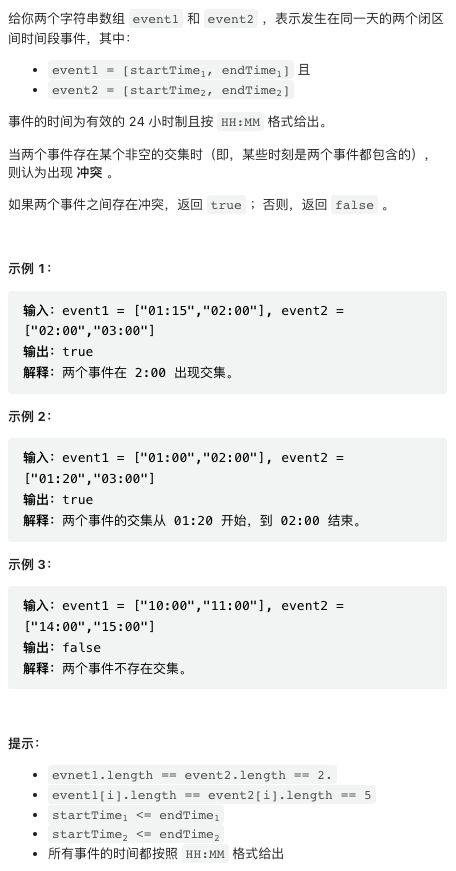

第三题比第四题难一点，第四题三行代码秒杀。。

[中国站传送门](https://leetcode.cn/contest/weekly-contest-316/) | [国际站传送门](https://leetcode.com/contest/weekly-contest-316/)

## 1. 判断两个事件是否存在冲突



一行代码。使用 Python 特有的连续比较运算符。

```py
class Solution:
    def haveConflict(self, event1: List[str], event2: List[str]) -> bool:
        return event2[0] <= event1[0] <= event2[1] or event1[0] <= event2[0] <= event1[1]
```

## 2. 最大公因数等于 K 的子数组数目


本题数据规模不大，可以直接 `O(n^2)` 暴力求解。

```py
class Solution:
    def subarrayGCD(self, nums: List[int], k: int) -> int:
        n, res = len(nums), 0
        for i in range(n):
            curr = nums[i]
            for j in range(i, n):
                curr = math.gcd(curr, nums[j])
                if curr == k:
                    res += 1
                elif curr < k:
                    break
        return res
```

顺便一提，最大公约数 gcd 运算如果视为二元运算符，具有交换律和结合律（本题最多使用到了结合律），能够使用很多类似于前缀和的技巧。

## 3. 使数组相等的最小开销


这道题目感觉比第四题要难一点，主要是 DP 实现时要小心一点。一些关键思路点如下：

- 对这种输入无序的题目，排序常常能简化问题
- 可以证明，最后的 nums 中所有数归化为一个值，这个值不一定唯一，但一定可以是 nums 中的一个数
  - 证明要点是考虑小于该值和大于该值的所有数分别的 cost 之和的相对大小
- 排序之后枚举每个值即可，然后使用 DP 快速计算每个可能取值可能的 cost

```py
class Solution:
    def minCost(self, nums: List[int], cost: List[int]) -> int:
        
        n = len(nums)
        pairs = sorted((x, y) for x, y in zip(nums, cost))

        suf, w = [0] * n, pairs[n - 1][1]
        for i in range(n - 2, -1, -1):
            suf[i] = suf[i + 1] + w * (pairs[i + 1][0] - pairs[i][0])
            w += pairs[i][1]
        
        pre, w = [0] * n, pairs[0][1]
        for i in range(1, n):
            pre[i] = pre[i - 1] + w * (pairs[i][0] - pairs[i - 1][0])
            w += pairs[i][1]
        
        return min(suf[i] + pre[i] for i in range(n))
```

这个题目看上去有点眼熟，应该是原题，但我不幸 WA 了一次。因为每当看到这个题目，我就会想起物理上重心的概念，然后试图使用数学方法直接求解，然后光荣翻车。。

我给出的这份代码并不是特别短，但它对称、好看！

## 4. 使数组相似的最少操作次数


感觉比第三题简单。本题约束「一定有解」降低了难度。关键思路：

- 操作不会改变奇偶性，因此奇数只能变成奇数，偶数只能变成偶数
- 对 target 中最小的奇数，可以证明由 nums 中最小的奇数变换到该数字的方案，一定是最优方案之一
  - 大概是个反证法，使用别的数字变换到 target 中最小奇数的方案一定不会优于使用 nums 中最小数字的方案
- 递推上一条，可以证明，将 nums 和 targe 分别先按奇偶性，再按大小排序，然后一一对应，就是一个最优的变换方案
- 既然一定有解，只要计数 nums 减小操作的次数就可以了

于是最终代码只有三行。。

```py
class Solution:
    def makeSimilar(self, nums: List[int], target: List[int]) -> int:
        nums = sorted(nums, key=lambda x: (x % 2, x))
        target = sorted(target, key=lambda x: (x % 2, x))
        return sum((x - y) // 2 for x, y in zip(nums, target) if x > y)
```
