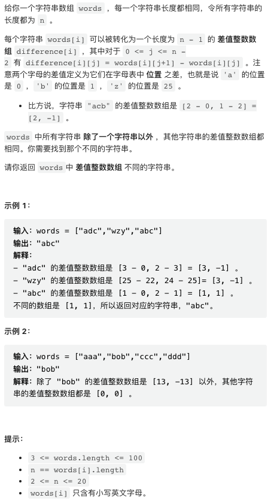
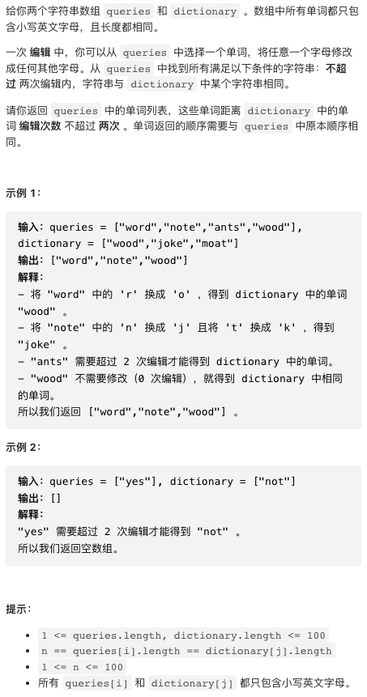
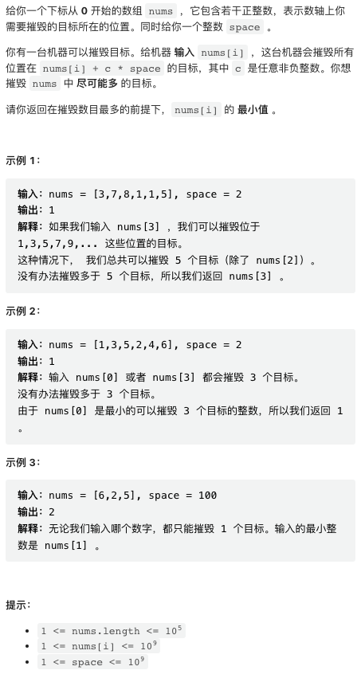
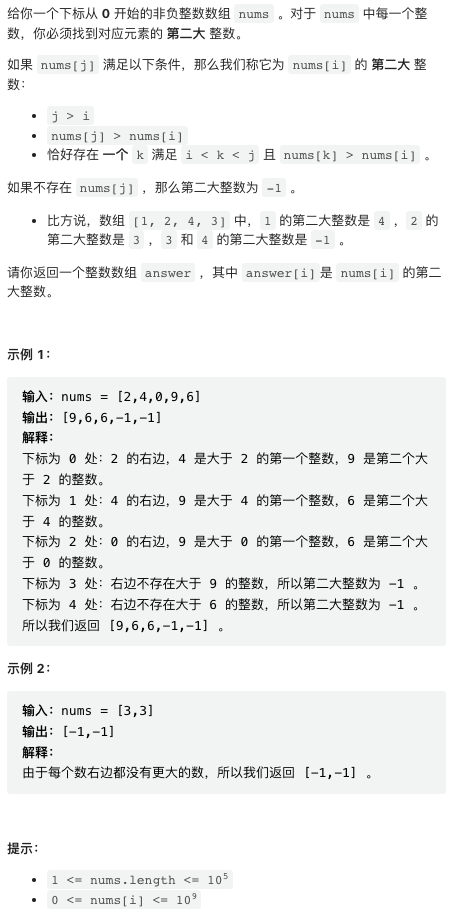

双周赛笔记从简，有兴趣可以留言讨论，C++ 强势回归。

## 1. 差值数组不同的字符串



我承认这个题目把它写成两行不利于阅读。

基本思路是，把每个 word 转换成它对应的 diff 数组并把这个数组转换成字符串（不转换好像也行），然后排序，那个特殊的字符串一定在第一个或者最后一个。

```py
class Solution:
    def oddString(self, words: List[str]) -> str:
        diff = sorted([(",".join(str(ord(x[j + 1]) - ord(x[j])) for j in range(len(x) - 1)), x) for x in words])
        return diff[0][1] if diff[0][0] != diff[1][0] else diff[-1][1]
```

## 2. 距离字典两次编辑以内的单词



我上周发现我还是有喜欢 C++ 代码的读者的，所以以后特别适合 C++ 的题目，还是给出 C++ 代码。

这个题目适合暴力解，C++ 可以确保不超时。

```cpp
class Solution {
public:
    vector<string> twoEditWords(vector<string>& queries, vector<string>& dictionary) {
        vector<string> res;
        for(auto& q: queries) {
            for(auto& w: dictionary) {
                int diff = 0;
                for(int i = 0; i < q.size(); i++) {
                    diff += q[i] != w[i];
                }
                if(diff <= 2) {
                    res.push_back(q);
                    break;
                }
            }
        }
        return res;
    }
};
```

## 3. 摧毁一系列目标



偏数学。某个输入对应的所有被摧毁的目标是**关于 space 同余**的，因为 `t % space= nums[i] % space + c * space % space = nums[i] % space`.

所以，我们可以先统计一下每个余数对应的目标数量，要求的输入就是余数是目标数量最大的余数的输入中最小的一个。

```py
class Solution:
    def destroyTargets(self, nums: List[int], space: int) -> int:
        nums.sort()
        # 所有的余数
        mod = [x % space for x in nums]
        # 余数 count
        cnt = collections.Counter(mod)
        # count 最多的余数的 count 数量
        max_cnt = max(cnt.values())

        for m, x in zip(mod, nums):
            if cnt[m] == max_cnt:
                return x
        return -1
```

## 4. 下一个更大元素 IV



人老了，这种难度的题目都需要使用 C++ 专有数据结构了。

这个题目明显跟单调栈有点关联，但想要构建出基于栈的题解并不是那么容易。反而基于链表或者有序 map 的解法比较容易理解。

这类题目一种常常会有帮助的思路是考虑从大到小求解。我们考虑使用一个 map, key 是数字原本的 index, 然后将所有数字从大到小加入这个 map, 则「下一个更大元素」很容易使用指针运算找到。特别注意，下一个更大元素是严格大于而不是大于等于，因此需要特殊处理一下相等的数字。

```cpp
class Solution {
public:
    vector<int> secondGreaterElement(vector<int>& nums) {
        int n = nums.size();
        
        // 将原数组逆序排序，并保留原本的 index
        vector<pair<int, int>> pairs(n);
        for(int i = 0; i < n; i++) {
            pairs[i] = {nums[i], i};
        }
        sort(pairs.begin(), pairs.end());
        reverse(pairs.begin(), pairs.end());
        
        vector<int> res(n);
        map<int, int> vals;  // <index, val>

        // 下面两行是特殊写法，可以保证 i, j 指向一个「相等区间」的 begin, end
        for(int i = 0, j = 0; i < n; i = j) {
            while(j < n and pairs[j].first == pairs[i].first) j++;

            for(int k = i; k < j; k++) {
                // 第一个更大元素
                auto it = vals.lower_bound(pairs[k].second);
                // 第二个更大元素
                if(it != vals.end()) it++;
                res[pairs[k].second] = it != vals.end() ? it->second : -1;
            }

            // 把这个区间加入到 map 中
            for(int k = i; k < j; k++) {
                vals[pairs[k].second] = pairs[k].first;
            }
        }
        
        return res;
    }
};
```

但有序 map 是一种 C++ 特有的数据结构，在 python 中难以实现这个解法。

讨论区大佬们给出了双单调栈写法，记录在这里。这个解法的重点在于，第一个单调栈 s 跟一般的单调栈相似，可以认为它记录的是「没有找到下一个更大元素的数」。这个解法的精妙之处在于，s 出栈之后，又入栈了第二个单调栈 t, t 中保存的相当于「没有找到第二个更大元素的数」。特别注意从 s 转移到 t 时需要保持原顺序，不要因为出栈操作变成逆序。

这类解法如果仔细去思考是可以构建出来的，但总体来说在实战中并不推荐，因为首先其应用范围特别窄，只适合特定题目，其次其操作过于复杂，难设计也难实现。

```py
# https://leetcode.cn/problems/next-greater-element-iv/solution/by-endlesscheng-q6t5/
class Solution:
    def secondGreaterElement(self, nums: List[int]) -> List[int]:
        ans, s, t = [-1] * len(nums), [], []
        for i, x in enumerate(nums):
            while t and nums[t[-1]] < x:
                ans[t.pop()] = x
            j = len(s) - 1
            while j >= 0 and nums[s[j]] < x:
                j -= 1
            t += s[j + 1:]
            del s[j + 1:]
            s.append(i)
        return ans
```