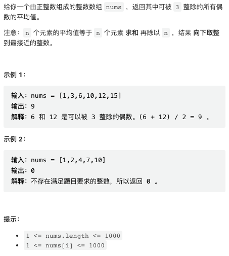
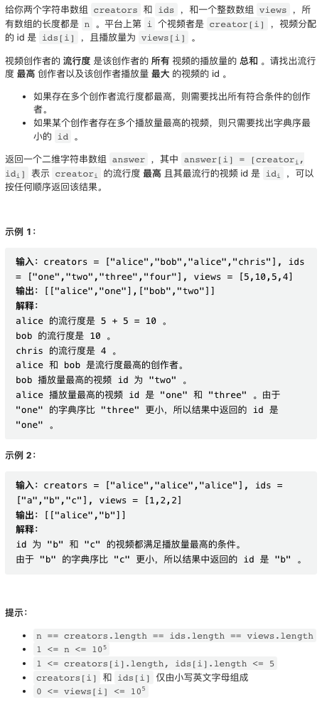
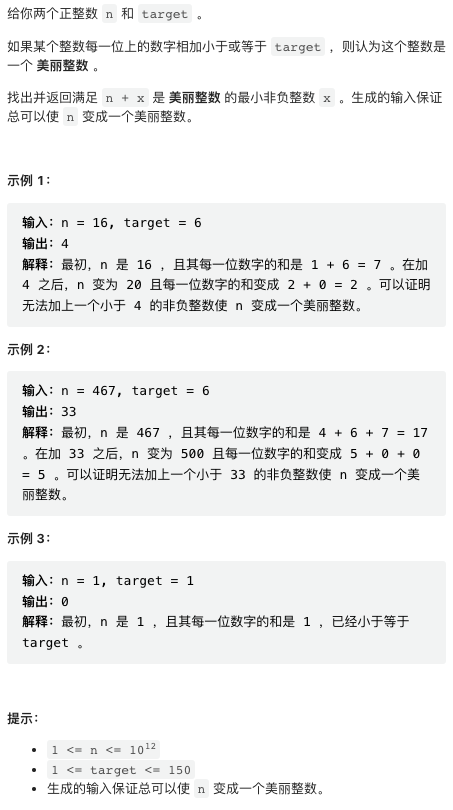
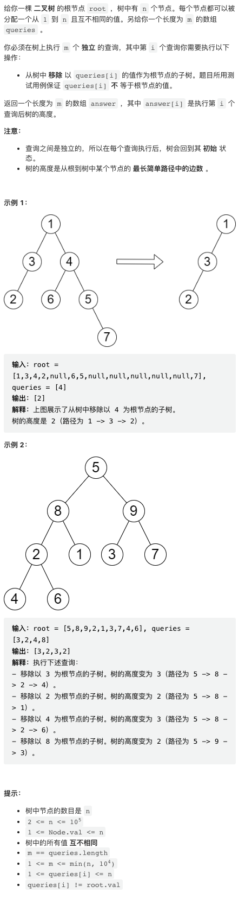

本周周赛难度尚可，第四题比较有意思。

## 1. 可被三整除的偶数的平均值



能够被 3 整除的偶数，也即能被 6 整除的整数。

```py
class Solution:
    def averageValue(self, nums: List[int]) -> int:
        vals = [x for x in nums if x % 6 == 0]
        return sum(vals) // len(vals) if vals else 0
```

## 2. 最流行的视频创作者



这是一道「语文题」，比较绕，要仔细读懂要计算的是啥。

```py
class Solution:
    def mostPopularCreator(self, creators: List[str], ids: List[str], views: List[int]) -> List[List[str]]:
        
        # 统计每个创作者的流行度
        cp = {}
        for c, v in zip(creators, views):
            cp[c] = cp.get(c, 0) + v
        
        # 最大流行度
        most_c = max(cp.values())
        
        # 统计每个最流行创作者的最流行的作品
        cv = {}
        for c, i, v in zip(creators, ids, views):
            if cp[c] == most_c:
                cv[c] = min(cv.get(c, (1, "")), (-v, i))
        
        return [(k, v[1]) for k, v in cv.items()]
```

## 3. 美丽整数的最小增量



简而言之，很直觉性的一个猜想是，我们可能应该选取 x 直到某个数位（比如十位，百位）恰好发生进位，此时能够显著减小数位和。

不难证明这一猜想的正确性。在 10 位上 (`x < 10`) 显然是成立的。在百位位上，如果 `x` 没有令百位发生进位，这个 x 一定劣于十位进位方案。如此递推即可证明。

```py
class Solution:
    def makeIntegerBeautiful(self, n: int, target: int) -> int:
        # mask 是当前要处理的数位的标记
        res, mask = 0, 1
        while sum(int(c) for c in str(n)) > target:
            # 从十位开始处理，每次循环右移一个数位
            mask *= 10
            tail = n % mask
            # 取补
            res += mask - tail
            n += mask - tail
        return res
```

## 4. 移除子树后的二叉树高度



问题很简单，删除二叉树某个子树之后，求剩下的二叉树高度。这个题目的思路稍微有点反常规。考虑删除的子树节点所在的层，如果这一层高度最高的子树没有被删除，则原二叉树高度不变。否则，剩余的二叉树高度就等于第二高的子树高度加上这一层的深度。

```py
class Solution:
    def treeQueries(self, root: Optional[TreeNode], queries: List[int]) -> List[int]:

        # key: 节点值
        # value: 节点的高度和深度（从根节点到该节点的距离）
        height, depth = defaultdict(int), defaultdict(int)
        # dfs 求解高度和深度
        def dfs(node, d):
            if node:
                depth[node.val] = d
                h = max(dfs(node.left, d + 1), dfs(node.right, d + 1)) + 1
                height[node.val] = h
                return h
            return -1
        
        dfs(root, 0)

        # key: 每一层的深度
        # value: 这一层所有的节点对应的子树高度、节点值
        tier = defaultdict(list)
        for node in height:
            tier[depth[node]].append((height[node], node))
        # 把每一层所有的节点按高度排序
        for t in tier.values():
            t.sort()

        res = []
        for q in queries:
            d = depth[q]
            t = tier[d]
            # 剩余的子树高度
            # 如果这一层只有一个节点，没有剩余子树，高度记为 -1
            # 否则，检查被删除的节点是不是最高子树
            # 如果是，剩余子树高度为次高子树高度，否，则为最高子树高度
            h = -1 if len(t) == 1 else (t[-1][0] if t[-1][1] != q else t[-2][0])
            res.append(d + h)
        return res
```
