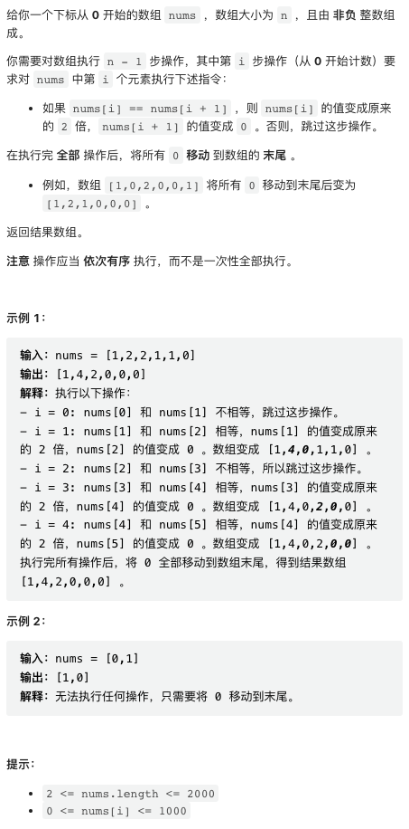
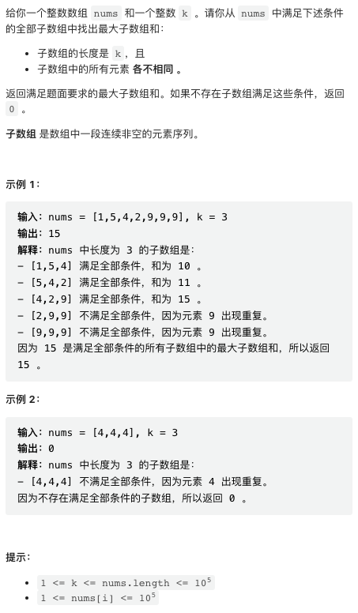
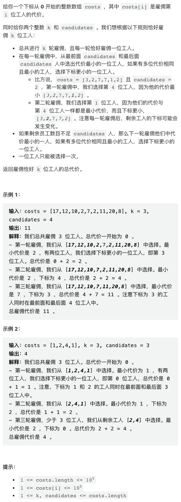
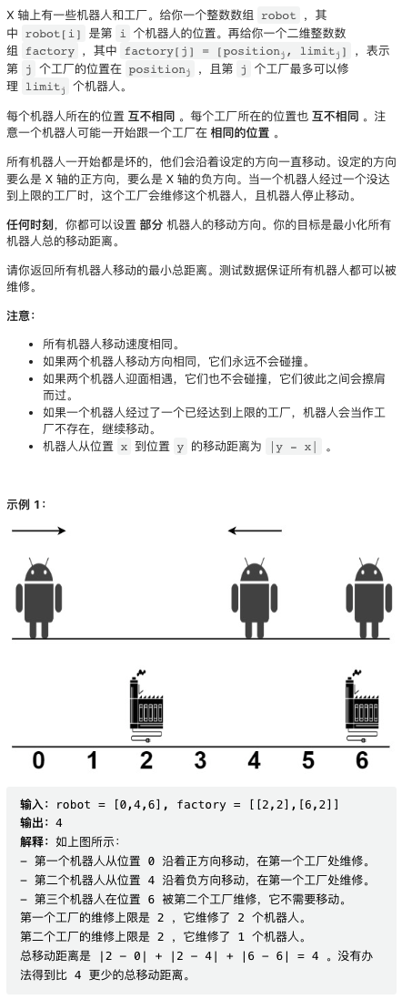
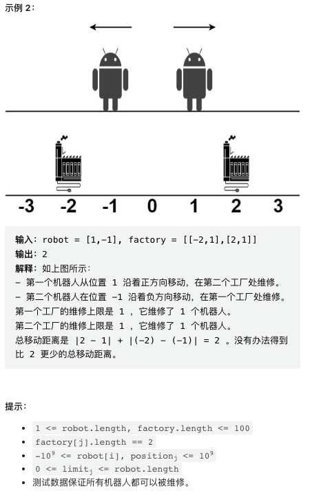

第四题难道只有我掉坑里上了网络流算法？

## 1. 对数组执行操作



按题目要求操作即可，最后将 0 后移使用了 python 的 sorted 函数，注意这个函数保证稳定排序。

```py
class Solution:
    def applyOperations(self, nums: List[int]) -> List[int]:
        for i in range(len(nums) - 1):
            if nums[i] == nums[i + 1]:
                nums[i] *= 2
                nums[i + 1] = 0
        return sorted(nums, key=lambda x: x == 0)
```

## 2. 长度为 K 子数组中的最大和



这是一个非常经典的滑动窗口统计题目，没有写过这种题目的小伙伴可以好好学习一下，这种技术应用范围还是挺广的。代码给出了详细注释。

写滑动窗口代码的要点在于注意检查初始化、第一个和最后一个窗口是否正确处理等等。代码啰嗦一点无所谓，但一定要确认边界条件都处理好了。

```py
class Solution:
    def maximumSubarraySum(self, nums: List[int], k: int) -> int:
        # 滑动窗口中每个数出现的次数，使用数组而非 map 会快一些
        count = [0] * (max(nums) + 1)
        # distinct 是窗口中只出现一次的数的个数，total 是滑动窗口和，res 是待求解的最大滑动窗口和
        distinct = total = res = 0
        
        for right in range(len(nums)):
            # 将右端元素加入滑动窗口
            y = nums[right]
            count[y] += 1
            total += y
            
            distinct += 1 if count[y] == 1 else -1 if count[y] == 2 else 0

            # 如果窗口已经到达长度 k
            if right >= k - 1:
                if distinct == k:
                    # 此时窗口中所有数字都是 distinct 的
                    res = max(res, total)

                # 将窗口左端元素移出窗口
                x = nums[right - k + 1]
                count[x] -= 1
                total -= x
            
                distinct += 1 if count[x] == 1 else -1 if count[x] == 0 else 0

        return res
```

## 3. 雇佣 K 位工人的总代价



使用优先队列解决问题，逻辑很直观。

```py
class Solution:
    def totalCost(self, costs: List[int], k: int, candidates: int) -> int:
        
        # 保存一下每个元素的原始下标，加入优先队列后需要借此确认是哪个元素 pop 出来了
        ci = [(c, i) for i, c in enumerate(costs)]
        # 假设 costs 足够长，左右端点位置
        left, right = candidates, len(costs) - candidates - 1
        # 初始化优先队列，注意 costs 可能不够长
        pq = sorted(ci[:left] + ci[right + 1:] if left <= right else ci)
        
        # 总开销
        total = 0
        for _ in range(k):
            # 最小元素加到总开销
            total += pq[0][0]
            # 如果还有剩余元素
            if left <= right:
                # 根据最小元素是在左边区间还是右边区间，来决定左边区间扩展还是右边区间扩展
                if pq[0][1] < left:
                    heapq.heapreplace(pq, ci[left])
                    left += 1
                else:
                    heapq.heapreplace(pq, ci[right])
                    right -= 1
            else:
                heapq.heappop(pq)

        return total
```

## 4. 最小移动总距离




首先，这个题目比较好的做法应该是讨论区 Lee215 的做法，这里摘录一下。这是一个非常简洁的 DP 做法，将两个输入数组分别排序后，`dp(i,j,k)` 是修好第 i 个机器人，并第 j 个工厂已经修复 k 个机器人情况下的最小 cost. DP 递推公式详见代码，非常漂亮。

这个题目还是有一点难度的，这个 DP 做法的关键在于，机器人和工厂分别排序之后，对于最优解，机器人选择的修理工厂的位置顺序应该跟机器人本身位置的位置顺序一致的。也就是，如果机器人 A 在机器人 B 左边，A 选择的修理工厂一定也在 B 选择的修理工厂左边或者同一位置。由这个性质，就不难使用 DP 求解了。

```python
# https://leetcode.com/problems/minimum-total-distance-traveled/solutions/2783305/python-dp-solution/
    def minimumTotalDistance(self, A: List[int], B: List[List[int]]) -> int:
        A.sort()
        B.sort()
        @lru_cache(None)
        def dp(i, j, k):
            if i == len(A): return 0
            if j == len(B): return inf
            res1 = dp(i, j + 1, 0)
            res2 = dp(i + 1, j, k + 1) + abs(A[i] - B[j][0]) if B[j][1] > k else inf
            return min(res1, res2)
        return dp(0, 0, 0)
```

但比赛时我脑子一抽，发现这是个典型的二部图匹配问题。机器人和工厂构成二部图，每个机器人与每个工厂的距离是二部图边的权重。二部图问题可以使用网络流算法解决，网络中边有流量限制 capacity, 以及权重。添加一个虚拟节点连接到所有机器人，这些边权重是 0，capacity 是 1。另一个虚拟节点连接到所有工厂，这些边权重是 0，capacity 就是每个工厂的修理机器人限额。机器人与工厂之间的边权重是机器人与工厂之间的距离，capacity 是 1，这样就构成了一个典型的带权重网络最大流问题，调用模板解决。

这个模板是我 2018 年写的了，自从写完从来没用过，今天终于用出来了，还挺靠谱的，可喜可贺。图算法几乎已经忘光了。没学过网络最大流算法的同学请跳过，在面试或者比赛中，这算法如果没有模板，很难手写。

```cpp
template <typename INDEX = int, typename NUM = int>
struct MCMFEdge {
    INDEX from, to;
    NUM capacity, flow, cost;
};

template <typename INDEX = int, typename NUM = int>
struct MinCostMaxFlow {
    std::vector<MCMFEdge<INDEX, NUM>> edges;
    std::vector<std::vector<INDEX>> graph;
    std::vector<INDEX> path_from;
    std::vector<NUM> path_weight, node_max_flow;
    std::vector<bool> in_queue;

    void init(INDEX num_node) {
        graph.clear();
        graph.resize(num_node);
        edges.clear();
        in_queue.resize(num_node);
        path_weight.resize(num_node);
        path_from.resize(num_node);
        node_max_flow.resize(num_node);
    }

    void add_edge(INDEX from, INDEX to, NUM capacity, NUM cost) {
        edges.push_back({from, to, capacity, 0, cost});
        edges.push_back({to, from, 0, 0, -cost});
        INDEX m = edges.size();
        graph[from].push_back(m - 2);
        graph[to].push_back(m - 1);
    }

    bool _bellman_ford(INDEX start, INDEX stop, NUM& flow, NUM& cost) {
        static const NUM INF = std::numeric_limits<NUM>::max();
        std::fill(in_queue.begin(), in_queue.end(), false);
        std::fill(path_weight.begin(), path_weight.end(), INF);
        path_weight[start] = 0;
        in_queue[start] = true;
        node_max_flow[start] = INF;

        std::queue<INDEX> Q;
        Q.push(start);
        while (!Q.empty()) {
            auto u = Q.front();
            Q.pop();
            in_queue[u] = false;
            for (INDEX i = 0; i < graph[u].size(); i++) {
                auto& e = edges[graph[u][i]];
                if (e.capacity > e.flow &&
                    path_weight[e.to] > path_weight[u] + e.cost) {
                    path_weight[e.to] = path_weight[u] + e.cost;
                    path_from[e.to] = graph[u][i];
                    node_max_flow[e.to] =
                        std::min(node_max_flow[u], e.capacity - e.flow);
                    if (!in_queue[e.to]) {
                        Q.push(e.to);
                        in_queue[e.to] = true;
                    }
                }
            }
        }
        if (path_weight[stop] == INF) return false;
        flow += node_max_flow[stop];
        cost += path_weight[stop] * node_max_flow[stop];
        for (INDEX u = stop; u != start; u = edges[path_from[u]].from) {
            edges[path_from[u]].flow += node_max_flow[stop];
            edges[path_from[u] ^ 1].flow -= node_max_flow[stop];
        }
        return true;
    }

    void min_cost_max_flow(INDEX start, INDEX stop, NUM& flow, NUM& cost) {
        // path info is stored in edges.
        flow = cost = 0;
        while (_bellman_ford(start, stop, flow, cost))
            ;
    }
};

class Solution {
public:
    long long minimumTotalDistance(vector<int>& robot, vector<vector<int>>& factory) {
        int m = robot.size(), n = factory.size();

        int n_node = 2 + m + n * 2;
        MinCostMaxFlow<long long, long long> solver;
        solver.init(n_node);

        int rbias = 2, fbias = 2 + m;

        for(int i = 0; i < m; i++) {
            solver.add_edge(0, rbias + i, 1, 0);            
        }
        for(int i = 0; i < m; i++) {
            for(int j = 0; j < n; j++) {
                solver.add_edge(rbias + i, fbias + j, 1, abs(robot[i] - factory[j][0]));
            }
        }
        for(int j = 0; j < n; j++) {
            solver.add_edge(fbias + j, 1, factory[j][1], 0);
        }

        long long cost = 0, flow = 0;
        solver.min_cost_max_flow(0, 1, flow, cost);
        return cost;
    }
};
```
