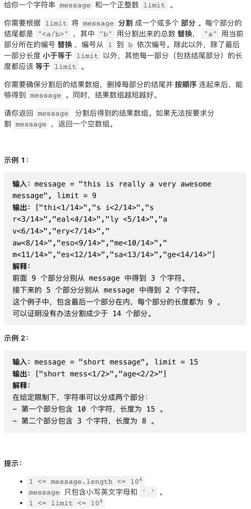

本周双周赛难度一般，第三题和第四题难度差不多，第三题甚至要麻烦一些。

## 1. 不同的平均值数目


按照要求操作即可。注意两个要点：

- 不同平均值个数等于不同的和的个数，借此避免浮点除法
  - 除法运算有浮点误差的风险（不过实际上本题处以 2 并不会触发浮点计算误差）
- 这里给出的代码每个平均值计算了两遍，并不影响结果

```py
class Solution:
    def distinctAverages(self, nums: List[int]) -> int:
        nums.sort();
        return len(set(x + y for x, y in zip(nums, nums[::-1])))
```

## 2. 统计构造好字符串的方案数


一个非常简单、非常典型的 DP，很适合用作大学一年级学完 DP 之后的课后练习的第一题。

反复确认了好几遍这个 0 和 1 没啥特别之处。

```cpp
class Solution:
    def countGoodStrings(self, low: int, high: int, zero: int, one: int) -> int:
        mod = 10 ** 9 + 7
        dp = [1] + [0] * (high)
        for i in range(1, high + 1):
            dp[i] += dp[i - zero] if i - zero >= 0 else 0
            dp[i] += dp[i - one] if i - one >= 0 else 0
            dp[i] %= mod
        return sum(dp[low:high + 1]) % mod
```

## 3. 树上最大得分和路径


这个题目讨论区有人认为作为第三题太难了。实际上这个题目只是稍微麻烦了一点，一点都不难。

这个题目比较简单的点在于，由于给定的是无向树而不是图，所以任意两个节点之间路径存在且唯一。因此，Bob 的路是完全确定的，可以先把 Bob 的路径标记出来，包括他到达路径上每一个点的时刻。而 Alice 前往任意一个叶节点的路径也是唯一的，可以用一个 DFS 遍历一遍图，把 Alice 的路径全部找出来，并在遍历过程中处理与 Bob 相交的节点。

```py
class Solution:
    def mostProfitablePath(self, edges: List[List[int]], bob: int, amount: List[int]) -> int:
        n = len(amount)
        
        # 建图
        graph = [[] for _ in range(n)]
        for x, y in edges:
            graph[x].append(y)
            graph[y].append(x)
        
        # 求以 0 为根节点时，每个节点的父节点
        # bob 的路径就是每次前往父节点，直到到达 0
        parent = [-1] * n
        def get_parent(node, p):
            parent[node] = p
            for child in graph[node]:
                if child != p:
                    get_parent(child, node)
        get_parent(0, -1)
        
        # 求 bob 到达其路径上的每个节点的时刻
        # 未到达节点时刻标记为 n
        t = 0
        visit = [n] * n
        while bob != -1:
            visit[bob] = t
            t += 1
            bob = parent[bob]
        
        # 标记 alice 到达每个叶节点时总得分
        # node: 当前节点
        # parent: dfs 路径的上一个节点
        # time: 也即 dfs 深度
        # got: 路径总得分
        # result: 记录叶节点总得分的数组
        def dfs(node, parent, time, got, result):
            if visit[node] > time:
                # bob 未曾到达
                got += amount[node]
            elif visit[node] == time:
                # 与 bob 同时到达
                got += amount[node] // 2
            
            # 先假设这是个叶节点，更新得分
            result[node] = got
            
            for child in graph[node]:
                if child != parent:
                    dfs(child, node, time + 1, got, result)
                    # 如果有任意一个字节点，则说明这不是个叶节点，删除得分
                    result[node] = float("-inf")
        
        # 得分初始化为 -inf 因为这个问题中得分可以为负数
        res = [float("-inf")] * n
        dfs(0, -1, 0, 0, res)
        return max(res)
```

## 4. 根据限制分割消息



从各个角度来说，这个问题都不是很难。我给出的解法也不是最优的，但思路比较简单。

这种复杂的字符串操作问题最好使用 Python 实现。这个问题的难点在于，不同的总消息数下后缀长度不同，每一个部分由于序号不同，后缀长度也不同。

思路上最简单的做法是，只要确认了总消息数长度，分割方法就几乎确定了，因此可以尝试总消息数为 9, 99, 999 等等，如果能够成功分割，再按照真实的分割数量重新生成一遍。

这个代码比较浪费，在尝试时不必生成字符串，只需要检查合法与否就可以了。但因为数据规模不大、`O(n)` 算法，这样也是可以的。

```py
class Solution:
    def splitMessage(self, message: str, limit: int) -> List[str]:
        
        # 一个数字的十进制表示长度
        # 直接使用 len(str(x)) 也可以，但开销比较大
        def slen(x):
            return 1 if x < 10 else 2 if x < 100 else 3 if x < 1000 else 4 if x < 10000 else 5
        
        # 按照总数为 n_part 尝试进行分割
        def check(n_part):
            n_part_len = slen(n_part)
            message_len = len(message)
            # idx 是下一个需要分配的字符
            idx = 0
            res = []
            while idx < message_len and len(res) < n_part:
                cost = 3 + n_part_len + slen(len(res) + 1)
                if cost >= limit:
                    # 后缀大于等于 lim 则无法分割
                    return []
                used = limit - cost
                # 生成一个分割
                res.append("%s<%s/%s>" % (message[idx:idx + used], len(res) + 1, n_part))
                idx += used
            
            # 检查是否合法并返回
            return res if idx >= message_len and len(res) <= n_part else []

        # 尝试总长度为 9, 99, 999 等等
        # 最大尝试 9999, 如果仍然无法分割，则一定无法分割，因为 len(s) < 1e4
        curr_total = 9
        while slen(curr_total) < 5:
            res = check(curr_total)
            if res:
                # 一旦分割成功，则按照真实长度重新生成一次
                res = check(len(res))
                return res
            curr_total = curr_total * 10 + 9

        return []
```
