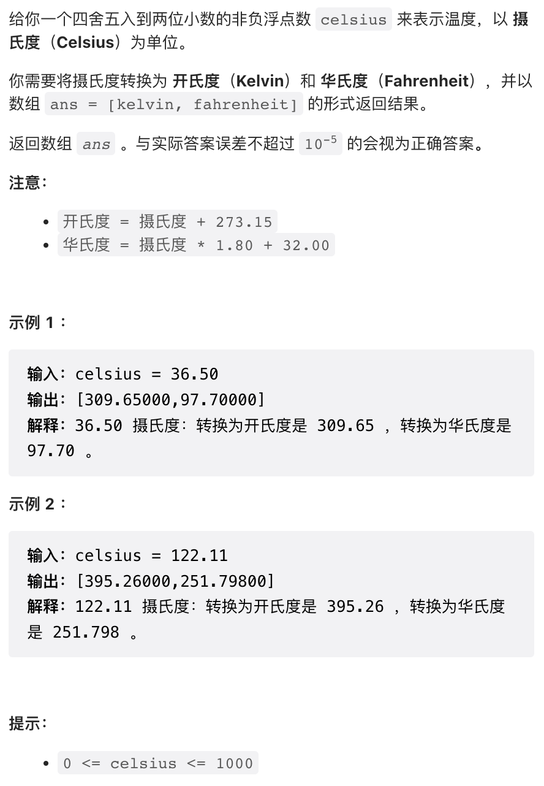
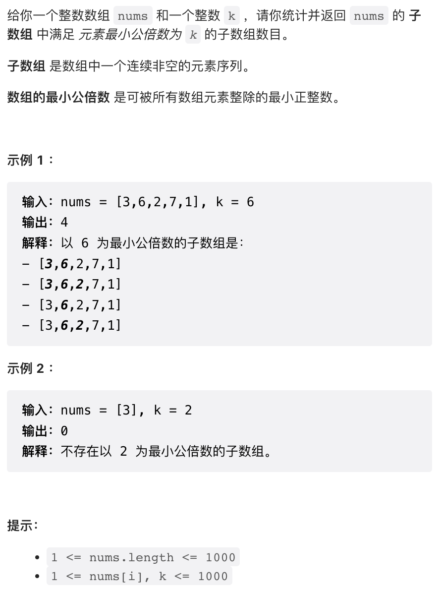
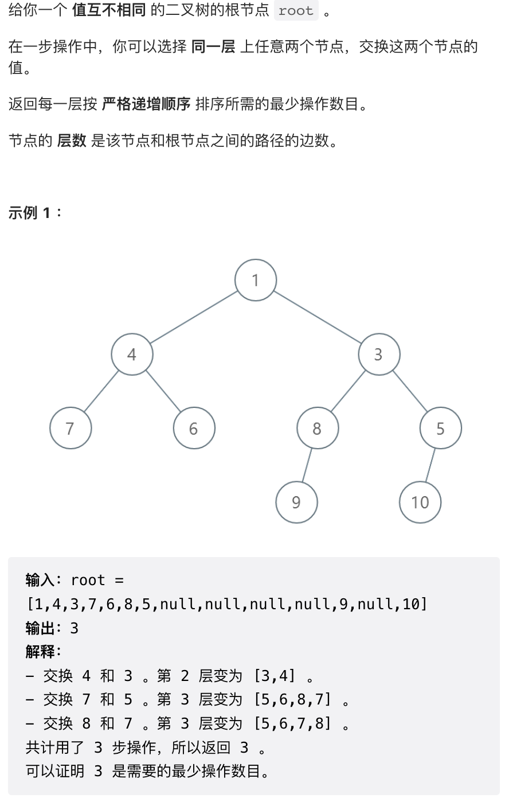
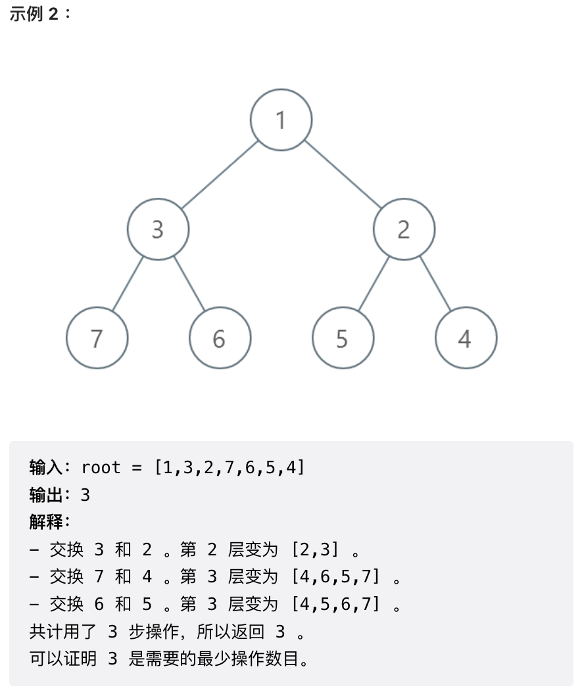
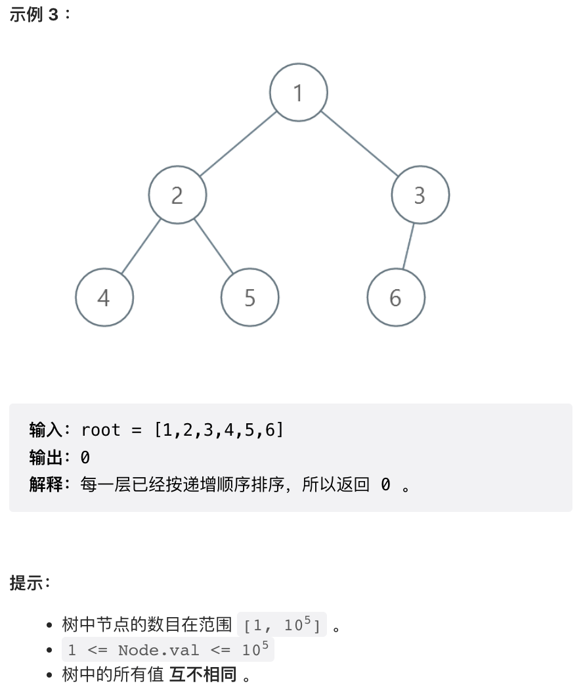
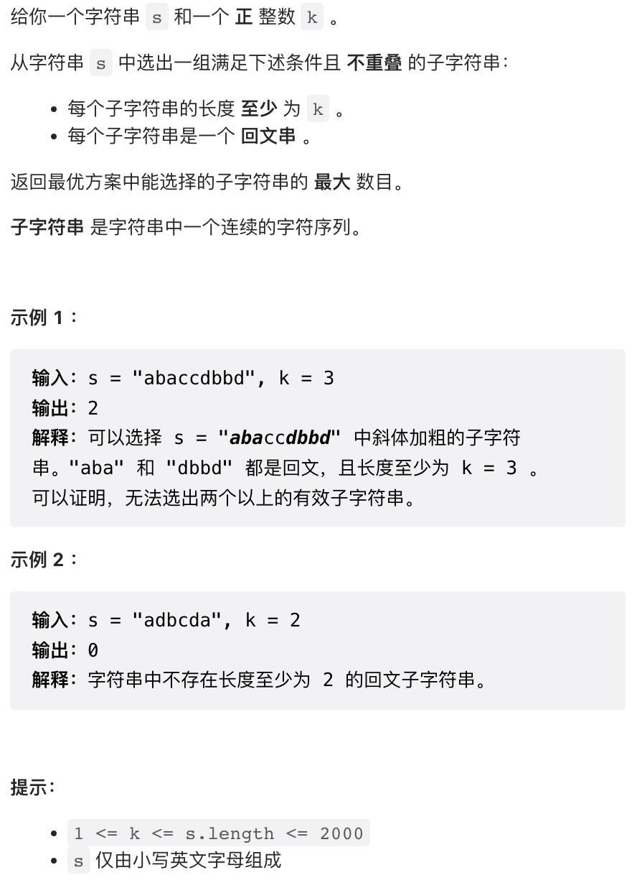

复习很多生僻知识点，LCM，排序最小操作数。Python 还是容易超时，C++ 还是靠谱。

## 1. 温度转换



非常简单，直接实现。

```py
class Solution:
    def convertTemperature(self, celsius: float) -> List[float]:
        return [celsius + 273.15, celsius * 1.80 + 32.00]
```

## 2. 最小公倍数为 K 的子数组数目



通常最大公约数用的比较多，最小公倍数用的比较少，这里复习一下。

最小公倍数跟最大公约数一样，如果视为二元运算符，具有交换律和结合律。本题中用到的性质是，最小公倍数跟前缀和一样，可以前缀计算。

Python 有内置的最小公倍数实现。如果要自行实现最小公倍数也不困难。

```py
# 使用 gcd 实现 lcm
# def lcm(x, y):
#     return x * y / gcd(x, y)
class Solution:
    def subarrayLCM(self, nums: List[int], k: int) -> int:
        n = len(nums)
        total = 0
        for left in range(n):
            l = nums[left]
            for right in range(left, n):
                l = math.lcm(l, nums[right])
                total += l == k
        return total
```

## 3. 逐层排序二叉树所需的最少操作数目





本题复习数组排序的最小操作数。

求排序的最小操作数有两种方法，一种做法是，先把这个数组排序，于是我们就知道了每个元素应该在最终的位置。然后从第一个位置开始，将应该在这个位置的数 y（最小元素）与该位置的数 x 交换。然后对于继续在 x 所在的位置执行这个操作，把应该放在这个位置的数换过来，把 x 换过去。重复该操作直到 x 恰好在它该在的位置。

另一种方法则是我这里使用的方法，借助并查集，对排序之后的数组和元素组，位置相同的元素标记为同一个集合。最后统计一下每个集合大小，将每个集合复原需要的操作数量就是集合大小减一。

这两种解法的背后的道理是相同的。我们将每个数字排序之后应该处的位置称为「目标位置」。数字x 的目标位置上的数字 y，其目标位置上有个数字 z ... 最终这会构成一个环，这个环中如果有 n 个元素，则 `n - 1` 次操作就能把所有的元素归位。第一种方法就是模拟这个操作过程，第二种方法直接把这些环找出来。

本题中特别注意，没有必要逐层求解这个问题，可以所有层共用一个并查集。

```py
# Definition for a binary tree node.
# class TreeNode:
#     def __init__(self, val=0, left=None, right=None):
#         self.val = val
#         self.left = left
#         self.right = right
class Solution:
    def minimumOperations(self, root: Optional[TreeNode]) -> int:
        
        # 将每一层节点值分别加入 list
        # 并统计一下最大节点值
        max_node = 0
        levels = collections.defaultdict(list)
        def dfs(node, lv):
            nonlocal max_node
            if node:
                levels[lv].append(node.val)
                max_node = max(max_node, node.val)
                dfs(node.left, lv + 1)
                dfs(node.right, lv + 1)
        dfs(root, 0)
        
        # 并查集
        mfs = list(range(max_node + 1))
        
        # 并查集路径压缩查找函数
        def find(x):
            mfs[x] = x if mfs[x] == x else find(mfs[x])
            return mfs[x]
        
        # 构造所有的环
        for nums in levels.values():
            for x, y in zip(nums, sorted(nums)):
                mfs[find(y)] = find(x)
        
        # 统计环中元素数量
        cnt = [0] * (max_node + 1)
        for x in range(max_node + 1):
            cnt[find(x)] += 1

        # 每个环需要的操作数是元素数量 -1
        return sum(x - 1 for x in cnt if x > 0)
```

## 4. 不重叠回文子字符串的最大数目



这个题目的数据规模有点尴尬，C++ `O(n^2)` 可以过，但 Python 不行。这个题目 `O(n^2)` 解法难度比第三题要低。

如果使用 `O(n^2)` 解法，该题目非常简单。首先上个回文子串判定，把所有的回文子串找出来。然后 DP 即可。

```python
# 该代码超时，C++ 版本可以过
class Solution:
    def maxPalindromes(self, s: str, k: int) -> int:
        
        n = len(s)
        # 判定所有回文子串
        pali = [[True] * (n + 1) for _ in range(n + 1)]
        for i in range(n - 1, -1, -1):
            for j in range(i + 1, n):
                pali[i][j] = pali[i + 1][j - 1] and s[i] == s[j]

        # dp[i] 是前缀 s[:i+1] 中的子字符串最大数目
        dp = [0] * n
        for right in range(n):
            if pali[0][right] and right >= k - 1:
                # 如果本身是个合法子字符串，则最大数据初始化为 1
                dp[right] = 1
            # 枚举以 right 结尾的所有子字符串
            for left in range(right - 1, -1, -1):
                # 判断 s[left+1:right+1] 是否为合法子字符串
                suf = right - left >= k and pali[left + 1][right]
                # dp 推导公式
                dp[right] = max(dp[right], dp[left] + suf)
                if suf:
                    # dp 是单调递增的
                    # 所以寻找到第一个合法位置之后可以提前退出
                    break

        return dp[-1]
```

```cpp
class Solution {
public:
    int maxPalindromes(string s, int k) {
        int n = s.size();
        vector<vector<bool>> pali(n + 1, vector<bool>(n + 1, true));
        for(int i = n - 1; i >= 0; i--) {
            for(int j = i + 1; j < n; j++) {
                pali[i][j] = pali[i + 1][j - 1] and s[i] == s[j];
            }
        }
        vector<int> dp(n);
        for(int right = 0; right < n; right++) {
            if(pali[0][right] and right >= k - 1) {
                dp[right] = 1;
            }
            bool suf = false;
            for(int left = right - 1; left >= 0 and not suf; left--) {
                suf = right - left >= k and pali[left + 1][right];
                dp[right] = max(dp[right], dp[left] + suf);
            }
        }
        return dp.back();
    }
};
```


