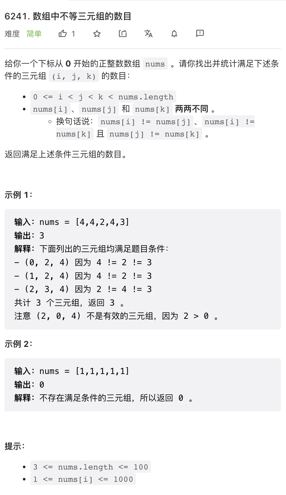
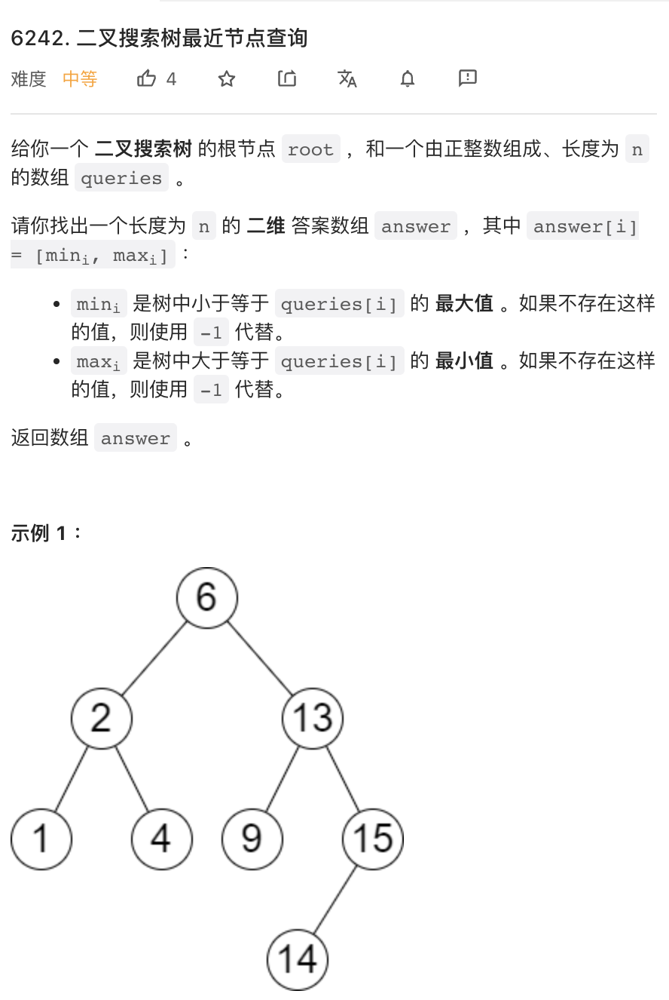
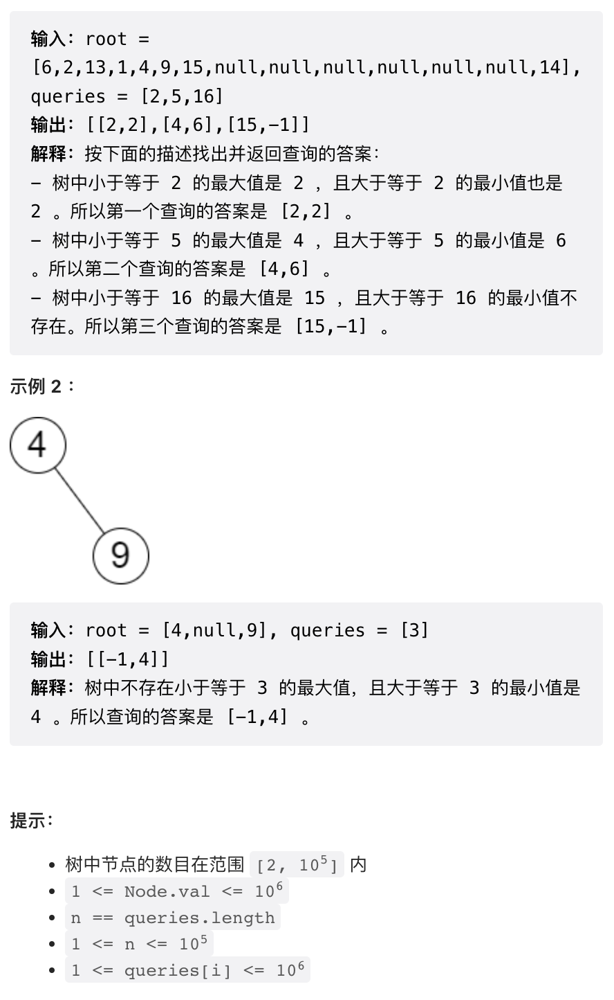
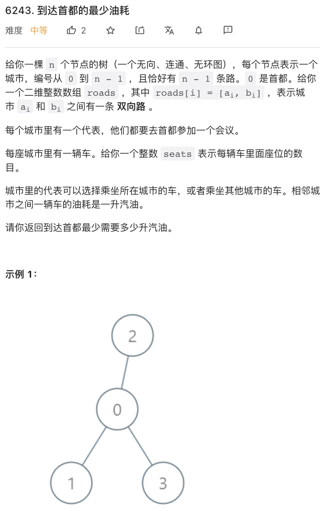
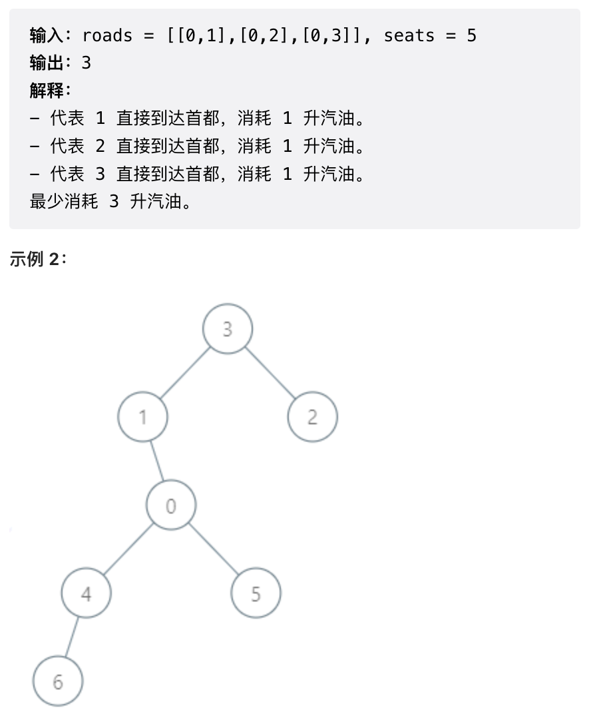
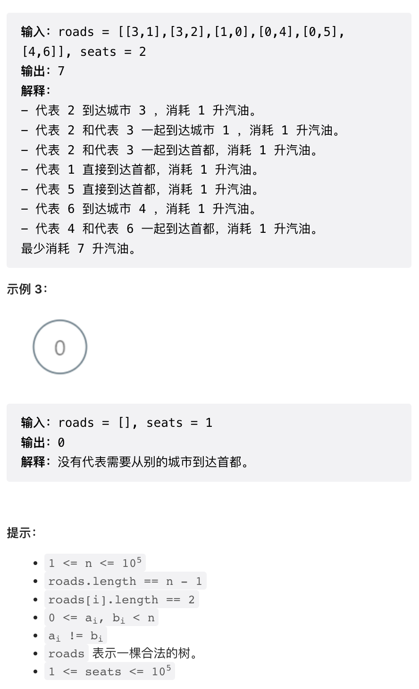
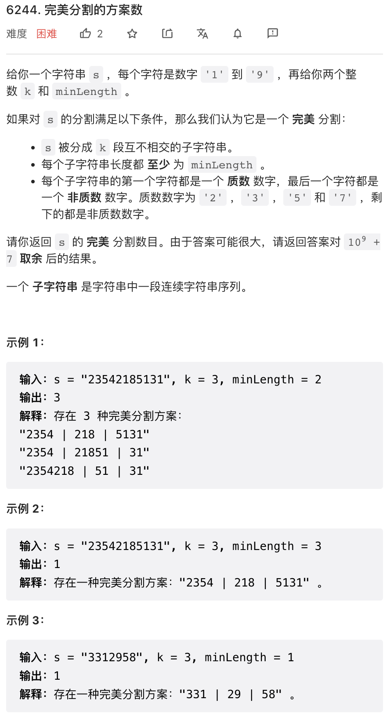

本次周赛给我的感觉是，除第四题外过于简单。第四题是一个稍微有点复杂的 DP。

## 1.



非常简单，直接实现。可能存在更优算法，但没什么必要。

```py
class Solution:
    def unequalTriplets(self, nums: List[int]) -> int:
        n = len(nums)
        cnt = 0
        for i in range(n):
            for j in range(i + 1, n):
                for k in range(j + 1, n):
                    cnt += nums[i] != nums[j] and nums[i] != nums[k] and nums[j] != nums[k]
        return cnt
```

## 2.




这个题目吧，如果出现在面试中，面试官的意思肯定是让你在树上进行操作，完成他的要求。但是出现在网测中，那就是另一回事了：二叉搜索树有可能严重不平衡，导致搜索复杂度达到 `O(n)` 因此有超时风险。

于是，更稳妥的做法是，先中序遍历二叉搜索树，把所有节点保存在一个数组中，然后使用二分查找。

使用二分查找时，注意仔细检查二分查找的 API，这个比较容易写错。多写几个 if else 虽然丑但是保险。

```py
# Definition for a binary tree node.
# class TreeNode:
#     def __init__(self, val=0, left=None, right=None):
#         self.val = val
#         self.left = left
#         self.right = right
class Solution:
    def closestNodes(self, root: Optional[TreeNode], queries: List[int]) -> List[List[int]]:

        # 中序遍历二叉搜索树
        nums = []
        def inOrder(node):
            if node:
                inOrder(node.left)
                nums.append(node.val)
                inOrder(node.right)
        inOrder(root)
        
        n = len(nums)
        res = []
        for x in queries:
            # p 是 nums 中第一个大于等于 x 的数的下标，相当于 C++ 的 lower_bound
            p = bisect.bisect_left(nums, x)
            if p != n and nums[p] == x:
                # nums 中存在 x 则上下限都是 x
                res.append([x, x])
            elif p == n:
                # nums 中不存在大于等于 x 的数
                res.append([nums[p - 1], -1])
            elif p == 0:
                # nums 中不存在小于等于 x 的数（等于第一个 if else 覆盖了）
                res.append([-1, nums[p]])
            else:
                # 正常情况
                res.append([nums[p - 1], nums[p]])

        return res
```

## 3. 





感觉这个问题作为第三题而言有些简单了。其实就是统计一下树上每个节点有多少个子节点，然后除以 seats 向上取整就是从这个节点到下一个父节点的 cost. 每个节点的 cost 分别计算即可。

```py
class Solution:
    def minimumFuelCost(self, roads: List[List[int]], seats: int) -> int:
        n = len(roads) + 1
        # 构建树
        g = [[] for _ in range(n)]
        for x, y in roads:
            g[x].append(y)
            g[y].append(x)
        
        def dfs(node, parent):
            # total: node 的子节点数量，包含自身
            # subcost: 所有子节点移动到该节点的开销
            total = subcost = 0
            for child in g[node]:
                if child != parent:
                    t, s = dfs(child, node)
                    total += t
                    subcost += s
            total += 1
            if node != 0:
                # 如果当前不是根节点，则再加上前往父节点的开销
                # 整数上取整除法
                subcost += total // seats + 1 if total % seats else total // seats
            return total, subcost
        
        return dfs(0, -1)[1]
```

## 4. 




这个问题是个稍微有点复杂的 DP.

这种连续区间问题很容易想到使用 DP 求解，使用 DP 计算所有前缀，所有 `k` 值对应的分割数量。DP 空间大小是 `O(n^2)`. DP 递推公式也即最后一个区间枚举所有可能的长度即可。但如果暴力枚举，则递推公式复杂度也是 `O(n)` 最终复杂度不可接受，因此我们需要使用一个类似于前缀和的方法加速。代码中有详细的注释。

这个问题稍微有点难度，难度就在于搞清楚这个前缀和应该怎么定义，并且在 DP 递推过程中处理好这个前缀和。

写这类 DP 问题，我的技巧是，一般写 bottom-up DP，并按照以下顺序写代码，而不是从头到尾一遍写出来。

- 定义好 DP 状态
- 写 DP 推导代码
- 检查 DP 状态依赖关系，并确认能够满足 DP 状态求解顺序
- 检查边界条件处理，包括 DP 边界状态的处理

```python
class Solution:
    def beautifulPartitions(self, s: str, k: int, minLength: int) -> int:
        p = "2357"
        mod = 10 ** 9 + 7
        n = len(s)
        
        # cnt[i][j]: 前 i 个字符（包括）分割为 j 个子串的方法数
        cnt = [[0] * (k + 1) for _ in range(n)]  

        # 这个是重点，
        # pre[i][j]: 终止在第 i 个字符（包括）之前，分割为 j 个子串，
        # 并且其末尾字符的下一个字符是质数的方案数
        # 因为是所有的「i 之前」因此是个前缀和
        # 这个前缀和的用途可以参照下文的计算代码理解
        pre = [[0] * (k + 1) for _ in range(n)]
        
        for i in range(n):
            if i != 0:
                # 初始化前缀和
                for j in range(1, k + 1):
                    pre[i][j] = pre[i - 1][j]

            # 仅当 s[i] 是一个合法结尾时才计算 cnt[i][j]
            if s[i] not in p:
                # 仅有一个区间的边界状态
                cnt[i][1] = 1 if s[0] in p and i >= minLength - 1 else 0
                for j in range(2, k + 1):
                    # 递推公式
                    # cnt[i][j] 也即终止在 i - minLength 之前
                    # 的分割方案的前缀和
                    cnt[i][j] = pre[i - minLength][j - 1]

                if i < n - 1 and s[i + 1] in p:
                    # 如果下一个字符是质数，更新前缀和
                    for j in range(1, k + 1):
                        pre[i][j] += cnt[i][j]
                        pre[i][j] %= mod

        return cnt[n - 1][k] % mod
```

由于工作之后没空刷题，水平急剧下降，今天周赛久违的进了前百，可喜可贺。