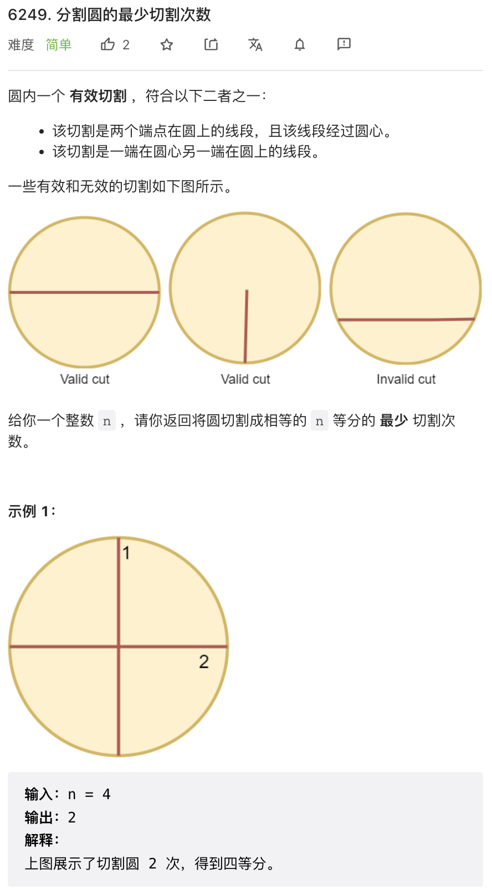
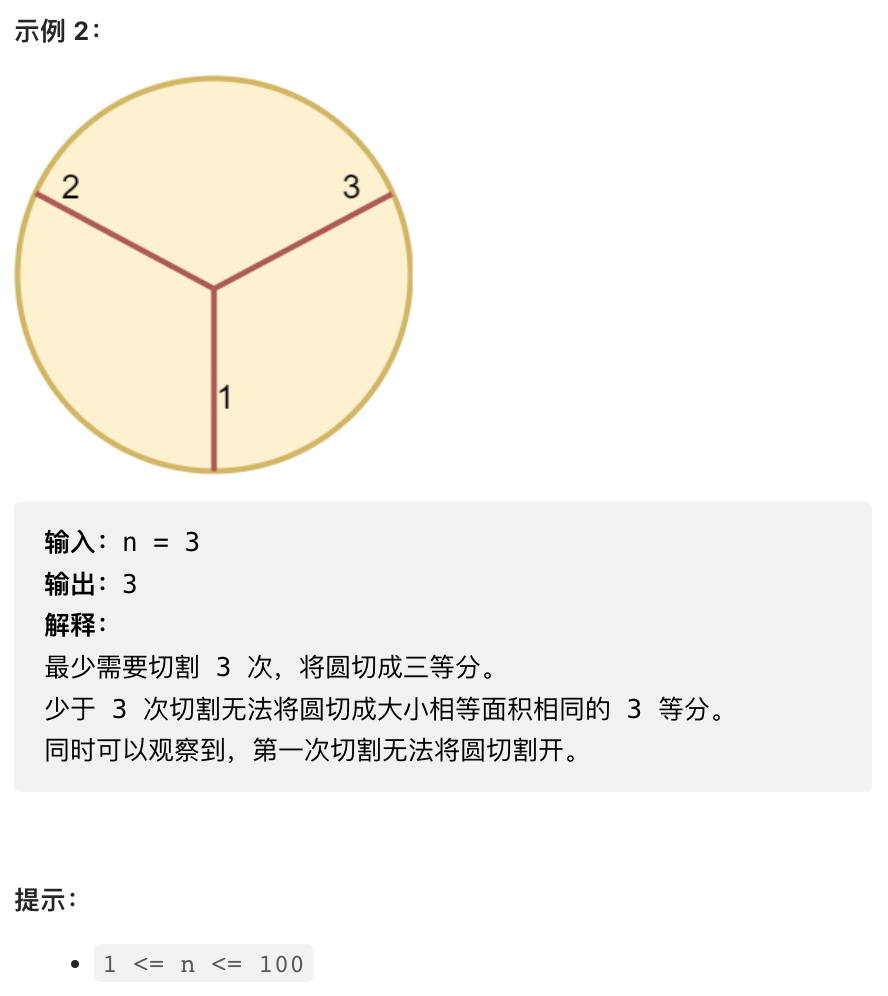
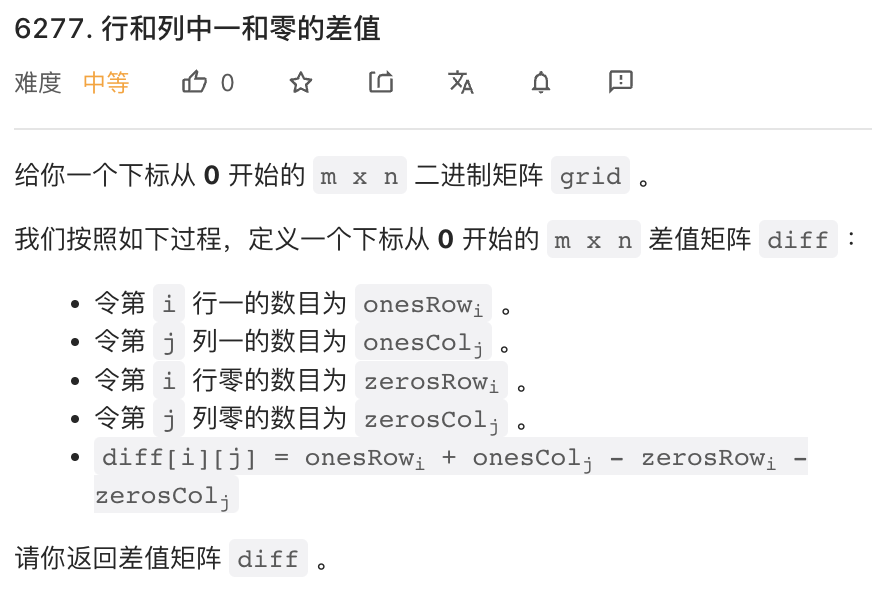
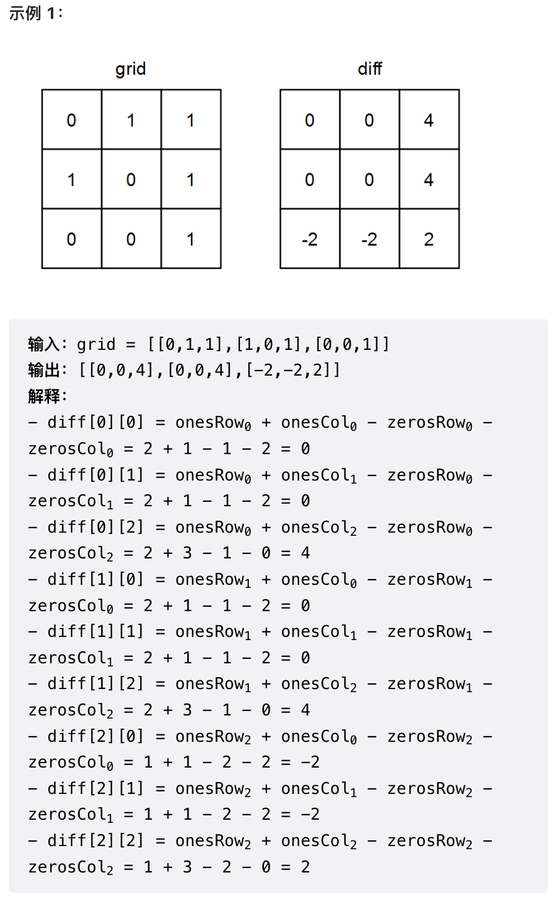
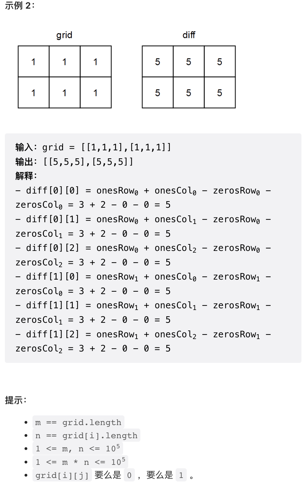
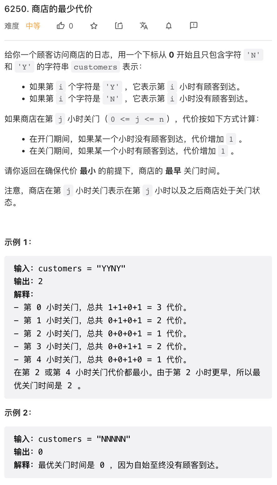
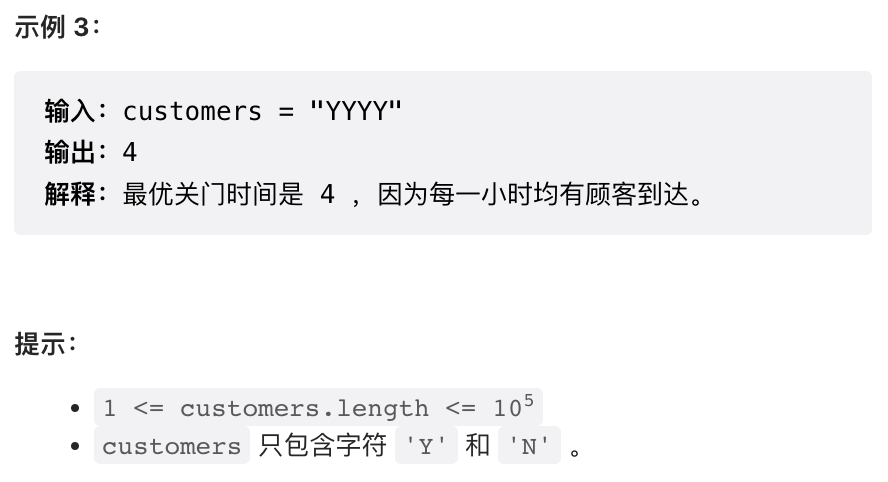
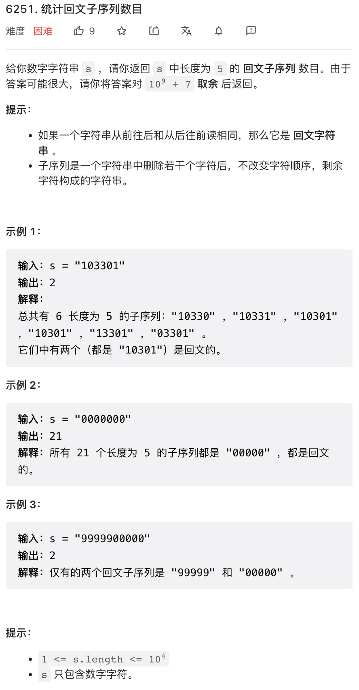

本周双周赛第一题非常适合做小学生数学题，第四题是个也很有意思的动态规划。

## 1.




这个题目需要稍微开动一下脑筋，分为三种情况：

- 如果最终需要划分奇数份，则每份都需要一刀
- 如果是偶数份，则只需要 `n/2` 刀
- 特别的，如果是一份，答案是 0 刀

```py
class Solution:
def numberOfCuts(self, n: int) -> int:
    return 0 if n <= 1 else n if n % 2 else n // 2
```

## 2.





本题非常简单，按要求计算即可。首先统计一下每一行 0 和 1 的数量，然后按照公式计算即可。

一个小优化是，只需要统计 0 的数量，1 的数量可以用总数减去 0 的数量。

```py
class Solution:
def onesMinusZeros(self, grid: List[List[int]]) -> List[List[int]]:
    m, n = len(grid), len(grid[0])
    
    row0, col0 = [0] * m, [0] * n
    for i in range(m):
        for j in range(n):
            if grid[i][j] == 0:
                row0[i] += 1
                col0[j] += 1
    
    res = [[0] * n for _ in range(m)]
    for i in range(m):
        for j in range(n):
            res[i][j] = m + n - 2 * row0[i] - 2 * col0[j]
    return res
```

## 3.




同样非常简单的第三题。在某一时刻关门的 cost, 就等于之前时刻 N 的前缀和，以及之后时刻 Y 的后缀和。

后者可以用前缀和推算出来。如果不想费劲推算，也可以暴力把 Y 后缀和算出来。

```py
class Solution:
def bestClosingTime(self, customers: str) -> int:
    n = len(customers)
    
    pre_n = [0] * (n + 1)
    for i in range(n):
        pre_n[i + 1] = (customers[i] == 'N') + pre_n[i]
    
    res = 0
    min_cost = n
    for i in range(n + 1):
        # suf_y[i] = total_y - pre_y[i]
        # = n - pre_n[n] - (i - pre_n[i]) = n - pre_n[n] - i + pre_n[i]
        # cost = pre_n[i] + suf_y[i]
        # = n - i - pre_n[n] + 2 * pre_n[i]
        cost = n - i - pre_n[n] + 2 * pre_n[i]
        if cost < min_cost:
            min_cost, res = cost, i
    return res
```

## 4.



第四题不是很难，有点意思。这个题目要求字符串中长度为 5 的回文子序列个数，而且字符串中只有数字。

长度为 5 回文子序列，意味着选定中间字符之后，前后只有两个字符需要决定了。再有限制字符串中只有数字，注意数据规模 `1E4` 这个问题很有可能是个 `O(100N)` 的复杂度。

一个可行的办法是，我们可以计算每个位置其前方或者后方所有长度为 2 的子序列个数，子序列最多只有 100 种，然后每个位置统计其前后匹配的子序列个数相乘就可以了。而长度为 2 的子序列个数，可以根据每个位置前方每个字符的计数再加一层统计即可。具体逻辑我在代码里写了详细的注释。

由于担心 Python 超时，这个题目给出 C++ 代码。

```cpp
class Solution {
public:
int countPalindromes(string s) {
    int n = s.size();
    long long mod = 1E9 + 7;
    
    // pre 是每个字符个数的前缀和，注意 pre[i] 是 s[:i-1] 的前缀和
    vector<vector<long long>> pre(n + 1, vector<long long>(10));
    // pre2[i] 是 s[:i-1] 之中，每种长度为 2 的子序列的计数
    // s[:i-1] 中一个 "12" 子序列会记录在 pre2[i][12] 中
    vector<vector<long long>> pre2(n + 1, vector<long long>(100));

    // 后缀和
    // suf2 与 pre2 类似，但子序列自带一个反向，也即子序列 "12" 的下标是 21
    // 这样最后进行匹配时，只要值相等就可以了
    auto suf = pre, suf2 = pre2;
    
    for(int i = 0, j = 1; i < n; i++, j++) {
        // 前缀和
        copy(pre[i].begin(), pre[i].end(), pre[j].begin());
        copy(pre2[i].begin(), pre2[i].end(), pre2[j].begin());
        int c = s[i] - '0';
        // 更新 pre
        pre[j][s[i] - '0']++;
        // 更新以当前字符结尾的长度为2子序列个数
        for(int x = 0; x <= 9; x++) {
            pre2[j][x * 10 + c] += pre[i][x];
        }
    }
    
    // 跟前缀和对称的后缀和逻辑
    for(int i = n, j = n - 1; i > 0; i--, j--) {
        copy(suf[i].begin(), suf[i].end(), suf[j].begin());
        copy(suf2[i].begin(), suf2[i].end(), suf2[j].begin());
        int c = s[j] - '0';
        suf[j][c]++;
        for(int x = 0; x <= 9; x++) {
            suf2[j][x * 10 + c] += suf[i][x];
        }
    }
    
    long long res = 0;
    for(int i = 0; i < n; i++) {
        // i 是回文子串中心，以 i 为中心的回文子串数量就是
        // 前后匹配的子串数量相乘再求和
        for(int x = 0; x <= 99; x++) {
            res = (res + pre2[i][x] * suf2[i + 1][x]) % mod;
        }
    }
    return int(res);
}
};
```
