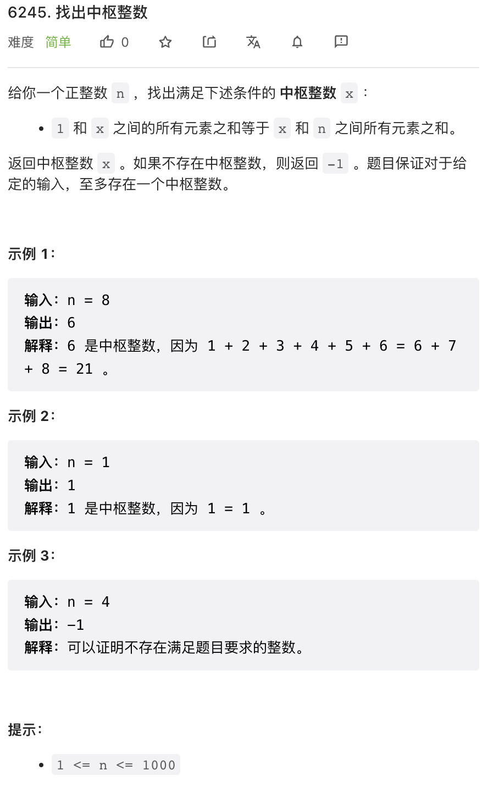
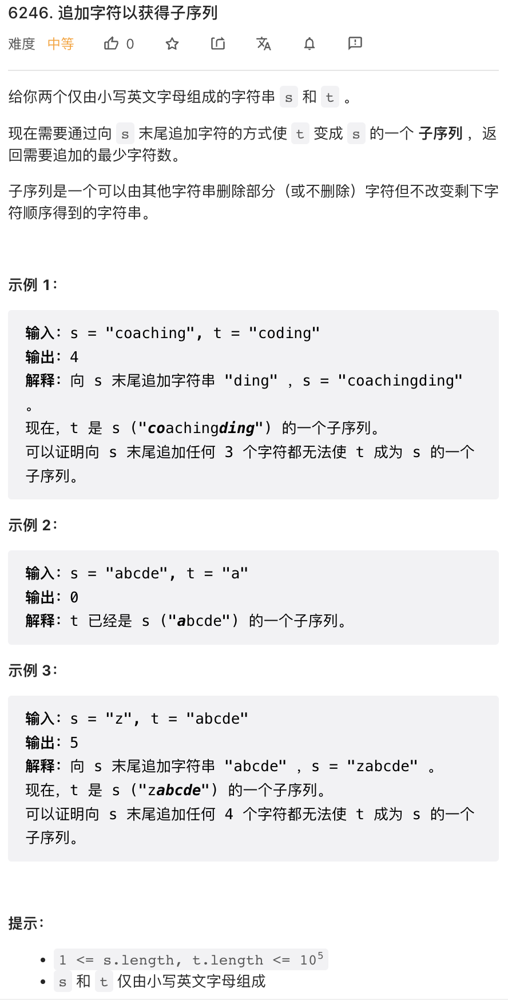
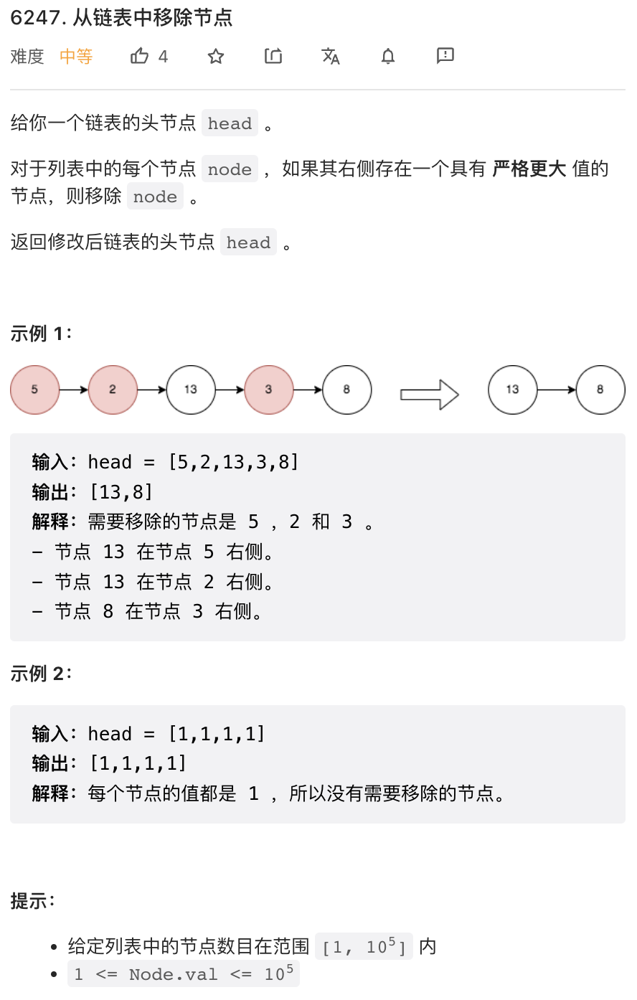
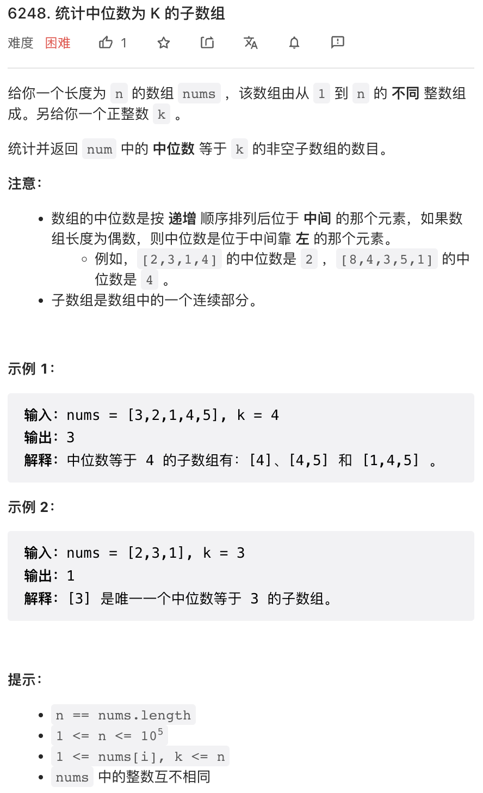

本周周赛无论按照什么标准来看都过于简单了，甚至感觉把一些陈年老题都翻出来了。

## 1.



按照等差数列求和公式算一下就行了。代码中的公式做了化简。

```py
class Solution:
    def pivotInteger(self, n: int) -> int:
        for i in range(n + 1):
            if i * (i + 1) - i == n * (n + 1) // 2:
                return i
        return -1
```

## 2.



这个题目明显就有点过分简单了，其实就是求 s 子序列能够匹配的最长 t 前缀，由于过于简单，一时不敢相信。

```py
class Solution:
    def appendCharacters(self, s: str, t: str) -> int:
        n = len(t)
        it = 0
        for c in s:
            if it < n and c == t[it]:
                it += 1
        return n - it
```

## 3. 



这个题目也很简单，你可以先把链表过一遍，得到后缀最大，然后直接就能判断某个节点是否需要删除。

或者更灵巧一点，使用常用的单调栈技术，维护一个单调下降栈就可以了。注意维护链表指针。

```py
# Definition for singly-linked list.
# class ListNode:
#     def __init__(self, val=0, next=None):
#         self.val = val
#         self.next = next
class Solution:
    def removeNodes(self, head: Optional[ListNode]) -> Optional[ListNode]:
        stack = []
        while head:
            while stack and stack[-1].val < head.val:
                stack.pop()
            if stack:
                stack[-1].next = head
            stack.append(head)
            head = head.next
        return stack[0]
```

## 4. 



难度一般。我们可以使用前缀相关的技巧轻易的计算出任何子区间中大于 k 的数字个数，或者小于 k 的数字个数，然后快速判断该区间是否满足要求。

满足要求的区间必须包含 k. 如果区间在 k 左边或者右边（单侧），这样的区间个数最多只有 N 个，枚举即可。

唯一的问题是覆盖 k, 两个端点分别在 k 之左和之右的情况。我们先考虑选定一个右端点，右方这些元素中，大于 k 的数字个数和小于 k 的数字个数分别记为 upper, lower. 对于合法区间，upper - lower 需要为 0 或者 1，分别对应奇数长和偶数长的区间。右方 upper - lower 可以计算，则左方 upper - lower 目标值就确定了。

于是我们可以先用类似于前缀和的技巧，把 k 左方的 diff = upper - lower 的每种取值计数预计算。这样就有一个 `O(n)` 解法了。代码中有详细注释。

这个问题分类讨论有点复杂，注意不要遗漏。

```python
class Solution:
    def countSubarrays(self, nums: List[int], k: int) -> int:
        
        # diff_cnt 是以 k 左方某个元素开始，以 k 结束的区间中
        # diff = upper - lower 每种可能取值的计数
        diff_cnt = defaultdict(lambda: 0)

        ki = nums.index(k)
        
        upper = lower = 0
        for left in range(ki - 1, -1, -1):
            upper += nums[left] > k
            lower += nums[left] < k
            # 统计每种取值的计数
            diff_cnt[upper - lower] += 1
        
        # diff_cnt[0] 是以 k 结尾的奇数长区间中合法的个数
        # diff_cnt[1] 是以 k 结尾的偶数长区间中合法的个数
        res = diff_cnt[0] + diff_cnt[1]
        upper = lower = 0
        for right in range(ki + 1, len(nums)):
            upper += nums[right] > k
            lower += nums[right] < k
            diff = upper - lower
            # diff + x in {0, 1}
            # so x in {-diff, 1 - diff}
            res += diff_cnt[-diff] + diff_cnt[1 - diff]
            if diff == 0 or diff == 1:
                # 如果 diff = 0 or 1 则
                # 以 k 开始以当前元素结尾也是合法区间
                res += 1

        # 最后 +1 是只包含 k 的单元素区间
        return res + 1
```
