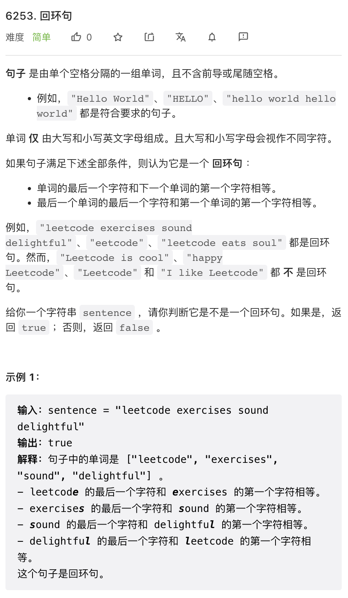
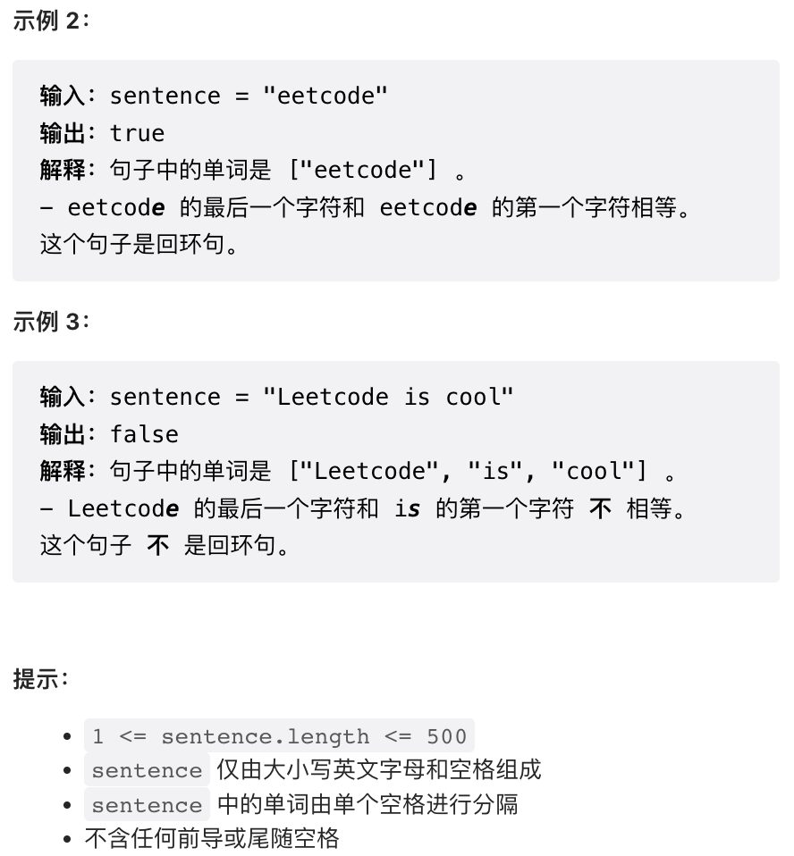
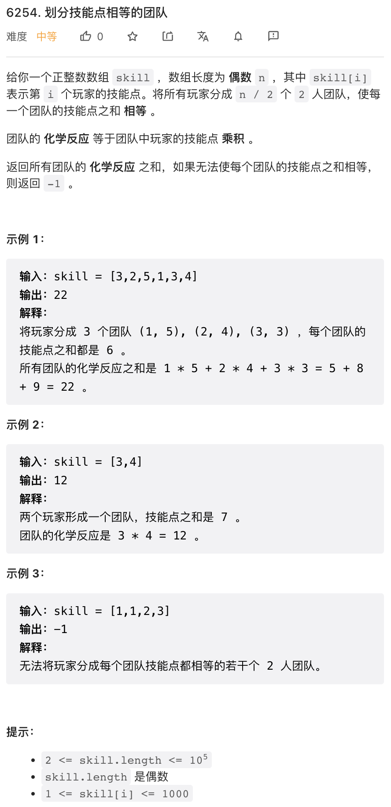
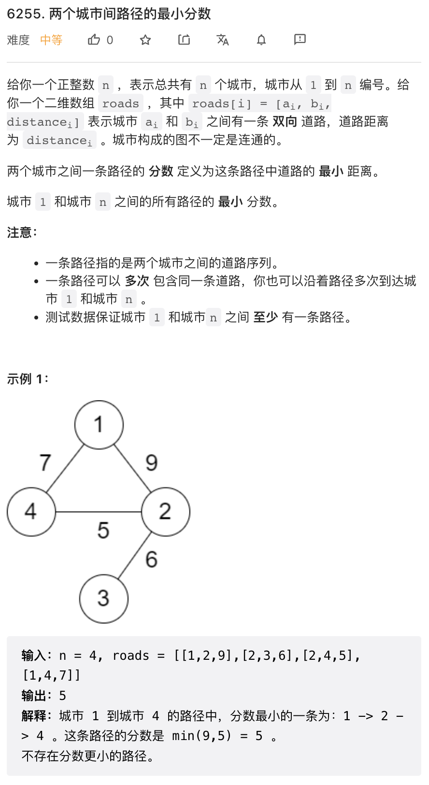
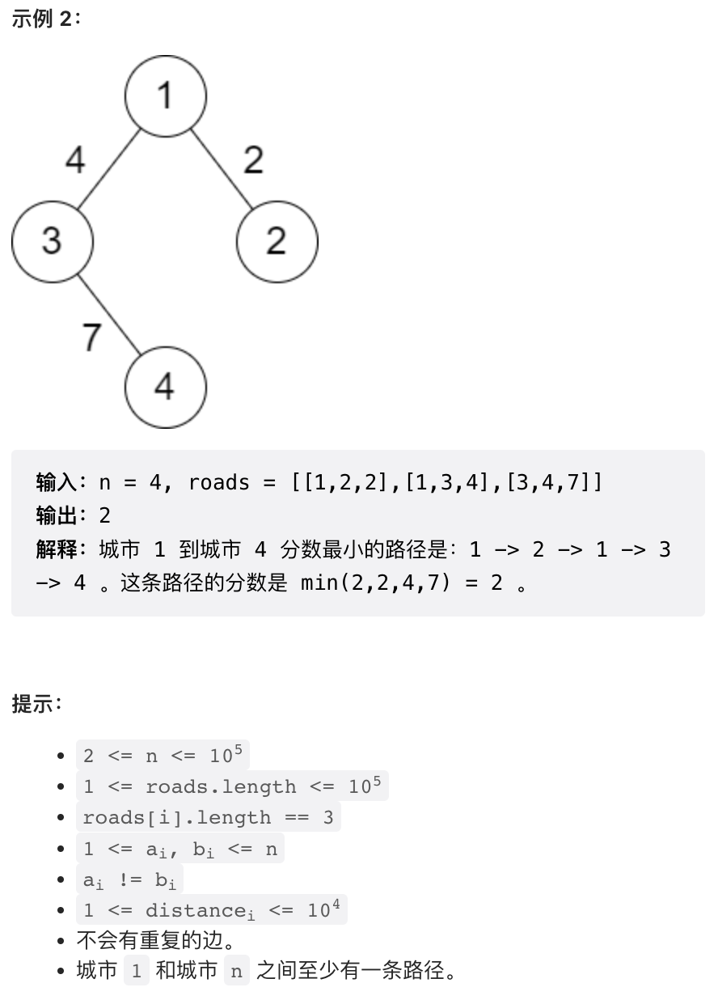
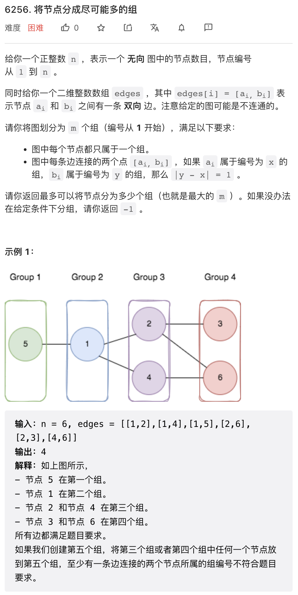
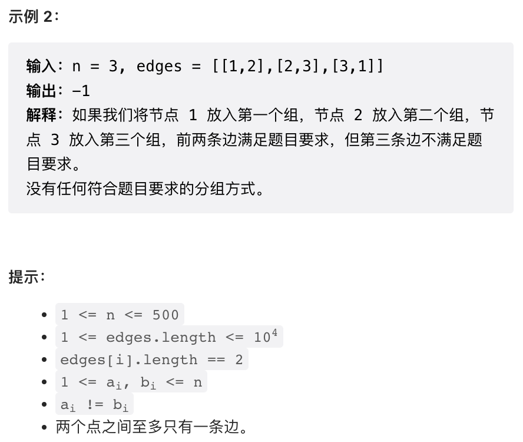

本周有两道图相关题目，可以复习一下图的最短路算法。

## 1.




直接实现即可。

```py
class Solution:
    def isCircularSentence(self, sentence: str) -> bool:
        words = sentence.split()
        return words[0][0] == words[-1][-1] and all(words[i][-1] == words[i + 1][0] for i in range(len(words) - 1))
```

## 2.



可以证明，如果合法的组对方式存在，最小数一定与最大数组对。否则，最大数跟任意其他数组成的数对之和，一定大于最小数与任意数组成的数对之和。然后，递归应用这一条推理，就能证明如果合法的组对方式存在，一定是第 i 小与第 i 大进行组队。之后实现就比较简单了。

```py
class Solution:
    def dividePlayers(self, skill: List[int]) -> int:
        skill.sort()
        prod = 0
        total = skill[0] + skill[-1]
        for i in range(len(skill) // 2):
            if skill[i] + skill[- 1 - i] != total:
                return -1
            prod += skill[i] * skill[- 1 - i]
        return prod
```

## 3. 




这个问题我觉得是本次周赛最有意思的问题。谈到最短路算法，我们当然会首先想到 dijkstra 算法。但这个问题中总路径长度定义比较特殊，是整条路径中最短的一条子路径的长度。这个定义其实类似于负权路径，所以不能使用 dijkstra 算法，而是要使用类似于 bellman ford 算法。

这两个算法尽在实际实现时区别很小，主要是 dijkstra 使用优先队列，bellman ford 使用队列。但 dijkstra 算法会保证每个节点只进队列一次，bellman ford 却不能保证。这一点是理论分析结果，在代码上是不会有体现的。bellman ford 使用优先队列也能运行，这个问题上，使用优先队列会更快的找到最短路径，从而更快收敛。

```py
# 这看上去是个 dijkstra, 实际上是个 bellman ford
def shortest(graph, from_node):
    import heapq
    node_num = len(graph)
    res = [float("inf")] * node_num
    heap = []
    # 队列中保存 (distance, node)
    # 注意初试节点 distance 需要设置为一个大数
    heapq.heappush(heap, (1e9, from_node))

    while len(heap):
        weight, node = heapq.heappop(heap)
        if weight >= res[node]:
            continue
        res[node] = weight
        for child in graph[node]:
            # 这里与 dijkstra 唯一的不同是求和改成 min
            heapq.heappush(heap, (min(weight, child[1]), child[0]))
    return res


class Solution:
    def minScore(self, n: int, roads: List[List[int]]) -> int:
        graph = [[] for _ in range(n + 1)]
        for x, y, d in roads:
            graph[x].append((y, d))
            graph[y].append((x, d))
        return shortest(graph, 1)[n]
```

## 4. 




这个问题其实并不复杂，只是操作有点繁琐。

很容易想到一个思路：从某一点出发，然后进行类似于 BFS 的层次遍历，遍历过程中检查是否合法，然后遍历的最大层数即为所求。这个思路成立的前提是，存在一种最优划分方法，其第一组只有一个节点。这一点是可以证明的。如果第一组有一个以上节点，只需要任意保留一个节点，将其他节点划分到第三组，则也是一个合法的划分。于是，我们可以从每个节点出发，层次遍历检查。这样时间复杂度是 `O(n * num_edges)` 在这个问题上时间复杂度有点紧张，保险起见使用 C++ 实现。

然后，需要注意这个题不保证图是联通的。所以我们需要分别求解每个子图。所以我们还得进行一遍子图划分，子图划分最简单的方法是使用并查集。最终代码如下。

```cpp
// 并查集模板
struct MergeFindSet {
    std::vector<int> p;
    MergeFindSet(int n) : p(n) { init(); }
    int find(int x) { return p[x] == x ? x : p[x] = find(p[x]); }
    void merge(int root, int child) { p[find(child)] = find(root); }
    void init() {
        for (int i = 0; i < int(p.size()); i++) p[i] = i;
    }
};

class Solution {
public:
    int magnificentSets(int n, vector<vector<int>>& edges) {
        // 构建图和并查集
        vector<vector<int>> G(n + 1);
        MergeFindSet mfs(n + 1);
        for(auto& p: edges) {
            G[p[0]].push_back(p[1]);
            G[p[1]].push_back(p[0]);
            mfs.merge(p[0], p[1]);
        }
        
        // 每个连通子图的最大划分
        // 连通子图按照并查集集合需要划分，最大 n
        // -2 代表这个序号没有对应的子图
        // -1 代表这个子图无法分割
        vector<int> subg(n + 1, -2);
        
        // 尝试从每个节点出发进行层次遍历
        for(int i = 1; i <= n; i++) {
            int ng = bfs(G, i);
            // 按照子图在并查集中的序号更新结果
            int sub = mfs.find(i);
            subg[sub] = max(subg[sub], ng);
        }
        
        // 最终划分数量是所有子图划分数量之和
        // 但如果任意子图无法划分，则无法划分
        int res = 0;
        for(int x: subg) {
            if(x == -1) return -1;
            if(x == -2) continue;
            res += x;
        }
        return res;
    }

    // BFS 层次遍历
    int bfs(vector<vector<int>>& G, int node) {
        // 节点所属的 group
        vector<int> group(G.size(), -1);
        group[node] = 1;

        queue<int> q;        
        q.push(node);
        
        while(q.size()) {
            int curr = q.front();
            q.pop();
            int cg = group[curr];
            for(int child: G[curr]) {
                int cc = group[child];
                if(abs(cc - cg) == 1) continue;
                // 如果发现一个近临节点的 group 序号差异不是 1 则划分失败
                if(cc != -1) return -1;
                // 标记新的近临界点 group 序号
                group[child] = cg + 1;
                q.push(child);
            }
        }
        
        return *max_element(group.begin(), group.end());
    }
};
```
