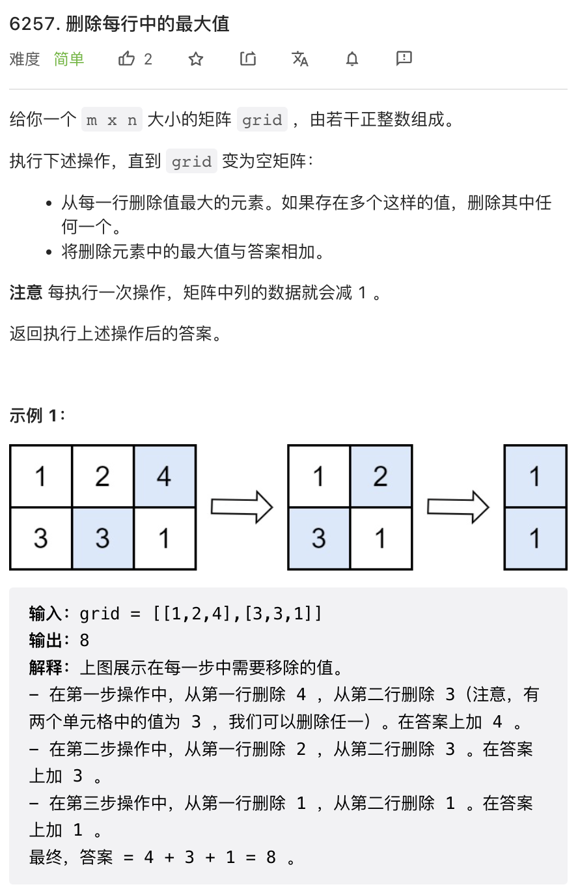
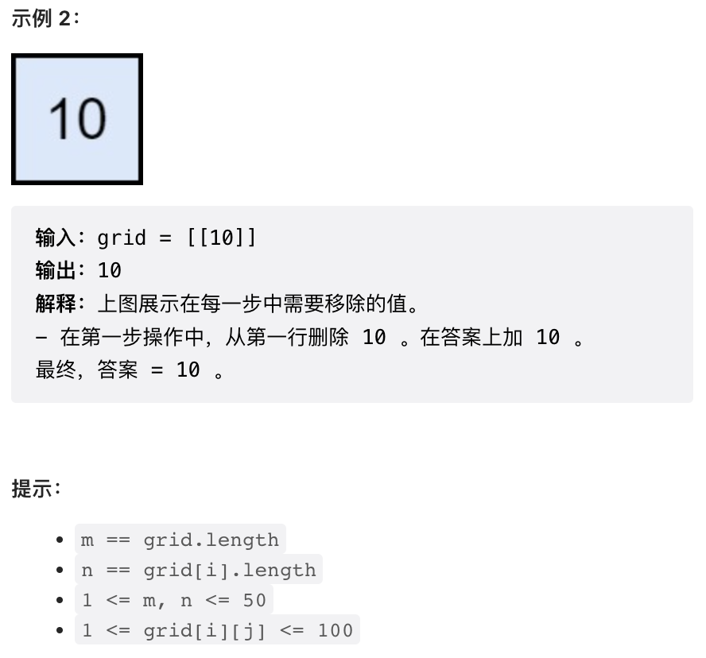
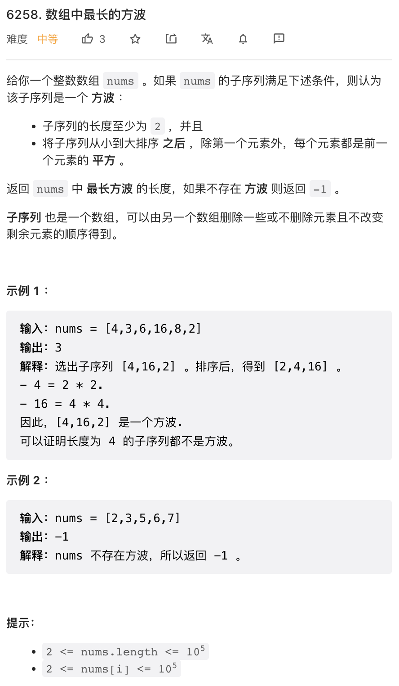
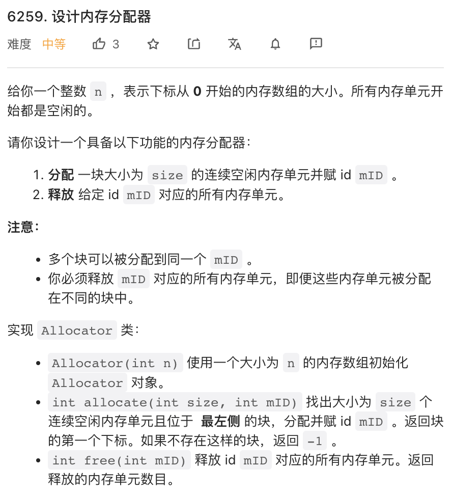
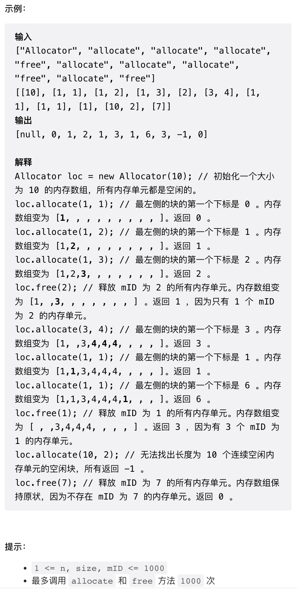
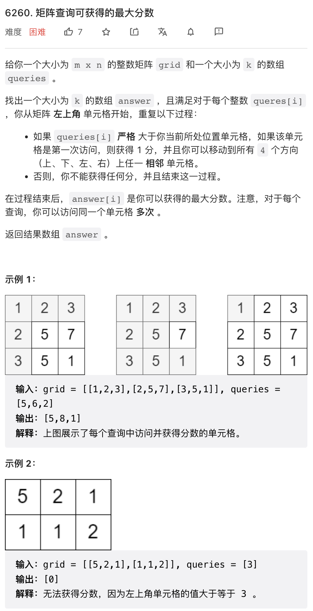
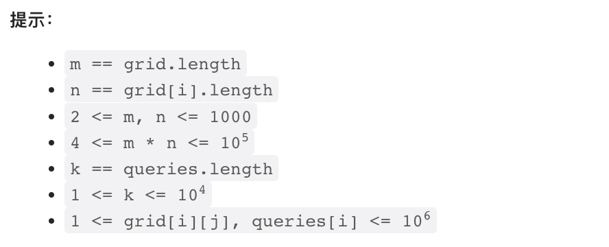

本周四道题目难度一般，第三题可以暴力，最后一题则是一个 BFS.

## 1.




众所周知，LeetCode 第一题不该太难，最好能够一行代码解决。本题操作比较繁琐，但仔细思考一下，其实相当于把原矩阵每一行排序之后，返回每一列最大值之和。

Python 的 zip 函数是同时迭代多个迭代器，将每个迭代器相应的元素作为一个 tuple 返回。函数参数之前添加 `*` 符号则会将一个列表拆开，每个元素作为一个函数参数。

```py
class Solution:
    def deleteGreatestValue(self, grid: List[List[int]]) -> int:
        return sum(max(x) for x in zip(*[sorted(r) for r in grid]))
```

## 2.



这是一个典型的 DP 问题。首先将数组排序，然后从后向前迭代（因为求平方比求平方根容易很多）。可以使用二分搜索检查每个元素的平方是否在数组中存在。

代码中有详细注释。

```py
class Solution:
    def longestSquareStreak(self, nums: List[int]) -> int:
        n = len(nums)
        nums.sort()
        
        # dp[i] 是以 i 为最小元素的方波的最大长度
        dp = [1] * n
        for i in range(n - 2, -1, -1):
            y = nums[i] ** 2
            j = bisect.bisect_left(nums, y, lo=i+1)
            if j < n and nums[j] == y:  # 若 nums[i] 的平方存在
                dp[i] = dp[j] + 1

        r = max(dp)
        return r if r != 1 else -1
```

## 3. 




这个问题由于数据规模较小，可以暴力实现，所以并不太困难。直接用一个长度为 `n` 的数组模拟内存。申请内存时，只要从左到右寻找第一个大于 `size` 的空闲块即可，并在数组中标记 mID. 释放时将所有的 mID 标记清空即可。

```py
class Allocator:

    def __init__(self, n: int):
        self.mem = [0] * n
        self.n = n

    def allocate(self, size: int, mID: int) -> int:
        left = -1  # left 是每个连续内存块的起始
        for i in range(self.n):
            # 若当前空闲且 left == -1, 则标记内存块起始点
            # 若当前不空闲，left 设置为 -1
            left = -1 if self.mem[i] != 0 else i if left == -1 else left    
            if left != -1 and i - left + 1 >= size:
                # 发现了一个满足要求的内存块，进行标记
                for j in range(left, i + 1):
                    self.mem[j] = mID
                return left
        return -1

    def free(self, mID: int) -> int:
        size = 0
        # 暴力的把所有 mID 标记清空
        for i in range(self.n):
            if self.mem[i] == mID:
                self.mem[i] = 0
                size += 1
        return size
```

## 4. 




这个问题作为最后一题，其实比较简单。

首先，给定一个 query, 要求的其实就是从左上角开始，能够到达的所有小于 query 的格子的数量。使用 BFS 即可求解。本题有多个 queries, 但这些 queries 是一次性给定的，所以可以先排序，然后广度优先搜索时，使用一个优先队列代替队列，每次先搜索小于 `queries[i]` 的所有格子，然后逐渐扩大搜索范围。

```python
class Solution:
    def maxPoints(self, grid: List[List[int]], queries: List[int]) -> List[int]:
        # query 和 query 原本的序号
        qi = sorted((x, i) for i, x in enumerate(queries))

        m = len(grid)
        n = len(grid[0])
        
        # 优先队列，(格点值，格点坐标 i, j)
        pq = [(grid[0][0], 0, 0)]

        res = [0] * len(qi)

        # 当前已经有多少格子出队
        curr_res = 0

        # BFS 需要注意，是入队时执行各种逻辑，还是出队时执行。这里选择出队执行
        for limit, res_idx in qi:
            # 当优先队列中最小格点小于当前 query
            while pq and pq[0][0] < limit:
                # 使用堆维护优先队列
                x, i, j = heappop(pq)
                # 格点第一次出队之后，将格点值标记为 -1
                # 仅在第一次出队后执行搜索和更新 curr_res
                if grid[i][j] != -1:
                    grid[i][j] = -1
                    curr_res += 1
                    # BFS
                    if i != m - 1: heappush(pq, (grid[i + 1][j], i + 1, j))
                    if j != n - 1: heappush(pq, (grid[i][j + 1], i, j + 1))
                    if i: heappush(pq, (grid[i - 1][j], i - 1, j))
                    if j: heappush(pq, (grid[i][j - 1], i, j - 1))
            # 记录当前 query 的结果
            res[res_idx] = curr_res
        return res
```
