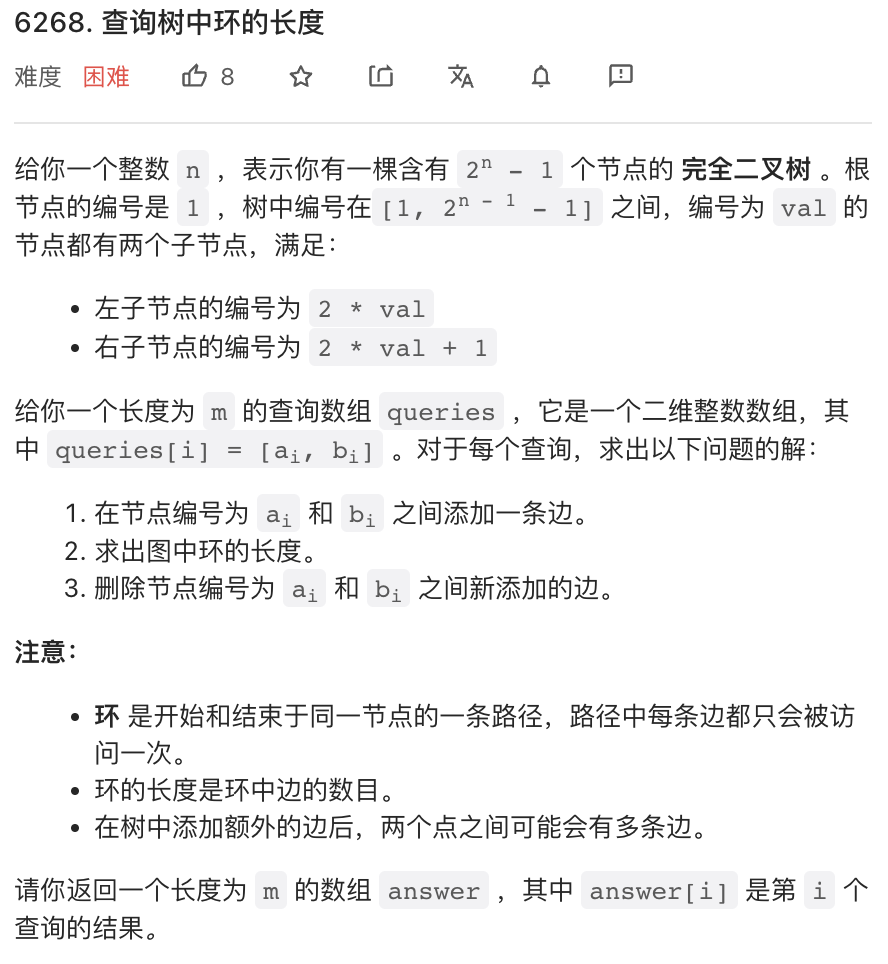

---
layout: mypost
title: 周赛 324 题解
categories: [leetcode]
---

本周周赛有两道 Hard! 两道题难度中规中矩，分别是巨烦无比的分类讨论 & 暴力版本公共祖先。

## 1.


非常简单的一道题目。

题目中其实定义了一种「相等」关系。对这类题目，我比较喜欢的一种 `O(n)` 时间复杂度的做法是，为每一类相等关系选取一个代表元作为 key, 然后数一下每个 key 出现的次数就行了。本题「代表元」可以选取将 word 所有字母去重排序后的字符串。

```py
class Solution:
    def similarPairs(self, words: List[str]) -> int:
        # 计数每个代表元所在的彼此相等集合中元素个数
        cnt = collections.Counter("".join(sorted(set(s))) for s in words)
        # 每个集合提供的 pair 是 x * (x - 1) / 2
        return sum(x * (x - 1) // 2 for x in cnt.values())
```

## 2.


这是一个很不像 LeetCode 风格的「数论」题目，你需要了解质因数分解算法。这里直接给出一个比较快的质因数分解算法模板。由于这个模板是 CPP 的，这道题目就 CPP 了。

质因数分解是 `O(n ^ 0.5)` 的时间复杂度。这道题目每次操作直觉上会令 `n` 的值以接近 `log n` 的程度衰减（好像不难证明，留给读者试试），所以这个平方根时间复杂度的质因数分解算法 + 暴力迭代就够了。

```cpp
// worst complexity: O(num ^ 0.5)
template <typename NUM = int>
void prime_fact(NUM num, vector<NUM>& res) {
    while (num % 2 == 0) {
        num /= 2;
        res.push_back(2);
    }
    for (int p = 3; p * p <= num; p += 2) {
        while (num % p == 0) {
            res.push_back(p);
            num /= p;
        }
    }
    if (num > 1) res.push_back(num);
}

class Solution {
public:
    int smallestValue(int n) {
        vector<int> fact;
        while(true) {
            fact.clear();
            prime_fact(n, fact);
            int _n = accumulate(fact.begin(), fact.end(), 0);
            if(_n == n) break;
            n = _n;
        }
        return n;
    }
};
```

## 3. 


这是一道我最讨厌的题目，仔细看了好多遍，好像确实不难，但也没啥漂亮解法，是一个比较麻烦的分类讨论，要写很多 if else.

基本思路是，原图中最多可以有四个度数为奇数的节点，然后根据节点个数展开分类讨论。在尝试加入新的边时需要检查是否重复，所以需要把所有的边加到一个 set 里。

```cpp
class Solution {
public:
    bool isPossible(int n, vector<vector<int>>& edges) {
        // 统计度数
        vector<int> degree(n + 1);
        // 边 set, 用于检查边是否已经存在
        // 总是把边较小的节点放在前面
        set<pair<int, int>> es;
        for(auto& p: edges) {
            degree[p[0]]++;
            degree[p[1]]++;
            es.insert({min(p[0], p[1]), max(p[0], p[1])});
        }
        // 所有度数为奇数的候选节点
        vector<int> can;
        for(int i = 1; i <= n; i++) {
            if(degree[i] % 2) {
                can.push_back(i);
            }
        }
        // 没有度数为奇数的节点，无需操作
        if(can.size() == 0) {
            return true;
        }
        if(can.size() == 2) {
            // 两个奇数度数节点
            // 如果这两个节点之间没有变，则加一条边即可
            if(!es.count({can[0], can[1]})) {
                return true;
            }
            // 否则，需要另找一个节点，然后分别跟这个节点加一条边
            // 所以需要 can 中两个节点跟这个节点都没有边相连
            for(int j = 1; j <= n; j++) {
                if(j != can[0] and j != can[1]) {
                    auto p1 = make_pair(min(can[0], j), max(can[0], j));
                    auto p2 = make_pair(min(can[1], j), max(can[1], j));
                    if(!es.count(p1) and !es.count(p2)) {
                        return true;
                    }
                }
            }
        } else if(can.size() == 4) {
            // 四个奇数节点，则必须能够两两加一条边
            if(
                (!es.count({can[0], can[1]}) and !es.count({can[2], can[3]})) or
                (!es.count({can[0], can[2]}) and !es.count({can[1], can[3]})) or
                (!es.count({can[0], can[3]}) and !es.count({can[1], can[2]}))
            ) {
                return true;
            }
        }
        // 其他情况都不行
        return false;
    }
};
```

## 4. 




第四题难度感觉比第三题难度小一点。要求的环的长度，其实就等于这两个节点到「最近公共祖先」距离之和加一。由于这是一棵满树，高度最多 30, 所以可以暴力求解最近公共祖先。而且这个满树可以根据节点编号方便的求出节点深度，从而很容易判断两个节点是不是在同一层。

```cpp
class Solution {
public:
    vector<int> cycleLengthQueries(int n, vector<vector<int>>& queries) {
        vector<int> res;
        for(auto &p: queries) {
            int x = min(p[0], p[1]), y = max(p[0], p[1]);
            int r = 1;
            // y 编号总是大于 x，所以层数总是比 x 更深
            // 如果 y 与 x 不在同一层，则先把 y 提升到跟 x 同一层
            // '>>= 1' 即父节点
            while(level(y) > level(x)) {
                y >>= 1;
                r++;
            }
            // 两者在同一层，则一直上移直到到达公共祖先
            while(x != y) {
                y >>= 1;
                x >>= 1;
                r += 2;
            }
            res.push_back(r);
        }
        return res;
    }
    // 求节点层数，观察一下不难发现，节点层数也即节点编号的最高有效位位置
    int level(int x) {
        for(int m = 1; m <= 30; m++) {
            if(x < (1 << m)) {
                return m;
            }
        }
        return 31;
    }
};
```
