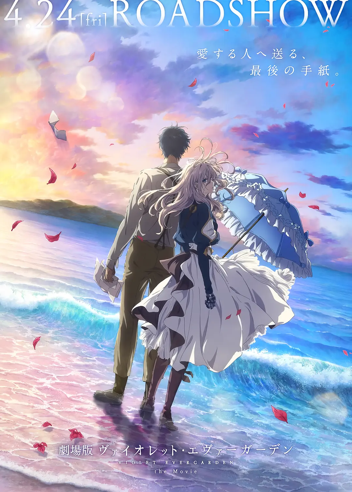

工作之后，能挤出时间读一本书越来越困难了，想要写点笔记难上加难。想看一部电影，列在 TODO List 上好久，具体看什么无所谓。今天终于把 TODO 勾掉了。

这个博客的 UI 本是 Fork 的 TMaize 的工作，我好久不同步了，好像有点简陋，什么时候有时间修缮一下吗？

## 如果世上不再有猫

故事情节像是在映射衰老与死亡的历程，生命中重要的东西一个一个渐渐失去，最终失去整个世界，告别整个世界。

但在这个故事里，借助电话、钟表的消失，也表达了一点这些东西在带来方便的同时也带来束缚。如果没有这些东西，生活会不会更简单一点。但既然生活在现实世界，没有办法真的将他们抹去，但至少看轻一点吧。

总有一些东西是我们宁可失去生命也不想失去的，因为，如果失去了它们，活着好像也没有什么意思了。所以宁可迎接死神，也不能接受世上不再有猫。

## 紫罗兰永恒花园剧场版

这个故事的终章。

这部作品跟它的名字一样，故事情节和人物有那么一点用力过猛，但欣赏这部作品就不是冲着故事来的。一个干净的故事、京阿尼最顶级的画面，这就够了。

这部作品在日本上映于 2020 年，是京阿尼很多老师的遗作。所以有很多关于死去的人、仍然活着的人的讨论。战争、生死、罪恶、赎罪。

这部剧场版里少佐的形象、行动可能会有点不近情理，但更多的是象征意义。在岛上，这一天的不去见她，象征了长久以来不去见她，从世上消失，以另外的名字开始生活，赎罪。少佐自己所说，无论如何，他是制造她悲剧的两个人之一，他不出现，她就与战争、军队再无瓜葛。他希望她生活在没有他，没有战争的时代，去看到、感受美好的事物。

最后两人隐居海岛，很美好、比原作更美好的结局。尘世多痛苦，隐居世外桃源是梦幻般美好的结局。许多人逝去，最后，电话取代书信，连书记人偶职业一并失去。曾经美好的人留在了邮票上，曾经动人的岁月尘封在博物馆里。
