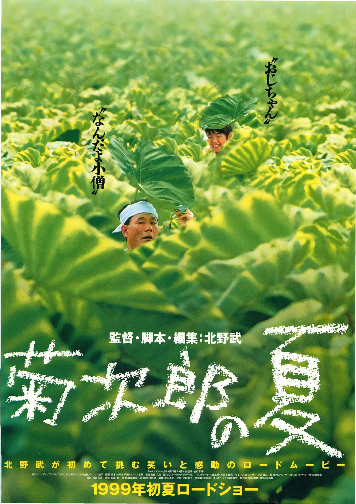

很多人可能没有看过这部电影，但一定听过这部电影的音乐。听到那几个音符仿佛就感受到夏天了。到处充满了生机，郁郁葱葱的暑假。

这是两个男孩找妈妈的故事，妈妈却不要他们了。片中最令人伤感的一幕就是小男孩找到了妈妈，却看到妈妈已经有了新的家庭、新的生活。「懂事」的孩子不去打扰妈妈的新生活，静静离开。但好在盛夏是一个令人愉悦的季节，一路上他们两个遇到了更多长不大的男孩，盛夏是玩耍的季节，一起玩耍就能忘记所有。

----

## 心花怒放

同时看的另一部电影，关键词：中年男人，文青，大理，洱海。

片中非主流的九零后现在已经开始躺平养生了。
